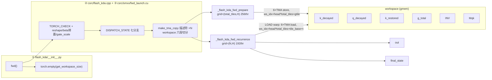

# 项目地图：从 flash_kda.fwd 到两个 CUDA kernel 的调用链

## 1. 本讲目标

u1-l1 里我们说过：FlashKDA 的 Python 层只是一层薄包装，真正的逻辑全部在 C++/CUDA 里；u1-l3 里我们把项目编译出了一个名为 `flash_kda_C` 的扩展模块。本讲要做的，就是把这两端**连起来**——画出一张从 `flash_kda.fwd` 出发、一路到达 GPU 上两个 kernel 的完整地图。读完本讲，你应该能够：

1. 画出 `Python → pybind → launch → Kernel 1 / Kernel 2` 的完整调用链，并说出数据（张量、指针、TMA 描述符）在每一层的形态变化。
2. 说出仓库里每个源码文件的职责分工与代码量级（Python 包装层 41 行、pybind 入口 232 行、启动层 238 行、Kernel 1 586 行、Kernel 2 839 行、公共工具 438 行），从而知道以后读代码该从哪个文件入手。
3. 理解**双 kernel 划分**：Kernel 1（prepare）按 token/tile 并行地做准备工作，Kernel 2（recurrence）按 head（× 序列）并行地做递推，两者通过一块 **workspace（工作区）** 中的 6 类中间张量衔接。
4. 给定输入形状，手工算出两个 kernel 的 grid 维度与 workspace 大小。

本讲是「地图课」：只建立结构与数据流的全景认知，不深入任何一段计算的实现细节——那些留给单元二、单元三逐篇拆解。

## 2. 前置知识

- **pybind11 / torch extension**：PyTorch 允许把 C++ 函数编译成 Python 可直接 `import` 的模块（`.so` 文件），两边的类型转换（`torch::Tensor` ↔ `torch.Tensor`、`std::optional` ↔ `None`）由 pybind11 自动完成。u1-l3 里编译出的 `flash_kda_C` 就是这样一个模块。
- **CUDA kernel launch**：host 代码用 `kernel<<<grid, block, smem, stream>>>(...)` 把一个函数放到 GPU 上执行。`grid` 是区块（block/CTA）网格，`block` 是每区块的线程数。FlashKDA 的两个 kernel 都用**动态共享内存**（`extern __shared__`），所以 launch 前要先用 `cudaFuncSetAttribute` 申请超过 48KB 的份额。
- **TMA（Tensor Memory Accelerator）**：Hopper（SM90）引入的异步批量搬运单元，由一个**描述符（descriptor）**描述「全局内存里一块什么形状、什么步长的张量」和「共享内存里什么 swizzle 布局」，之后一条指令就能搬一整块 tile。描述符的构造细节在 u2-l5 展开，本讲只需要知道「launch 层造好描述符、当参数传给 kernel」。
- **workspace（工作区）**：两个 kernel 无法直接交换共享内存里的数据（各自的 smem 生命周期只覆盖自己的执行期），所以 Kernel 1 把中间结果写进一块全局内存缓冲，Kernel 2 再从同一块缓冲读——这块缓冲就叫 workspace。它是两级流水线的「传送带」。
- **并行轴（parallel axis）**：一个 kernel 的 grid 维度决定了「哪些量之间可以并行」。KDA 计算既含可并行的按 tile 准备，又含必须串行的沿时间递推——把两类工作拆进两个 kernel、各自选对并行轴，正是双 kernel 设计的动机（u1-l1 提到这一拆分带来至少 15% 的端到端收益）。

## 3. 本讲源码地图

| 文件 | 行数 | 职责 | 本讲关注点 |
|---|---|---|---|
| [flash_kda/__init__.py](https://github.com/MoonshotAI/FlashKDA/blob/7afb9f454f160a6c4bbc0999beca0a8c40a38934/flash_kda/__init__.py) | 41 | Python 包装层：分配 workspace、透传参数 | 调用链起点 |
| [csrc/flash_kda.cpp](https://github.com/MoonshotAI/FlashKDA/blob/7afb9f454f160a6c4bbc0999beca0a8c40a38934/csrc/flash_kda.cpp) | 232 | pybind 入口：输入校验、布局预处理、模板分发 | `fwd` 的中转逻辑 |
| [csrc/fwd.h](https://github.com/MoonshotAI/FlashKDA/blob/7afb9f454f160a6c4bbc0999beca0a8c40a38934/csrc/fwd.h) | 27 | `launch_fwd` 模板声明 | 分发与实现的边界 |
| [csrc/smxx/fwd_launch.cu](https://github.com/MoonshotAI/FlashKDA/blob/7afb9f454f160a6c4bbc0999beca0a8c40a38934/csrc/smxx/fwd_launch.cu) | 238 | 唯一的 `.cu`：构造 gmem 张量与 TMA 描述符、切分 workspace、启动 K1/K2 | 两次 kernel launch |
| [csrc/smxx/fwd_kernel1.cuh](https://github.com/MoonshotAI/FlashKDA/blob/7afb9f454f160a6c4bbc0999beca0a8c40a38934/csrc/smxx/fwd_kernel1.cuh) | 586 | Kernel 1 `_flash_kda_fwd_prepare`（+ 辅助 kernel `_flash_kda_build_tile_prefix`） | 头部映射与尾部 6 次 TMA store |
| [csrc/smxx/fwd_kernel2.cuh](https://github.com/MoonshotAI/FlashKDA/blob/7afb9f454f160a6c4bbc0999beca0a8c40a38934/csrc/smxx/fwd_kernel2.cuh) | 839 | Kernel 2 `_flash_kda_fwd_recurrence` | warp 角色划分与三段循环 |
| [csrc/smxx/utils.cuh](https://github.com/MoonshotAI/FlashKDA/blob/7afb9f454f160a6c4bbc0999beca0a8c40a38934/csrc/smxx/utils.cuh) | 438 | 公共工具：近似指令、`WorkspaceSizes`、`WarpRole`、流水线构造、16×16 求逆 | `WorkspaceSizes` 与 `WarpRole` |
| [setup.py](https://github.com/MoonshotAI/FlashKDA/blob/7afb9f454f160a6c4bbc0999beca0a8c40a38934/setup.py) | 105 | 构建脚本（u1-l3 已精读） | 证明「只有两个编译单元」 |

## 4. 核心概念与源码讲解

### 4.1 仓库目录结构：三个编译产物来源与一个单翻译单元策略

#### 4.1.1 概念说明

一个「Python 包 + CUDA 扩展」的项目通常分三层：**Python 包装层**（用户直接调用的 API）、**host 胶水层**（pybind 入口、校验、分发、launch）、**device 层**（真正的 kernel）。FlashKDA 的特殊之处在于 device 层没有独立的 `.cu` 文件——两个 kernel 都写在 `.cuh` **实现头**（implementation header）里，被唯一的 `.cu` 文件 `#include` 进来。

这是一种「**单翻译单元**」策略：`fwd_launch.cu` include 了 `fwd_kernel1.cuh` 和 `fwd_kernel2.cuh`，三个文件在编译器眼里是一份代码。好处是 kernel 之间可以共享内联函数（都在 `utils.cuh`）而不产生链接开销，模板实例化也只做一次；代价是改任何一个头都要重编整个 `.cu`（u1-l3 讲过「改 csrc 需重装」的原因之一就在这）。

#### 4.1.2 核心流程

代码从源码到运行的层次关系：

```text
flash_kda/            ← Python 包装层（pip 安装的包）
   │  import
csrc/flash_kda.cpp    ← host 胶水：编译成 flash_kda_C.so 的一部分（pybind 模块定义在这）
   │  调用 launch_fwd<D,...>() 模板函数
csrc/fwd.h            ← launch_fwd 的声明（.cpp 与 .cu 之间的合同）
   │  实现
csrc/smxx/fwd_launch.cu  ← #include "fwd_kernel1.cuh" / "fwd_kernel2.cuh"
   │  <<<launch>>>
device: K1 + K2 两个 __global__ kernel（定义在两个 .cuh 里，编译进同一份 cubin）
```

#### 4.1.3 源码精读

先看构建侧的证据——整个扩展只有两个源文件，`flash_kda.cpp`（host）与 `fwd_launch.cu`（device）：

- [setup.py:55-67](https://github.com/MoonshotAI/FlashKDA/blob/7afb9f454f160a6c4bbc0999beca0a8c40a38934/setup.py#L55-L67)：`CUDAExtension(name='flash_kda_C', sources=['csrc/flash_kda.cpp', 'csrc/smxx/fwd_launch.cu'], ...)`——产物模块名 `flash_kda_C`，两个编译单元，CUTLASS 与 `csrc` 都在 include path 里。
- [csrc/smxx/fwd_launch.cu:1-3](https://github.com/MoonshotAI/FlashKDA/blob/7afb9f454f160a6c4bbc0999beca0a8c40a38934/csrc/smxx/fwd_launch.cu#L1-L3)：`#include "fwd.h"`、`#include "fwd_kernel1.cuh"`、`#include "fwd_kernel2.cuh"`——两个 kernel 源头汇入这个翻译单元。

再看完整的仓库目录树（不含 submodule `cutlass/` 与本教程目录）：

```text
FlashKDA/
├── README.md                      # 项目说明：安装、测试、fla 集成
├── setup.py / setup_clangd.sh / .clangd.template / config.yaml
│                                  # 构建 + 可选 IDE 配置（u1-l3）
├── .gitmodules                    # cutlass submodule 声明
├── BENCHMARK_H20.md / BENCHMARK_GB200.md   # 性能报告（u1-l1）
├── docs/
│   └── 20260420-flashkda-v1-deep-dive.md   # 官方深度解析（u1-l1）
├── flash_kda/
│   └── __init__.py                # ★ Python 包装层，41 行
├── csrc/
│   ├── flash_kda.cpp              # ★ pybind 入口：校验 + 分发，232 行
│   ├── fwd.h                      # launch_fwd 模板声明，27 行
│   └── smxx/
│       ├── fwd_launch.cu          # ★ TMA 描述符 + 两次 launch，238 行
│       ├── fwd_kernel1.cuh        # ★ Kernel 1 prepare，586 行
│       ├── fwd_kernel2.cuh        # ★ Kernel 2 recurrence，839 行
│       └── utils.cuh              # ★ 公共工具，438 行
├── tests/
│   ├── torch_ref.py               # bit-exact torch 参考实现（u2-l1 精读）
│   ├── test_fwd.py / test_fwd_full.py / conftest.py
│   └── test.sh / run_test_full.sh
├── benchmarks/
│   ├── bench_fwd.py / bench.sh / ncu.sh / generate_benchmark_md.py
└── cutlass/                       # submodule：header-only 依赖（clone 后才有内容）
```

带 ★ 的五个文件就是调用链的五个落脚点，也是本讲的主角。目录名 `smxx` 意为「SM 各代通用」（源码同时支持 90a/100a/103a/120a，见 u1-l3）。

#### 4.1.4 代码实践

**实践：亲手复现「文件—行数—职责」表，验证单翻译单元说法。**

1. 实践目标：不依赖本讲表格，自己从仓库统计出调用链各文件的规模，确认「只有两个编译单元」。
2. 操作步骤：在仓库根目录执行：
   ```bash
   git ls-files | grep -v '^FlashKDA-tutorial'   # 看全部受版本控制的文件（cutlass submodule 另计）
   wc -l flash_kda/__init__.py csrc/flash_kda.cpp csrc/fwd.h csrc/smxx/*.cu csrc/smxx/*.cuh
   grep -n 'sources' setup.py                     # 确认编译单元列表
   grep -n '#include' csrc/smxx/fwd_launch.cu     # 确认 .cuh 的汇入点
   ```
3. 需要观察的现象：`sources=` 里恰好只有 `csrc/flash_kda.cpp` 与 `csrc/smxx/fwd_launch.cu` 两项；`fwd_launch.cu` 的 include 列表里有 `fwd_kernel1.cuh`、`fwd_kernel2.cuh`（以及经由它们间接 include 的 `utils.cuh`）。
4. 预期结果：行数与本讲第 3 节表格一致（41/232/27/238/586/839/438）。若你后续改了代码导致行号漂移，本讲的永久链接均锚定在 commit `7afb9f4`，仍可对照阅读。
5. 本实践只需读仓库，无需 GPU，可直接完成。

#### 4.1.5 小练习与答案

**练习 1**：为什么 `fwd_kernel1.cuh` / `fwd_kernel2.cuh` 用 `.cuh` 而不是 `.cu`？
**答案**：它们是模板化的 `__global__` 函数与配套结构体，需要被 `fwd_launch.cu` include 后随其一起实例化编译；若做成独立 `.cu` 编译单元，模板实例要么无法跨单元共享（需显式实例化声明），要么重复编译。`.cuh` 明确表达「这是被 include 的实现头」。

**练习 2**：`utils.cuh` 被谁直接 include？
**答案**：被 [csrc/smxx/fwd_kernel1.cuh:3](https://github.com/MoonshotAI/FlashKDA/blob/7afb9f454f160a6c4bbc0999beca0a8c40a38934/csrc/smxx/fwd_kernel1.cuh#L3) 与 [csrc/smxx/fwd_kernel2.cuh:7](https://github.com/MoonshotAI/FlashKDA/blob/7afb9f454f160a6c4bbc0999beca0a8c40a38934/csrc/smxx/fwd_kernel2.cuh#L7) 直接 include，从而随两个 kernel 一起进入 `fwd_launch.cu` 的翻译单元。

**练习 3**：仓库里哪个文件定义了 Python 能看到的模块名？
**答案**：两处配合——[setup.py:57](https://github.com/MoonshotAI/FlashKDA/blob/7afb9f454f160a6c4bbc0999beca0a8c40a38934/setup.py#L57) 把扩展命名为 `flash_kda_C`，[csrc/flash_kda.cpp:219](https://github.com/MoonshotAI/FlashKDA/blob/7afb9f454f160a6c4bbc0999beca0a8c40a38934/csrc/flash_kda.cpp#L219) 的 `PYBIND11_MODULE(TORCH_EXTENSION_NAME, m)` 用该名字注册 Python 模块。

### 4.2 调用链与文件职责：一次 `flash_kda.fwd` 调用的四段旅程

#### 4.2.1 概念说明

调用链上的每一层都只做「自己那一层该做的事」，职责边界非常干净：

| 层 | 文件 | 做什么 | 不做什么 |
|---|---|---|---|
| ① Python 包装 | `flash_kda/__init__.py` | 算 workspace 大小并分配、整理可选参数 | 任何校验（交给 C++） |
| ② pybind 入口 | `csrc/flash_kda.cpp` | 校验 dtype/形状/状态组合、布局预处理、按 7 种状态组合 × 2 种模式分发模板 | 不碰 CUDA kernel 语法 |
| ③ 启动层 | `csrc/smxx/fwd_launch.cu` | 造 gmem 张量视图、切分 workspace、构造 TMA 描述符、设置 smem、启动 kernel | 不做数值计算 |
| ④ device 层 | `fwd_kernel1.cuh` / `fwd_kernel2.cuh` | 全部计算 | 不感知 Python |

理解这条链的关键是注意**数据形态在每层的变化**：Python 的 `torch.Tensor` → C++ 的裸指针 → CuTe 的 gmem 张量视图 → TMA 描述符（作为 `CUTE_GRID_CONSTANT` 参数进 kernel）。

#### 4.2.2 核心流程

一次 `flash_kda.fwd(q, k, v, g, beta, ...)` 的完整旅程：

```text
① flash_kda/__init__.py::fwd
   ├─ 由 (T_total, H, N) 调 get_workspace_size → torch.empty 分配 workspace
   └─ 调 flash_kda_C.fwd(所有张量 + workspace + 标量)
        │
② csrc/flash_kda.cpp::fwd   （pybind）
   ├─ TORCH_CHECK 校验链：CUDA/contiguous/dtype/形状/状态组合/varlen 规则
   ├─ 布局预处理：reshape [B,T,H,D]→[B*T,H,D]、beta 转置 [T,H]→[H,T]、
   │              gate_scale = lower_bound·log2(e)
   ├─ 计算 total_tiles（batched 精确 / varlen 上界）
   └─ DISPATCH_STATE 宏按 (HasStateIn, HasStateOut, StateFP32, IsVarlen)
      七分支 → launch_fwd<128, HI, HO, FP32, VL>(...)
        │
③ csrc/smxx/fwd_launch.cu::launch_fwd   （模板实例）
   ├─ 造 gmem 布局：q/k/v/g/out 共用 [H, T_total, D]；beta 一维
   ├─ workspace 切成 6 段数组 + tile_prefix 尾部
   ├─ make_tma_copy 造出 K1 的 5 个 load + 6 个 store 描述符、
   │                K2 的 8 个 load + 2 个 store 描述符
   ├─ [varlen] 先启动 _flash_kda_build_tile_prefix<<<1,32>>>
   ├─ 启动 K1：grid=(total_tiles, H)，block=256
   └─ 启动 K2：grid=(N, H)，block=192（=128 MMA + 32 load + 32 store 线程）
        │
④ device：K1 写 workspace 6 类中间张量 → K2 读之，串行递推，写 out/final_state
```

#### 4.2.3 源码精读

**第 ① 层：Python 包装层只做「分配 workspace + 透传」。**

- [flash_kda/__init__.py:1-2](https://github.com/MoonshotAI/FlashKDA/blob/7afb9f454f160a6c4bbc0999beca0a8c40a38934/flash_kda/__init__.py#L1-L2)：`from flash_kda_C import fwd as _fwd_raw, get_workspace_size`——Python 层与 C++ 层的全部接口就这两个函数。
- [flash_kda/__init__.py:34-41](https://github.com/MoonshotAI/FlashKDA/blob/7afb9f454f160a6c4bbc0999beca0a8c40a38934/flash_kda/__init__.py#L34-L41)：由 `q.shape` 推出 `T_total = B*T` 与序列数 `N`（有 `cu_seqlens` 时为 `numel()-1`，否则为 `B`）；调 `get_workspace_size(T_total, H, N)` 得到字节数，`torch.empty(..., dtype=torch.uint8)` 分配；最后把所有参数原样交给 `_fwd_raw`。注意 `out`、`final_state` 都是**由调用方分配、kernel 原地写入**的缓冲。

**第 ② 层：pybind 入口是「海关 + 分诊台」。**

- [csrc/flash_kda.cpp:28-43](https://github.com/MoonshotAI/FlashKDA/blob/7afb9f454f160a6c4bbc0999beca0a8c40a38934/csrc/flash_kda.cpp#L28-L43)：`fwd` 的完整签名——五个 bf16 张量、`scale`、`out`、`workspace`、两个 fp32 门控参数张量、`lower_bound`，以及三个 `std::optional`（初始/最终状态、`cu_seqlens`）。可选参数在这里「塌缩」成布尔值。
- [csrc/flash_kda.cpp:44-110](https://github.com/MoonshotAI/FlashKDA/blob/7afb9f454f160a6c4bbc0999beca0a8c40a38934/csrc/flash_kda.cpp#L44-L110)：一连串 `TORCH_CHECK`——全部张量须 CUDA + contiguous；q/k/v/g/beta/out 必须 bf16；状态张量必须 bf16 或 fp32 且二者 dtype 一致；形状必须 `[B,T,H,D]` 且 `D == 128`。（逐条报错规则在 u2-l2 做成对照表。）
- [csrc/flash_kda.cpp:112-136](https://github.com/MoonshotAI/FlashKDA/blob/7afb9f454f160a6c4bbc0999beca0a8c40a38934/csrc/flash_kda.cpp#L112-L136)：布局预处理三件事——(a) `reshape` 把 `[B,T,H,D]` 压成 `[B*T,H,D]`（连续内存、同一数据指针，零拷贝）；(b) `beta_2d.t().contiguous()` 把 beta 从 `[T,H]` 转置成 `[H,T]`，注释点明这是为了走 **1D TMA**、免除 16 行的 T 维对齐约束；(c) `gate_scale = lower_bound * 1.4426950408889634` 预乘 \( \log_2 e \)，把之后 kernel 里的指数运算换成 `ex2`（以 2 为底）指令。
- [csrc/flash_kda.cpp:176-181](https://github.com/MoonshotAI/FlashKDA/blob/7afb9f454f160a6c4bbc0999beca0a8c40a38934/csrc/flash_kda.cpp#L176-L181)：`total_tiles` 的两种算法——batched 模式精确 \( N \cdot \lceil T_{seq}/16 \rceil \)；varlen 模式用上界 \( \lceil T_{total}/16 \rceil + N \)（每序列最多多出 1 个尾 tile，多出来的 CTA 在 kernel 里提前退出）。
- [csrc/flash_kda.cpp:184-216](https://github.com/MoonshotAI/FlashKDA/blob/7afb9f454f160a6c4bbc0999beca0a8c40a38934/csrc/flash_kda.cpp#L184-L216)：`LAUNCH` / `DISPATCH_STATE` 两个宏。`LAUNCH(HI, HO, FP32, VL)` 展开成 `launch_fwd<128, HI, HO, FP32, VL>(...)`；`DISPATCH_STATE` 按 `(has_state_in, has_state_out, state_fp32)` 的 **7 种组合**（三布尔共 8 种，但「无入有出且 fp32/bf16」等组合列举后恰好 7 个有效分支）选择实例。为什么要编译期分发而不是运行时 `if`？——模板布尔让 kernel 内的加载/存储代码在编译期就被裁剪（死代码消除），寄存器与 smem 都不吃亏。这套分发的完整拆解在 u2-l3。
- [csrc/flash_kda.cpp:219-232](https://github.com/MoonshotAI/FlashKDA/blob/7afb9f454f160a6c4bbc0999beca0a8c40a38934/csrc/flash_kda.cpp#L219-L232)：`PYBIND11_MODULE` 把 `fwd` 与 `get_workspace_size` 注册为 Python 可见函数。

**第 ②/③ 层的合同：`fwd.h`。**

- [csrc/fwd.h:6-27](https://github.com/MoonshotAI/FlashKDA/blob/7afb9f454f160a6c4bbc0999beca0a8c40a38934/csrc/fwd.h#L6-L27)：`launch_fwd<D, HasStateIn, HasStateOut, StateFP32, IsVarlen>` 的声明，参数从裸指针到 stream 一共 17 个。`.cpp` 只 include 这个头就能分发，不需要看见任何 CUDA 语法——这就是「合同」的意义。

**第 ③ 层：启动层是「搬运总装车间」。**

- [csrc/smxx/fwd_launch.cu:6-27](https://github.com/MoonshotAI/FlashKDA/blob/7afb9f454f160a6c4bbc0999beca0a8c40a38934/csrc/smxx/fwd_launch.cu#L6-L27)：模板头，与 `fwd.h` 一一对应；`kInputStages=3`、`kOutputStages=2` 是 K2 流水线级数（u3-l2）。
- [csrc/smxx/fwd_launch.cu:50-59](https://github.com/MoonshotAI/FlashKDA/blob/7afb9f454f160a6c4bbc0999beca0a8c40a38934/csrc/smxx/fwd_launch.cu#L50-L59)：gmem 布局——q/k/v/g/out 五个张量**共用**同一个 `[H, T_total, D]`（stride 为 `D, D*H, 1`）布局，因为它们形状相同、各自连续；beta 用一维 `[H*T_total]` 布局。
- [csrc/smxx/fwd_launch.cu:87-116](https://github.com/MoonshotAI/FlashKDA/blob/7afb9f454f160a6c4bbc0999beca0a8c40a38934/csrc/smxx/fwd_launch.cu#L87-L116)：`make_tma_copy(SM90_TMA_LOAD{}, m, SmemLayout{})` 家族——K1 侧 5 个 load 描述符（q、k、g、beta、dt_bias）+ 6 个 workspace store 描述符；K2 侧 8 个 load 描述符（v、beta、6 个 workspace 分量）+ out store。
- [csrc/smxx/fwd_launch.cu:119-144](https://github.com/MoonshotAI/FlashKDA/blob/7afb9f454f160a6c4bbc0999beca0a8c40a38934/csrc/smxx/fwd_launch.cu#L119-L144)：状态 TMA 描述符按 `StateFP32` 选 fp32/bf16 两套；无状态输入/输出时用 `out_ptr` 造一个**哑描述符**占位（模板参数要求描述符类型存在，但对应分支永远不会真正发起拷贝）。
- [csrc/smxx/fwd_launch.cu:146-181](https://github.com/MoonshotAI/FlashKDA/blob/7afb9f454f160a6c4bbc0999beca0a8c40a38934/csrc/smxx/fwd_launch.cu#L146-L181)：**K1 启动块**——`kK1Threads = 256`；`cudaFuncSetAttribute` 申请动态共享内存；varlen 时先以 `<<<1, 32>>>` 启动辅助 kernel `_flash_kda_build_tile_prefix` 写前缀和；随后 `dim3 grid_k1(total_tiles, H)`，`kernel1<<<grid_k1, block_k1, smem_size_k1, stream>>>` 带着全部描述符与标量启动。整个块被 `#if BLOCK_LEVEL_K1 >= 0` 包裹（默认 1，见 [csrc/smxx/utils.cuh:30-36](https://github.com/MoonshotAI/FlashKDA/blob/7afb9f454f160a6c4bbc0999beca0a8c40a38934/csrc/smxx/utils.cuh#L30-L36) 的宏默认值，这是 u3-l12 消融实验的开关）。
- [csrc/smxx/fwd_launch.cu:183-216](https://github.com/MoonshotAI/FlashKDA/blob/7afb9f454f160a6c4bbc0999beca0a8c40a38934/csrc/smxx/fwd_launch.cu#L183-L216)：**K2 启动块**——`kK2Threads = 32*2 + 128 = 192`；`dim3 grid_k2(N, H)`；模板参数多出 `HasStateIn/HasStateOut/StateFP32`（状态完全是 K2 的事，K1 不掺和）。注意 kernel 还额外收到裸指针 `out_ptr`（[csrc/smxx/fwd_launch.cu:213](https://github.com/MoonshotAI/FlashKDA/blob/7afb9f454f160a6c4bbc0999beca0a8c40a38934/csrc/smxx/fwd_launch.cu#L213)），供尾块绕过 TMA 逐元素写 out（u3-l7）。
- [csrc/smxx/fwd_launch.cu:220-238](https://github.com/MoonshotAI/FlashKDA/blob/7afb9f454f160a6c4bbc0999beca0a8c40a38934/csrc/smxx/fwd_launch.cu#L220-L238)：显式实例化表——`INSTANTIATE_STATE_VARIANTS(true/false)` 各展开 7 个 `launch_fwd` 实例，共 14 份。没有这份表，`.cpp` 里的模板调用会链接失败（模板定义在别的编译单元）。

#### 4.2.4 代码实践

**实践：用 torch.profiler 抓出两个 kernel 的名字，验证调用链真的落在两个 `__global__` 函数上。**

1. 实践目标：以运行时证据（而非仅靠读代码）确认一次 `flash_kda.fwd` 会启动 `_flash_kda_fwd_prepare` 与 `_flash_kda_fwd_recurrence` 两个 CUDA kernel（varlen 时还有第三个 `_flash_kda_build_tile_prefix`）。
2. 操作步骤：写 `prof.py`（**示例代码**，非项目自带）：
   ```python
   import torch, flash_kda
   from tests.test_fwd import _make_inputs          # 复用测试的输入构造
   from tests.torch_ref import torch_kda            # 若无此函数，参考 test_fwd.py 里的生成方式

   B, T, H, D = 1, 4096, 32, 128
   q, k, v, g, beta, A_log, dt_bias = _make_inputs(B, T, H, D)   # 以 tests 里的现成工具为准
   out = torch.empty_like(v)
   flash_kda.fwd(q, k, v, g, beta, 1/(D**0.5), out, A_log, dt_bias, -5.0)  # warmup

   from torch.profiler import profile, ProfilerActivity
   with profile(activities=[ProfilerActivity.CUDA]) as prof:
       flash_kda.fwd(q, k, v, g, beta, 1/(D**0.5), out, A_log, dt_bias, -5.0)
   print(prof.key_averages().table(sort_by="cuda_time_total", row_limit=10))
   ```
3. 需要观察的现象：表格的 kernel 名列应出现 `_flash_kda_fwd_prepare` 与 `_flash_kda_fwd_recurrence`；注意 `_make_inputs` 的真实签名以 [tests/test_fwd.py](https://github.com/MoonshotAI/FlashKDA/blob/7afb9f454f160a6c4bbc0999beca0a8c40a38934/tests/test_fwd.py) 为准，若不匹配请照该文件的构造方式自行生成随机输入。
4. 预期结果：两个 kernel 各占一行；grid 维度可另用 `nsys`/`ncu`（u3-l10）核实为 `(256, 32)` 与 `(1, 32)`（本例 batched、T=4096、H=32）。若你手边没有 SM90 机器，此项**待本地验证**。
5. 附带的纯阅读版实践（无 GPU 也能做）：把张量 `q` 在四层中的名字连成一条线——`q`（Python）→ `q_3d`（[csrc/flash_kda.cpp:113](https://github.com/MoonshotAI/FlashKDA/blob/7afb9f454f160a6c4bbc0999beca0a8c40a38934/csrc/flash_kda.cpp#L113)）→ `q_ptr`（L120）→ `m_q`（[csrc/smxx/fwd_launch.cu:55](https://github.com/MoonshotAI/FlashKDA/blob/7afb9f454f160a6c4bbc0999beca0a8c40a38934/csrc/smxx/fwd_launch.cu#L55)）→ `tma_load_q`（L87）→ kernel 参数（[csrc/smxx/fwd_kernel1.cuh:121](https://github.com/MoonshotAI/FlashKDA/blob/7afb9f454f160a6c4bbc0999beca0a8c40a38934/csrc/smxx/fwd_kernel1.cuh#L121)）→ smem 里的 `s_q_tile`（[csrc/smxx/fwd_kernel1.cuh:227](https://github.com/MoonshotAI/FlashKDA/blob/7afb9f454f160a6c4bbc0999beca0a8c40a38934/csrc/smxx/fwd_kernel1.cuh#L227)）。这条「名字迁移线」就是调用链的微观形态。

#### 4.2.5 小练习与答案

**练习 1**：为什么 `flash_kda/__init__.py` 里不做任何形状校验？
**答案**：校验集中在 C++ 侧的 `TORCH_CHECK`（[csrc/flash_kda.cpp:44-110](https://github.com/MoonshotAI/FlashKDA/blob/7afb9f454f160a6c4bbc0999beca0a8c40a38934/csrc/flash_kda.cpp#L44-L110)），保证无论用户从 Python 包装层还是直接 `import flash_kda_C` 调用，错误输入都会被同一套规则拦截，避免规则在两种语言里重复维护。

**练习 2**：`DISPATCH_STATE` 为什么是 7 个分支而不是 8 个（三个布尔共 8 种组合）？
**答案**：`state_fp32` 不是独立开关，而是由「初始/最终状态的 dtype 是否为 fp32」推导出来的派生量；当两个状态都不存在时（`!has_state_in && !has_state_out`），谈不上 fp32 与否，`state_fp32` 恒为 false，8 种组合里那种情况不存在，故 7 分支。见 [csrc/flash_kda.cpp:57-79](https://github.com/MoonshotAI/FlashKDA/blob/7afb9f454f160a6c4bbc0999beca0a8c40a38934/csrc/flash_kda.cpp#L57-L79) 与 L192-L207 的分支顺序。

**练习 3**：launch 层为什么给无状态的配置也造 TMA 描述符（用 `out_ptr` 当哑指针）？
**答案**：kernel 的模板参数类型（如 `TmaLoadState`）必须在编译期确定，描述符是 `CUTE_GRID_CONSTANT` 参数、按值传入；无状态实例也需要一个类型合法的实参。运行时对应分支被 `if constexpr (HasStateIn ...)` 裁掉，哑描述符永远不会被真正使用。见 [csrc/smxx/fwd_launch.cu:129-142](https://github.com/MoonshotAI/FlashKDA/blob/7afb9f454f160a6c4bbc0999beca0a8c40a38934/csrc/smxx/fwd_launch.cu#L129-L142)。

### 4.3 双 kernel 流水线总览：K1 生产、workspace 中转、K2 消费

#### 4.3.1 概念说明

KDA 的 chunk 化算法（u1-l2 的矩阵形式）天然含两类工作量：

- **块内准备**：L2 归一化、门控激活与前缀和、四个 decay 变体、\( L \)、\( M_{qk} \)、\( (I+L)^{-1} \)——这些只依赖本 chunk 的输入，**块与块之间完全独立**，天然适合大并行。
- **沿时间递推**：状态 \( S \) 从上一个 chunk 传到下一个 chunk，同一序列内**必须串行**。

FlashKDA 把它们拆进两个 kernel，各自选对并行轴：

| | Kernel 1 `_flash_kda_fwd_prepare` | Kernel 2 `_flash_kda_fwd_recurrence` |
|---|---|---|
| 并行轴 | grid `(total_tiles, H)`：**每个 (tile, head) 一个 CTA**，全并行 | grid `(N, H)`：**每个 (序列, head) 一个 CTA**，序列内沿 tile 串行 |
| 线程组织 | 256 线程同质协作，单发 TMA | 192 线程 **warp 专用化**：4 个 MMA warp + 1 个 LOAD warp + 1 个 STORE warp |
| 输入 | q、k、g、beta、dt_bias（TMA） | v、beta（TMA 直读）+ **workspace 6 类中间张量** + initial_state |
| 输出 | **workspace 6 类中间张量**（TMA 写） | out、final_state |
| 是否接触状态 | 否 | 是（三条输入路径 / 两条输出路径，u3-l6） |

两个 kernel 之间没有显式同步——它们被顺序提交到同一条 stream（[csrc/flash_kda.cpp:136](https://github.com/MoonshotAI/FlashKDA/blob/7afb9f454f160a6c4bbc0999beca0a8c40a38934/csrc/flash_kda.cpp#L136) 取当前 stream，两次 launch 都传它），靠 stream 的顺序执行语义保证 K1 写完 workspace 后 K2 才开始。

#### 4.3.2 核心流程

整条数据流（batched 模式为例）：

```text
gmem 输入                K1 (每 tile×head 一个 CTA)              workspace (gmem)           K2 (每 seq×head 一个 CTA)
─────────               ──────────────────────────              ────────────────           ──────────────────────────
q,k,g ──TMA──►  L2 归一化 / 门控激活+cumsum / decay_apply   ──TMA store──► k_decayed  ──TMA load──►  LOAD warp 按 stage 预取
beta  ──TMA──►  (单线程发 TMA，一次声明事务字节)                         q_decayed                      │
dt_bias─TMA─►                                                          k_restored                     ▼
                                                                        g_total          MMA warp 沿 t 串行循环:
                   warp MMA 构造 L(fp32)/Mqk(bf16)                     INV               Phase1  双 GEMM k@s, q@s
                   tril+beta 掩码 → inv_fwd_subst 求 (I+L)⁻¹           Mqk               Phase2-5 u 修正/投影/写 out tile
                                                                        tile_prefix       Phase6  s = s·g_total + k_rᵀ@U
                   (varlen: _build_tile_prefix 先写 tile_prefix)       (int32×N+1)                        │
                                                                                                           ▼
initial_state ────────────────────────────────────────────────────────────────────────────► state_acc(bf16/fp32/清零)
                                                                                                           │
out ◄─────────────────────────────────────────────────── TMA store（尾块逐元素回退）◄────────────┤
final_state ◄──────────────────────────────────────────── TMA store（bf16 直通/fp32 转换）◄──────┘
```

K2 内部是一个经典的生产者-消费者双流水线：LOAD warp 提前把第 \( t+1, t+2 \) 个 tile 的 8 份输入搬进多级 smem 缓冲（`kInputStages=3`），4 个 MMA warp 消费第 \( t \) 份做计算并把结果写进输出缓冲（`kOutputStages=2`），STORE warp 再把成品搬回 gmem——三者通过 `PipelineTmaAsync` / `PipelineAsync` 两条流水线同步（构造见 [csrc/smxx/utils.cuh:86-143](https://github.com/MoonshotAI/FlashKDA/blob/7afb9f454f160a6c4bbc0999beca0a8c40a38934/csrc/smxx/utils.cuh#L86-L143)，细节在 u3-l2/l3）。

#### 4.3.3 源码精读

**workspace 的「宪法」：每 tile 多少字节、切成哪几段。**

- [csrc/smxx/utils.cuh:64-77](https://github.com/MoonshotAI/FlashKDA/blob/7afb9f454f160a6c4bbc0999beca0a8c40a38934/csrc/smxx/utils.cuh#L64-L77)：`WorkspaceSizes<CHUNK, D>` 给出每个 tile 的 6 段字节数——k_decayed/q_decayed/k_restored 各 `16×128×2 = 4096` 字节（bf16），g_total `128×4 = 512` 字节（fp32），INV/Mqk 各 `16×16×2 = 512` 字节（bf16），合计 `kPerTile = 13824` 字节。static_assert 保证每段 128 字节对齐（TMA 要求）。
- [csrc/smxx/fwd_launch.cu:62-71](https://github.com/MoonshotAI/FlashKDA/blob/7afb9f454f160a6c4bbc0999beca0a8c40a38934/csrc/smxx/fwd_launch.cu#L62-L71)：按 `n_ht = H × total_tiles` 把 workspace 切成 6 个**首尾相接的定长数组**，最后跟一个 `tile_prefix`（int32×(N+1)，向上对齐到 128 字节）尾部缓冲。这与 Python 侧 [csrc/flash_kda.cpp:5-26](https://github.com/MoonshotAI/FlashKDA/blob/7afb9f454f160a6c4bbc0999beca0a8c40a38934/csrc/flash_kda.cpp#L5-L26) 的 `get_workspace_size` 公式严格一致：
  \[ \text{bytes} = H \cdot \text{total\_tiles} \cdot 13824 + \big\lceil \tfrac{(N+1)\cdot 4}{128} \big\rceil \cdot 128 \]

**生产者 K1：尾部一次写出 6 份。**

- [csrc/smxx/fwd_kernel1.cuh:515-527](https://github.com/MoonshotAI/FlashKDA/blob/7afb9f454f160a6c4bbc0999beca0a8c40a38934/csrc/smxx/fwd_kernel1.cuh#L515-L527)：计算完成、经过 `fence_view_async_shared + __syncthreads`（L512-514）保证 smem 数据对 TMA 可见后，**由 0 号线程**依次发起 6 次 TMA store。寻址公式为 \( \text{ws\_idx} = \text{head\_idx} \cdot \text{total\_tiles} + \text{global\_tile\_idx} \)（L516），即「按 head 分大段、段内按 tile 线性排布」。
- [csrc/smxx/fwd_kernel1.cuh:528-582](https://github.com/MoonshotAI/FlashKDA/blob/7afb9f454f160a6c4bbc0999beca0a8c40a38934/csrc/smxx/fwd_kernel1.cuh#L528-L582)：其余 5 段（q_decayed、k_restored、g_total、INV、Mqk）完全同构的 store 块；每次 `cute::copy` 后 `tma_store_arrive()`。
- [csrc/smxx/fwd_kernel1.cuh:584-585](https://github.com/MoonshotAI/FlashKDA/blob/7afb9f454f160a6c4bbc0999beca0a8c40a38934/csrc/smxx/fwd_kernel1.cuh#L584-L585)：`tma_store_wait<0>()` 等 TMA 写回完成后 CTA 才退出——保证 K2 读到的数据已落盘。

**消费者 K2：LOAD warp 用同一个 ws_idx 读回来。**

- [csrc/smxx/fwd_kernel2.cuh:188-197](https://github.com/MoonshotAI/FlashKDA/blob/7afb9f454f160a6c4bbc0999beca0a8c40a38934/csrc/smxx/fwd_kernel2.cuh#L188-L197)：warp 角色划分——`warp_id < 4` 为 MMA（`kComputeThreads = 128`，见 L169-170），第 5 个 warp 为 `LOAD_QKG`，第 6 个为 `STORE`；角色枚举 `WarpRole` 定义在 [csrc/smxx/utils.cuh:79-84](https://github.com/MoonshotAI/FlashKDA/blob/7afb9f454f160a6c4bbc0999beca0a8c40a38934/csrc/smxx/utils.cuh#L79-L84)。
- [csrc/smxx/fwd_kernel2.cuh:216-234](https://github.com/MoonshotAI/FlashKDA/blob/7afb9f454f160a6c4bbc0999beca0a8c40a38934/csrc/smxx/fwd_kernel2.cuh#L216-L234)：每个 CTA 负责一个 `(seq_idx=blockIdx.x, head_idx=blockIdx.y)`；varlen 时直接线性扫 `cu_seqlens` 累加出本序列的 `tile_base`（与 K1 用 tile_prefix 二分的做法不同——K1 有成千上万个 CTA，每个都省一次 O(N) 扫描才划算；K2 只有 N×H 个 CTA，扫描可接受）。
- [csrc/smxx/fwd_kernel2.cuh:346-359](https://github.com/MoonshotAI/FlashKDA/blob/7afb9f454f160a6c4bbc0999beca0a8c40a38934/csrc/smxx/fwd_kernel2.cuh#L346-L359)：LOAD warp 的生产者循环——`producer_acquire` 拿到一个空 stage 后，算 \( \text{ws\_idx} = \text{head\_idx} \cdot \text{total\_tiles} + \text{tile\_base} + t \)（L351），这与 K1 的写入公式**逐比特对齐**（K1 的 `global_tile_idx` = 本序列之前的 tile 数 `tile_base` + 块内序号），然后把 v、beta、6 份 workspace 分量共 8 次 TMA 拷贝挂到同一个事务 barrier 上（完整清单见 L353-L417）。
- [csrc/smxx/fwd_kernel2.cuh:426-659](https://github.com/MoonshotAI/FlashKDA/blob/7afb9f454f160a6c4bbc0999beca0a8c40a38934/csrc/smxx/fwd_kernel2.cuh#L426-L659)：MMA warp 的主循环，按注释分成 Phase 1-6（L533 双 GEMM、L570 转型/装载、L589 delta 修正、L625 Mqk@U、L652 写 out、L659 状态更新）——本讲只需记住「Phase 1-5 产出本 chunk 的 out，Phase 6 把状态推进到下一 chunk」。
- [csrc/smxx/fwd_kernel2.cuh:746-784](https://github.com/MoonshotAI/FlashKDA/blob/7afb9f454f160a6c4bbc0999beca0a8c40a38934/csrc/smxx/fwd_kernel2.cuh#L746-L784)：STORE warp——整块 tile 走 TMA store；`actual_len < CHUNK` 的尾块退化为单 lane 逐元素写 `out_raw_ptr`，避免 16 行整块 TMA 越界写到下一条序列（varlen 正确性的关键分支，u3-l7）。

**K1 头部：tile 映射与提前退出（解释 grid 为什么用上界）。**

- [csrc/smxx/fwd_kernel1.cuh:169-199](https://github.com/MoonshotAI/FlashKDA/blob/7afb9f454f160a6c4bbc0999beca0a8c40a38934/csrc/smxx/fwd_kernel1.cuh#L169-L199)：`blockIdx.(x,y) → (global_tile_idx, head_idx)`；varlen 用 `tile_prefix` 上的二分查找定位 `seq_idx/local_t`（L175-186，前缀和由 [csrc/smxx/fwd_kernel1.cuh:89-104](https://github.com/MoonshotAI/FlashKDA/blob/7afb9f454f160a6c4bbc0999beca0a8c40a38934/csrc/smxx/fwd_kernel1.cuh#L89-L104) 的辅助 kernel 预先写入 workspace 尾部），batched 用整除映射（L187-195）；`local_t` 超出本序列实际 tile 数的 CTA 直接 `return`（L198-199）——这就是 host 侧敢于用上界启动 grid 的原因。

**一次完整launch的样例数字**（B=1, T=4096, H=32, batched, D=128）：
`total_tiles = 1×⌈4096/16⌉ = 256`；K1 grid = (256, 32) 共 8192 个 CTA；K2 grid = (1, 32) 共 32 个 CTA；workspace = 32×256×13824 + 128 = 113,246,336 字节 ≈ 108 MiB。可以看到 K1 的并行度是 K2 的 256 倍——这正是「准备阶段吃并行、递推阶段吃串行」的直观体现。

#### 4.3.4 代码实践

**实践：手工推演 varlen 下的 tile 布局与 grid，并与代码公式对拍。**

1. 实践目标：把 4.3.3 的映射公式用具体数字走一遍，确认你能预测 K1/K2 的 grid、`tile_prefix` 内容与哪些 CTA 会提前退出。
2. 操作步骤：
   1. 设 varlen 输入 `seq_lens = [7, 33, 16, 64]`（`T_total = 120`），`H = 8`。手算：每序列 tile 数 `⌈len/16⌉`，得 `tile_prefix`；host 侧 `total_tiles` 上界（[csrc/flash_kda.cpp:178](https://github.com/MoonshotAI/FlashKDA/blob/7afb9f454f160a6c4bbc0999beca0a8c40a38934/csrc/flash_kda.cpp#L178)）；K1 grid 与 K2 grid。
   2. 写 `tile_math.py`（**示例代码**）复算并打印，再与 `flash_kda_C.get_workspace_size(120, 8, 4)` 的返回值对拍：
      ```python
      from flash_kda_C import get_workspace_size
      seqs = [7, 33, 16, 64]; H = 8; T_total = sum(seqs); N = len(seqs)
      tiles = [ (l + 15)//16 for l in seqs ]
      prefix = [0]
      for t in tiles: prefix.append(prefix[-1] + t)
      total_tiles = (T_total + 15)//16 + N          # host 上界
      ws = H * total_tiles * 13824 + ((N + 1) * 4 + 127)//128*128
      print(tiles, prefix, total_tiles, ws)
      print(get_workspace_size(T_total, H, N))       # 应与 ws 相等
      ```
   3. 再为 `global_tile_idx = 0..total_tiles-1` 逐个套用 K1 的二分查找逻辑（[csrc/smxx/fwd_kernel1.cuh:175-186](https://github.com/MoonshotAI/FlashKDA/blob/7afb9f454f160a6c4bbc0999beca0a8c40a38934/csrc/smxx/fwd_kernel1.cuh#L175-L186)），记录每个 CTA 的 `(seq_idx, local_t)` 及是否提前退出。
3. 需要观察的现象：`tiles = [1, 3, 1, 4]`，`prefix = [0, 1, 4, 5, 9]`（实际 9 个 tile）；host 上界 `total_tiles = 8 + 4 = 12`；K1 grid = (12, 8) 有 96 个 CTA，其中 `global_tile_idx ∈ {9, 10, 11}` 的 3×8 = 24 个 CTA 会提前退出；K2 grid = (4, 8)。
4. 预期结果：`tile_math.py` 中 `ws` 与 `get_workspace_size(120, 8, 4)` 完全相等（`4 × 4` 字节对齐到 128 后为 128，总 = 8×12×13824 + 128 = 1,327,232 字节）；二分查找结果与「按 prefix 区间 `[prefix[s], prefix[s+1])` 归属」的暴力法一致。无 GPU 时公式部分仍可手算验证，`get_workspace_size` 调用**待本地验证**。

#### 4.3.5 小练习与答案

**练习 1**：K1 与 K2 之间没有任何显式同步原语，为什么 K2 读 workspace 不会读到旧数据？
**答案**：两次 launch 使用同一条 stream（[csrc/flash_kda.cpp:136](https://github.com/MoonshotAI/FlashKDA/blob/7afb9f454f160a6c4bbc0999beca0a8c40a38934/csrc/flash_kda.cpp#L136)），CUDA stream 保证同流上的 kernel 按提交顺序执行，K1 全部 CTA（含其 `tma_store_wait<0>`）完成后 K2 才被调度。

**练习 2**：K1 写 workspace 用 `ws_idx = head_idx * total_tiles + global_tile_idx`，K2 读用 `ws_idx = head_idx * total_tiles + tile_base + t`。两者为什么一致？
**答案**：`global_tile_idx` 是全局 tile 编号，等于「该序列之前所有 tile 的数目（即 K2 侧的 `tile_base`）+ 块内序号 `t`」。同一对 `(head, tile)` 在两个公式下得到相同下标，这就是 workspace 契约的寻址核心。

**练习 3**：为什么 K2 的 grid 是 `(N, H)` 而不是 `(total_tiles, H)`？
**答案**：K2 做的是沿时间的递推，状态 \( S \) 必须从序列头传到序列尾——同一序列的各 tile 有数据依赖，只能由同一个 CTA 串行处理；不同序列、不同 head 之间无依赖，可并行。故并行轴取 `(序列, head)`，CTA 内部再沿 tile 循环并用多级流水线掩盖访存。

**练习 4**：workspace 里的 `tile_prefix` 是谁写、谁读？
**答案**：varlen 模式下由辅助 kernel `_flash_kda_build_tile_prefix`（[csrc/smxx/fwd_kernel1.cuh:89-104](https://github.com/MoonshotAI/FlashKDA/blob/7afb9f454f160a6c4bbc0999beca0a8c40a38934/csrc/smxx/fwd_kernel1.cuh#L89-L104)，launch 于 [csrc/smxx/fwd_launch.cu:164-167](https://github.com/MoonshotAI/FlashKDA/blob/7afb9f454f160a6c4bbc0999beca0a8c40a38934/csrc/smxx/fwd_launch.cu#L164-L167)）从 `cu_seqlens` 计算；只有 K1 读它（二分查找 `global_tile_idx → seq_idx`）。K2 不读 prefix，而是自己线性扫 `cu_seqlens` 算 `tile_base`。

## 5. 综合实践

**任务：画出你的第一份 FlashKDA 调用链与数据流图，保存为 `notes/callgraph.md`。**

把本讲三个模块的产出合并成一张图，要求：

1. **覆盖四层调用链**：`flash_kda.fwd` → `flash_kda_C.fwd`（校验/预处理/分发）→ `launch_fwd<...>`（TMA 描述符/workspace 切分）→ K1 与 K2 两个 `__global__` 函数（varlen 时含 `_flash_kda_build_tile_prefix`）。
2. **标注每层的关键动作**：至少包括 workspace 分配、beta 转置、`gate_scale` 预乘、`DISPATCH_STATE` 七分支、两次 grid 配置（`(total_tiles, H)` × 256 线程 与 `(N, H)` × 192 线程）。
3. **画出 workspace 的生产者-消费者关系**：6 类中间张量（k_decayed、q_decayed、k_restored、g_total、INV、Mqk）从 K1 的 6 次 TMA store 流向 K2 LOAD warp 的 8 次 TMA load 中的 6 次（另两次是直读 gmem 的 v 与 beta）；`tile_prefix` 只在 varlen 时出现（prefix kernel → K1）。
4. **标注 K2 内部三条支线**：LOAD warp → 4 个 MMA warp（Phase 1-6）→ STORE warp（整块 TMA / 尾块逐元素回退），以及 initial_state 进入、out/final_state 离开的路径。

推荐用 mermaid `flowchart LR`，起步骨架（**示例代码**，请自行补全）：



完成后自查三点：图的每条边能否对应到本讲引用的具体代码行；workspace 6 段的字节大小是否标注（4096/4096/4096/512/512/512，每 tile 13824）；batched 与 varlen 两条路径的差异（tile_prefix、二分 vs 整除、尾块回退）是否在图中可见。这份图将是你阅读单元二、三所有讲义时的「随身地图」。

## 6. 本讲小结

- 仓库是「薄 Python + 薄胶水 + 厚 kernel」的结构：调用链五站为 `flash_kda/__init__.py`(41 行) → `csrc/flash_kda.cpp`(232 行) → `csrc/fwd.h`(27 行，合同) → `csrc/smxx/fwd_launch.cu`(238 行) → `fwd_kernel1.cuh`(586 行)/`fwd_kernel2.cuh`(839 行)，公共逻辑在 `utils.cuh`(438 行)；两个 kernel 以 `.cuh` 实现头汇入唯一 `.cu` 的单翻译单元。
- 每层职责单一：Python 层只分配 workspace；pybind 层做校验、布局预处理（reshape / beta 转置 / gate_scale 预乘 \( \log_2 e \)）与 7 种状态组合 × 2 种模式的模板分发；launch 层造 gmem 视图与 TMA 描述符、切 workspace、启动 kernel。
- 双 kernel 划分对应算法的两类工作量：K1「按 (tile, head) 全并行」做块内准备，K2「按 (序列, head) 并行、序列内串行」做递推，靠同一条 stream 的顺序语义衔接。
- workspace 是两级流水线的传送带：每 tile 13824 字节，切成 k_decayed/q_decayed/k_restored/g_total/INV/Mqk 六段 + varlen 时的 tile_prefix 尾部；双方用同一个 \( \text{ws\_idx} = \text{head\_idx}\cdot\text{total\_tiles} + \text{tile} \) 寻址，K1 的 6 次 TMA store 与 K2 LOAD warp 的 6 次 TMA load 逐比特对齐。
- K2 内部是 warp 专用化的生产者-消费者流水线（4 MMA + 1 LOAD + 1 STORE warp，`kInputStages=3`/`kOutputStages=2`），这是单元三的主角。

## 7. 下一步学习建议

- 下一讲 **u1-l5（第一次调用：flash_kda.fwd 的参数、形状与运行模式）**：把本讲的地图落到可运行的调用上——逐项构造全部输入张量，区分 batched/varlen 两种模式与三种状态运行模式。建议先把本讲 4.3.4 的 `tile_math.py` 跑通，再进入 u1-l5。
- 若你想先「向下」看：按本讲的地图通读一遍 [csrc/smxx/fwd_launch.cu](https://github.com/MoonshotAI/FlashKDA/blob/7afb9f454f160a6c4bbc0999beca0a8c40a38934/csrc/smxx/fwd_launch.cu) 全文（仅 238 行、无复杂计算），它是对本讲调用链最好的巩固；K1/K2 的内部留到 u2-l6/u2-l7 与 u3-l2 之后再看，届时每个符号都会有解释。
- 若你想先「向旁」看：[tests/torch_ref.py](https://github.com/MoonshotAI/FlashKDA/blob/7afb9f454f160a6c4bbc0999beca0a8c40a38934/tests/torch_ref.py) 的 chunk 化参考实现（u2-l1）能告诉你 workspace 里那 6 类中间张量**在数学上各是什么**——与本讲的「工程视角」正好互补。
