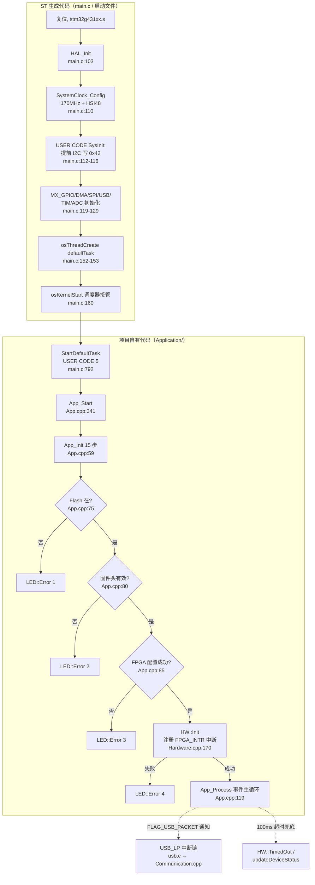

# 固件启动流程与 FreeRTOS 任务

> 本讲属于单元 5（嵌入式固件），前置讲义为 u1-l4（固件与 FPGA 工具链）。你已经知道固件镜像如何构建、组装与烧写；本讲进入固件内部，回答一个问题：**从按下电源（复位）到设备能响应 USB 命令，这颗 STM32G431 究竟经历了什么？**

## 1. 本讲目标

学完本讲，你应该能够：

1. 跟踪完整的启动序列：`复位向量 → main() → HAL/时钟/外设初始化 → FreeRTOS 调度器 → defaultTask → App_Start() → App_Init() → App_Process() 主循环`，并说出每一步所在的文件。
2. 说出固件里**只有两个 RTOS 任务**（defaultTask 与 LedStatusTask）这一事实，以及绝大多数工作其实发生在**中断上下文**里——这是理解本固件架构的关键。
3. 理解 FreeRTOS 的中断优先级约束（`configLIBRARY_MAX_SYSCALL_INTERRUPT_PRIORITY = 5`），以及固件为此设计的「二级中断分发」技巧 `STM::DispatchToInterrupt`。
4. 在庞大的 VNA_embedded 工程中一眼区分：哪些是 ST 工具生成的代码（不要手改），哪些是项目自有代码（学习的重点）。

一个小的勘误说明：大纲中实践任务写作「App::initspereported」，源码中并不存在这个符号。真实的启动函数是 `App_Start()`、`App_Init()`、`App_Process()`（见 [App.cpp](https://github.com/jankae/LibreVNA/blob/c4276df1e79c559f878ebc17e9f0bd3bd0a70f57/Software/VNA_embedded/Application/App.cpp)），本讲的流程图将以「从复位到 `App_Process()` 事件主循环开始运行」为终点。

## 2. 前置知识

### 2.1 单片机固件是什么

**单片机（MCU）** 是把 CPU、内存（Flash 存程序、SRAM 存变量）、外设（SPI/I2C/USB/定时器）集成在一颗芯片里的计算机。**固件（firmware）** 就是烧录进芯片 Flash 的程序——上电后 CPU 从固定地址（复位向量）取第一条指令，程序从此自动运行，没有操作系统安装盘，也没有 shell。

LibreVNA 的 MCU 是 **STM32G431**（ARM Cortex-M4 内核，主频最高 170MHz）。它是整台设备的「大管家」：向 FPGA 发命令、驱动射频芯片、通过 USB 与 PC 通信。

### 2.2 STM32 HAL 与 CubeMX

直接操作寄存器写 STM32 程序非常繁琐。ST 提供 **HAL（Hardware Abstraction Layer，硬件抽象层）** 库，把「配置 SPI 波特率」这类操作封装成 `HAL_SPI_Init()` 等函数。**STM32CubeMX** 是一个图形化配置工具：你在界面上点选「启用 SPI1、主机模式、8 位数据」，它就生成 `MX_SPI1_Init()` 等 C 代码。u1-l4 中提到的 STM32CubeIDE 内置了这个工具。

CubeMX 生成的代码里布满了这样的标记：

```c
/* USER CODE BEGIN Includes */
#include "App.h"          // ← 用户自己写的，夹在标记之间
/* USER CODE END Includes */
```

只有 `USER CODE BEGIN xxx` 与 `USER CODE END xxx` 之间的内容属于开发者；下次在 CubeMX 里改配置重新生成代码时，**标记外的部分会被覆盖，标记内的会被保留**。所以阅读本工程固件代码的第一个技巧就是：看一段代码在不在 USER CODE 区内，就知道它是 ST 生成的模板还是开发者有意写下的逻辑。

### 2.3 FreeRTOS 最小概念集

**FreeRTOS** 是一个开源的实时操作系统内核，核心概念只有几个：

- **任务（Task）**：相当于一个独立的线程，各有自己的栈和优先级。`xTaskCreateStatic()` 用静态分配的内存创建任务（本工程关闭了动态内存分配，全部用静态分配）。
- **调度器（Scheduler）**：`osKernelStart()` 之后，调度器按「优先级抢占 + 时间片」让任务轮流运行。`configUSE_PREEMPTION = 1` 表示高优先级任务就绪时可以立刻打断低优先级任务。
- **优先级**：数字越大优先级越高（FreeRTOS 惯例），范围 0 到 `configMAX_PRIORITIES - 1`。本工程 `configMAX_PRIORITIES = 7`，即 0～6。
- **任务通知（Task Notification）**：`xTaskNotifyFromISR()` 在中断里向指定任务发送一个 32 位值（常按位使用，每一位代表一种事件），`xTaskNotifyWait()` 在任务里等待并取走它。它比信号量/队列更轻量，是 FreeRTOS 官方推荐的「中断→任务」同步原语。
- **空闲任务（Idle Task）**：优先级 0 的系统任务，没有别的任务可运行时执行它；通过 `vApplicationIdleHook()` 钩子可以挂自己的代码。
- **中断优先级约束**（本讲重点，详见 4.3）：Cortex-M 的 NVIC 中断优先级数字**越小越优先**，这与 FreeRTOS 任务优先级恰好相反。FreeRTOS 规定：优先级数字小于 `configLIBRARY_MAX_SYSCALL_INTERRUPT_PRIORITY`（本工程为 5）的中断**禁止调用任何 FreeRTOS API**，否则可能死锁或崩溃。

### 2.4 本固件用到的外设一览

| 外设 | 用途 | 初始化位置 |
|---|---|---|
| I2C2 | Si5351C 时钟芯片等 | `MX_I2C2_Init()` |
| SPI1/SPI2 | 与 FPGA、Flash 通信 | `MX_SPI1_Init()` / `MX_SPI2_Init()` |
| USB（PCD） | 与 PC 的唯一通道 | `MX_USB_PCD_Init()` |
| TIM17 | HAL 时基（1ms 滴答） | `stm32g4xx_hal_timebase_tim.c` |
| TIM2 | LED 的 PWM 调光 | `MX_TIM2_Init()` |
| ADC1 | 片内温度传感器 | `MX_ADC1_Init()` |
| EXTI（GPIO 外部中断） | FPGA 打断 MCU 的敲门信号 | `Exti::Init()` |

## 3. 本讲源码地图

| 文件 | 归属 | 作用 |
|---|---|---|
| `Software/VNA_embedded/Src/main.c` | CubeMX 生成 + USER CODE | 程序入口：时钟、外设初始化，创建 defaultTask，启动调度器 |
| `Software/VNA_embedded/Src/app_freertos.c` | CubeMX 生成 | 空闲任务的静态内存、HardFault 调试处理 |
| `Software/VNA_embedded/Src/stm32g4xx_hal_timebase_tim.c` | ST 生成 | 用 TIM17 给 HAL 当 1ms 时基（SysTick 已让给 FreeRTOS） |
| `Software/VNA_embedded/Inc/FreeRTOSConfig.h` | CubeMX 生成（可改） | FreeRTOS 内核配置：抢占、优先级数、中断约束 |
| `Software/VNA_embedded/Application/App.h/.cpp` | 项目自有 | 固件主逻辑：`App_Start` / `App_Init` / `App_Process` |
| `Software/VNA_embedded/Application/Led.cpp` | 项目自有 | 第二个任务 LedStatusTask 与 LED 错误指示 |
| `Software/VNA_embedded/Application/Drivers/stm.hpp/.cpp` | 项目自有 | `STM::DispatchToInterrupt` 二级中断分发机制 |
| `Software/VNA_embedded/Application/Drivers/Exti.cpp` | 项目自有 | EXTI 回调注册表，FPGA 中断的入口 |
| `Software/VNA_embedded/Application/Drivers/USB/usb.c` | 项目自有 | USB 设备栈封装，收发数据的底层 |
| `Software/VNA_embedded/Application/Communication/Communication.cpp` | 项目自有 | 协议拆帧与回调分发（u4-l1 已精读） |
| `Software/VNA_embedded/Application/Hardware.cpp` | 项目自有 | 硬件门面，注册 FPGA 中断回调（u5-l2 主角，本讲只看一小段） |

记号约定：下文把 `Src/`、`Middlewares/`、`Drivers/`（芯片厂商库）统称 **ST 生成代码**，把 `Application/` 称为 **项目自有代码**。

## 4. 核心概念与源码讲解

本讲的三个最小模块：

1. CubeMX 生成代码与用户代码区
2. App 启动与任务初始化
3. 中断与同步

### 4.1 CubeMX 生成代码与用户代码区

#### 4.1.1 概念说明

`Src/main.c` 是 CubeMX 生成的骨架，但它不只是模板——开发者在 USER CODE 区里塞进了项目的「第一推动力」。理解这个文件的诀窍是**先看骨架、再看暗线**：

- **骨架**（ST 生成）：`HAL_Init → SystemClock_Config → 一串 MX_xxx_Init → 创建任务 → 启动调度器`，所有 CubeMX 工程都长这样。
- **暗线**（项目自有）：藏在各处 USER CODE 区里的三段代码，其中最关键的一行把整个项目自有代码世界（`Application/`）接入了 ST 骨架。

#### 4.1.2 核心流程

`main()` 的执行顺序（伪代码）：

```text
复位 → 启动文件(stm32g431xx.s, ST 生成) 设置栈 → SystemInit → main()
main():
    HAL_Init()                     # 复位外设、初始化 Flash 接口、配置 NVIC
    SystemClock_Config()           # HSI16 → PLL → 170MHz；启用 HSI48 给 USB
    [USER CODE SysInit]
        MX_I2C2_Init()             # 提前初始化 I2C（早于其他外设！）
        向 I2C 器件 0x42 的寄存器 0x01 写 0x09
    MX_GPIO_Init()                 # FPGA_CS/FLASH_CS/FPGA_INTR 等引脚
    MX_DMA_Init() / MX_I2C2_Init() / MX_SPI1_Init() / MX_SPI2_Init()
    MX_UCPD1_Init() / MX_USART3_UART_Init() / MX_USB_PCD_Init()
    MX_TIM1_Init() / MX_TIM2_Init() / MX_ADC1_Init()
        [USER CODE ADC1_Init 2] ADC 自校准
    osThreadStaticDef(defaultTask, StartDefaultTask, ...)   # 静态创建任务
    osThreadCreate(osThread(defaultTask), NULL)
    osKernelStart()                # 永不返回：调度器接管 CPU
```

时钟树值得算一遍。`SystemClock_Config()` 里配置 PLLM=4、PLLN=85、PLLR=2，以内部 16MHz 振荡器 HSI 为源：

\[ f_{CPU} = \frac{f_{HSI}}{PLLM} \times PLLN \div PLLR = \frac{16\,\mathrm{MHz}}{4} \times 85 \div 2 = 170\,\mathrm{MHz} \]

另外启用了 **HSI48**（48MHz 内部振荡器）专供 USB 外设——这就是为什么这块板不需要外部 USB 晶振。

还有一个容易忽略的细节：**HAL 的 1ms 时基不是 SysTick，而是 TIM17**。因为 FreeRTOS 要独占 SysTick 做自己的调度节拍（`configTICK_RATE_HZ = 1000`，即 1ms 一个 RTOS tick），CubeMX 检测到使用 FreeRTOS 时自动把 HAL 时基搬到 TIM17，配置在 [stm32g4xx_hal_timebase_tim.c:L33-L87](https://github.com/jankae/LibreVNA/blob/c4276df1e79c559f878ebc17e9f0bd3bd0a70f57/Software/VNA_embedded/Src/stm32g4xx_hal_timebase_tim.c#L33-L87)。于是固件里存在**两套 1ms 心跳**：TIM17 中断驱动 `HAL_GetTick()`（供 HAL 超时使用），SysTick 驱动 RTOS 调度。

#### 4.1.3 源码精读

**① 骨架主体与 USER CODE Includes——项目自有代码的接入口。**

[main.c:L94-L130](https://github.com/jankae/LibreVNA/blob/c4276df1e79c559f878ebc17e9f0bd3bd0a70f57/Software/VNA_embedded/Src/main.c#L94-L130)：`main()` 函数。HAL 初始化、时钟配置、一串 `MX_xxx_Init()` 都是 ST 生成的标准段落；注意 L119-L129 的外设初始化顺序由 CubeMX 按pin脚依赖自动排列。

[main.c:L24-L26](https://github.com/jankae/LibreVNA/blob/c4276df1e79c559f878ebc17e9f0bd3bd0a70f57/Software/VNA_embedded/Src/main.c#L24-L26)：USER CODE Includes 区里只有一行 `#include "App.h"`——这就是 ST 骨架与项目自有代码之间唯一的编译期连接点。

**② USER CODE SysInit——一处耐人寻味的「提前 I2C 写」。**

[main.c:L112-L116](https://github.com/jankae/LibreVNA/blob/c4276df1e79c559f878ebc17e9f0bd3bd0a70f57/Software/VNA_embedded/Src/main.c#L112-L116)：

```c
/* USER CODE BEGIN SysInit */
MX_I2C2_Init();
uint8_t ctrl = 0x09;
HAL_I2C_Mem_Write(&hi2c2, 0x42, 0x01, I2C_MEMADD_SIZE_8BIT, &ctrl, 1, 100);
/* USER CODE END SysInit */
```

在所有外设批量初始化**之前**，先单独初始化了 I2C2，并向地址 `0x42` 器件的寄存器 `0x01` 写入 `0x09`。这是全仓库唯一一处引用该地址的代码。它必须这么早执行，通常意味着这个器件影响后续外设的供电或使能（具体是哪颗芯片需对照 `Hardware/` 目录的原理图确认——**待确认**）。这个例子很好地说明了 USER CODE 区的用法：往生成代码的固定缝隙里，插进时序上有特殊要求的初始化。

**③ USER CODE ADC1_Init 2——ADC 自校准。**

[main.c:L278-L280](https://github.com/jankae/LibreVNA/blob/c4276df1e79c559f878ebc17e9f0bd3bd0a70f57/Software/VNA_embedded/Src/main.c#L278-L280)：在 `MX_ADC1_Init()` 尾部的 USER CODE 区调用 `HAL_ADCEx_Calibration_Start()`，对片内 ADC（用于读温度）做一次出厂式自校准。有趣的是 `App_Init()` 里还会再做一次（见 4.2.3），属于双保险。

**④ 任务的静态创建与调度器启动。**

[main.c:L150-L160](https://github.com/jankae/LibreVNA/blob/c4276df1e79c559f878ebc17e9f0bd3bd0a70f57/Software/VNA_embedded/Src/main.c#L150-L160)：

```c
/* definition and creation of defaultTask */
osThreadStaticDef(defaultTask, StartDefaultTask, osPriorityNormal, 0, 1024,
                  defaultTaskBuffer, &defaultTaskControlBlock);
defaultTaskHandle = osThreadCreate(osThread(defaultTask), NULL);
/* USER CODE BEGIN RTOS_THREADS */
/* USER CODE BEGIN ... */       // 各类 RTOS 对象的 USER CODE 区全部空置
/* Start scheduler */
osKernelStart();
```

三个观察点：

- 任务栈 `defaultTaskBuffer[1024]`（[main.c:L60](https://github.com/jankae/LibreVNA/blob/c4276df1e79c559f878ebc17e9f0bd3bd0a70f57/Software/VNA_embedded/Src/main.c#L60)）是 1024 个**字**（word），即 4KB 静态数组。
- 用 `osThreadStaticDef`（CMSIS-RTOS v1 封装，展开后是 `xTaskCreateStatic`，见 [cmsis_os.c:L206-L211](https://github.com/jankae/LibreVNA/blob/c4276df1e79c559f878ebc17e9f0bd3bd0a70f57/Software/VNA_embedded/Middlewares/Third_Party/FreeRTOS/Source/CMSIS_RTOS/cmsis_os.c#L206-L211)）静态创建——本工程 `configSUPPORT_STATIC_ALLOCATION = 1` 且不使用堆，运行期零动态内存。
- `osPriorityNormal` 经 [cmsis_os.c:L103-L111](https://github.com/jankae/LibreVNA/blob/c4276df1e79c559f878ebc17e9f0bd3bd0a70f57/Software/VNA_embedded/Middlewares/Third_Party/FreeRTOS/Source/CMSIS_RTOS/cmsis_os.c#L103-L111) 的映射 `fpriority = tskIDLE_PRIORITY + (p - osPriorityIdle)`，对应 FreeRTOS 优先级 **3**（0 - (-3) = 3）。
- `main.c` 里 RTOS_MUTEX/SEMAPHORES/TIMERS/QUEUES/THREADS 五个 USER CODE 区**全部空置**——固件没有用任何队列、信号量、互斥量，同步全靠任务通知（4.3 会看到）。

**⑤ StartDefaultTask——交棒的那一行。**

[main.c:L789-L799](https://github.com/jankae/LibreVNA/blob/c4276df1e79c559f878ebc17e9f0bd3bd0a70f57/Software/VNA_embedded/Src/main.c#L789-L799)：

```c
void StartDefaultTask(void const * argument)
{
  /* USER CODE BEGIN 5 */
  App_Start();
  /* Infinite loop */
  for(;;)
  {
    osDelay(1);
  }
  /* USER CODE END 5 */
}
```

`App_Start()` 内部是一个永不返回的事件循环（见 4.2），所以后面的 `for(;;)` 实际是死代码，只是 CubeMX 模板要求任务函数不能结束。**这一行 `App_Start()` 就是「ST 世界」与「项目世界」的交接点。**

**⑥ app_freertos.c——生成代码里少见的「有内容」。**

[app_freertos.c:L76-L87](https://github.com/jankae/LibreVNA/blob/c4276df1e79c559f878ebc17e9f0bd3bd0a70f57/Software/VNA_embedded/Src/app_freertos.c#L76-L87)：`vApplicationGetIdleTaskMemory()` 向内核上交空闲任务的栈和 TCB 内存——静态分配模式下内核通过这个钩子要内存。

[app_freertos.c:L93-L139](https://github.com/jankae/LibreVNA/blob/c4276df1e79c559f878ebc17e9f0bd3bd0a70f57/Software/VNA_embedded/Src/app_freertos.c#L93-L139)：`HardFault_Handler` 用内联汇编把出错的 r0-r3、r12、lr、pc、psr 从栈上搬到局部变量，然后停在 `for(;;)`。这是 FreeRTOS 官方推荐的调试写法——硬件异常（野指针、栈溢出到非法地址等）发生时，接上调试器就能直接看到崩溃现场的寄存器值，而不会在无限异常嵌套中迷失。

[app_freertos.c:L62-L73](https://github.com/jankae/LibreVNA/blob/c4276df1e79c559f878ebc17e9f0bd3bd0a70f57/Software/VNA_embedded/Src/app_freertos.c#L62-L73)：这里有一个 `__weak` 的 `vApplicationIdleHook()` 空实现——注意它是弱符号，真正的实现在项目自有代码 [Trigger.cpp:L20-L28](https://github.com/jankae/LibreVNA/blob/c4276df1e79c559f878ebc17e9f0bd3bd0a70f57/Software/VNA_embedded/Application/Trigger.cpp#L20-L28)（4.3.3 会看到它干什么）。

#### 4.1.4 代码实践

**实践目标**：不借助 IDE，仅靠文本搜索就能回答「main.c 里哪些行为是项目自有代码」。

**操作步骤**：

1. 在仓库根目录执行：`grep -n "USER CODE" Software/VNA_embedded/Src/main.c`，统计共多少对标记区。
2. 对每一对标记区，读其中的内容，填写一张三列表格：`标记名 | 是否有代码 | 代码做了什么`。
3. 验证你的判断：`git log --oneline -3 -- Software/VNA_embedded/Src/main.c` 看该文件的提交历史，再用 `git log -S "App_Start" --oneline -- Software/VNA_embedded/Src/main.c` 找到引入 `App_Start()` 的那次提交。

**需要观察的现象**：大多数 USER CODE 区是空的，只有 Includes、SysInit、ADC1_Init 2、StartDefaultTask 的 USER CODE 5 四处有实质内容——项目对生成代码的侵入非常克制。

**预期结果**：你会得到与 4.1.3 ①②③⑤ 一致的结论；`git log -S` 能定位到历史上某次提交把 `App_Start()` 写进了 USER CODE 5 区（具体 commit 信息以本地仓库输出为准，**待本地验证**）。

#### 4.1.5 小练习与答案

**练习 1**：如果开发者把 `App_Start()` 写在了 USER CODE 区**之外**（比如直接写在 `MX_ADC1_Init()` 调用之后），会发生什么？

**答案**：当下能正常编译运行，但下次任何人在 CubeMX 中改动配置并重新生成代码时，这一行会被**静默覆盖丢失**，固件将退化为一个空转的死循环且无任何报错提示。这正是 USER CODE 标记存在的意义。

**练习 2**：`main.c` 中 `HAL_TIM_PeriodElapsedCallback`（[main.c:L809-L820](https://github.com/jankae/LibreVNA/blob/c4276df1e79c559f878ebc17e9f0bd3bd0a70f57/Software/VNA_embedded/Src/main.c#L809-L820) 判断 `TIM17` 后调用 `HAL_IncTick()`）为什么存在？HAL 不是默认用 SysTick 计时吗？

**答案**：因为工程启用了 FreeRTOS，SysTick 被内核征用为调度节拍（1ms/tick）。CubeMX 因此把 HAL 时基改到 TIM17，TIM17 每 1ms 中断一次，在中断里调用该回调使 `HAL_GetTick()` 递增。固件由此有两套心跳：TIM17→HAL 时基，SysTick→RTOS 调度。

**练习 3**：`Error_Handler()`（[main.c:L826-L835](https://github.com/jankae/LibreVNA/blob/c4276df1e79c559f878ebc17e9f0bd3bd0a70f57/Software/VNA_embedded/Src/main.c#L826-L835)）的实现是关中断加死循环。为什么嵌入式系统里这是可接受的「错误处理」？

**答案**：初始化阶段（时钟、外设配置）失败意味着硬件状态不可信，继续运行可能产生不可预测的行为（如射频芯片收到乱码配置）。关中断死循环相当于「安全停车」：设备停止一切动作，等开发者接调试器检查；对测量仪器而言，宁可不动也不能乱动。

### 4.2 App 启动与任务初始化

#### 4.2.1 概念说明

跨过 `App_Start()` 这道门，就进入了 `Application/` 的世界。这一层要解决的问题：**把一颗「外设都配好但什么都没干」的芯片，变成一台「能被 PC 识别、能控制 FPGA、能测量」的 VNA**。

一个先声夺人的事实：整个固件**只有两个任务**。

| 任务 | 创建位置 | FreeRTOS 优先级 | 栈 | 职责 |
|---|---|---|---|---|
| defaultTask | [main.c:L152](https://github.com/jankae/LibreVNA/blob/c4276df1e79c559f878ebc17e9f0bd3bd0a70f57/Software/VNA_embedded/Src/main.c#L152) | 3 | 4KB | 执行 `App_Start()`：初始化一切，然后成为**事件主循环** |
| LedStatusTask | [Led.cpp:L93](https://github.com/jankae/LibreVNA/blob/c4276df1e79c559f878ebc17e9f0bd3bd0a70f57/Software/VNA_embedded/Application/Led.cpp#L93) | 6（最高） | 512B | LED 呼吸/闪烁/错误码动画，平时挂起 |

测量数据的搬运、协议处理、硬件时序**都不在任务里**，而在中断链上（4.3 详述）。defaultTask 平时睡着，有事件才被唤醒。这是一种典型的「**单任务事件驱动 + 中断为主力**」架构：避免任务间同步的复杂度，把实时性交给 NVIC。

#### 4.2.2 核心流程

`App_Init()` 的初始化序列（每步右侧是所在文件）：

```text
App_Start()                                  App.cpp
 ├─ App_Init()                               App.cpp
 │   ├─ 1. STM::Init()                       stm.cpp    ← 初始化 COMP4「二级中断」分发 FIFO
 │   ├─ 2. Delay::Init()                     delay.cpp
 │   ├─ 3. ADC 再校准                        App.cpp    ← 对应 main.c 里的那一次，双保险
 │   ├─ 4. handle = 当前任务句柄              App.cpp    ← 之后所有通知都发给 defaultTask
 │   ├─ 5. usb_init(communication_usb_input) usb.c      ← 注册 USB 收包入口，启动枚举
 │   ├─ 6. Log_Init / LED::Init / LED::Pulsating  Led.cpp ← 创建 LedStatusTask，呼吸灯=「正在启动」
 │   ├─ 7. Communication::SetCallback(USBPacketReceived) ← 完整包 → 通知 defaultTask
 │   ├─ 8. Log_SetRedirect(usb_log)          App.cpp    ← 日志也走 USB 上报
 │   ├─ 9. Exti::Init()                      Exti.cpp   ← 使能全部 EXTI 中断（优先级 1）
 │   ├─ 10. Trigger::Init(TriggerOutISR)     Trigger.cpp ← 触发输出脚的 EXTI
 │   ├─ 11. [B 版硬件] 检查 Flash → 读固件头 → FPGA::Configure()  ← 从 Flash 灌 bitstream！
 │   ├─ 12. [B 版硬件] EN_6V 打开射频供电
 │   ├─ 13. Cal::Load()                      Cal.cpp    ← 从 Flash 读设备校准
 │   ├─ 14. HW::Init()                       Hardware.cpp ← Si5351/MAX2871/衰减器全上电，注册 FPGA_INTR
 │   └─ 15. LED::Off() / sweepActive=false   ← 呼吸灯熄灭=启动完成
 └─ App_Process()                            App.cpp    ← 永不返回的事件主循环
```

对照 u1-l4 讲过的烧写流程看第 11 步：上电时 MCU 先校验外部 Flash 中的固件头（magic、CRC），合法则把其中的 FPGA bitstream 经 SPI 灌进 FPGA；任何失败都会停在对应的 `LED::Error(n)`，用户看到的是 LED 闪 n 下。也就是说 **FPGA 配置发生在 `App_Init()` 里、USB 通信能力就绪之后**——这解释了为什么第 5 步（usb_init）排得那么靠前：即使后续 FPGA 配置失败，日志和错误指示仍能通过 USB 到达 PC。

启动失败的 LED 错误码表（可在实机上对照闪烁次数定位故障）：

| 闪烁次数 | 含义 | 源码位置 |
|---|---|---|
| 1 | 板载 Flash 检测失败 | [App.cpp:L75-L78](https://github.com/jankae/LibreVNA/blob/c4276df1e79c559f878ebc17e9f0bd3bd0a70f57/Software/VNA_embedded/Application/App.cpp#L75-L78) |
| 2 | 固件头无效（magic/CRC 不过），不配置 FPGA | [App.cpp:L89-L92](https://github.com/jankae/LibreVNA/blob/c4276df1e79c559f878ebc17e9f0bd3bd0a70f57/Software/VNA_embedded/Application/App.cpp#L89-L92) |
| 3 | FPGA 配置过程失败 | [App.cpp:L85-L88](https://github.com/jankae/LibreVNA/blob/c4276df1e79c559f878ebc17e9f0bd3bd0a70f57/Software/VNA_embedded/Application/App.cpp#L85-L88) |
| 4 | `HW::Init()` 失败（射频硬件初始化） | [App.cpp:L104-L107](https://github.com/jankae/LibreVNA/blob/c4276df1e79c559f878ebc17e9f0bd3bd0a70f57/Software/VNA_embedded/Application/App.cpp#L104-L107) |

#### 4.2.3 源码精读

**① App_Start 与 App_Init 的开场。**

[App.cpp:L341-L385](https://github.com/jankae/LibreVNA/blob/c4276df1e79c559f878ebc17e9f0bd3bd0a70f57/Software/VNA_embedded/Application/App.cpp#L341-L385)：`App_Start()` 只有两个有效语句——`App_Init()` 和 `App_Process()`。中间那一大段注释掉的是开发者调试 Si5351 二本振时的实验代码，是了解「作者当初怎么调硬件」的活化石，读源码时别被它吓到。

[App.cpp:L59-L73](https://github.com/jankae/LibreVNA/blob/c4276df1e79c559f878ebc17e9f0bd3bd0a70f57/Software/VNA_embedded/Application/App.cpp#L59-L73)：

```cpp
inline void App_Init() {
	STM::Init();
	Delay::Init();
	HAL_ADCEx_Calibration_Start(&hadc1, ADC_SINGLE_ENDED);
	handle = xTaskGetCurrentTaskHandle();      // 记下 defaultTask 的句柄
	usb_init(communication_usb_input);         // USB 收包 → Communication 拆帧
	Log_Init();
	LED::Init();                                // 创建 LedStatusTask
	LED::Pulsating();                           // 呼吸灯：正在启动
	Communication::SetCallback(USBPacketReceived); // 完整协议包 → 通知本任务
	Log_SetRedirect(usb_log);                   // 日志重定向到 USB
	LOG_INFO("Start");
	Exti::Init();
	Trigger::Init(TriggerOutISR);
```

注意 `handle = xTaskGetCurrentTaskHandle()`：因为 `App_Init` 运行在 defaultTask 自己的上下文里，取「当前任务句柄」就是取 defaultTask 的句柄，存进静态变量 `handle`（[App.cpp:L30](https://github.com/jankae/LibreVNA/blob/c4276df1e79c559f878ebc17e9f0bd3bd0a70f57/Software/VNA_embedded/Application/App.cpp#L30)），之后两个 ISR 都向它发通知。这是「单任务事件驱动」架构的标准写法。

**② 条件编译：一套代码适配两版硬件。**

[App.cpp:L33-L37](https://github.com/jankae/LibreVNA/blob/c4276df1e79c559f878ebc17e9f0bd3bd0a70f57/Software/VNA_embedded/Application/App.cpp#L33-L37)：`#if HW_REVISION >= 'B'` 定义 `HAS_FLASH`——只有 B 版及以后的硬件有 MCU 可控的板载 Flash，固件升级与上电自举 FPGA 才成立。u1-l4 提过 A 版硬件 FPGA 自己从 Flash 主模式自举，对应 [App.cpp:L93-L96](https://github.com/jankae/LibreVNA/blob/c4276df1e79c559f878ebc17e9f0bd3bd0a70f57/Software/VNA_embedded/Application/App.cpp#L93-L96) 的 `#else` 分支：干脆 `vTaskDelay(2000)` 等 FPGA 自己配好。

[App.cpp:L74-L100](https://github.com/jankae/LibreVNA/blob/c4276df1e79c559f878ebc17e9f0bd3bd0a70f57/Software/VNA_embedded/Application/App.cpp#L74-L100)：

```cpp
if(!HWHAL::flash.isPresent()) {
    LOG_CRIT("Failed to detect onboard FLASH");
    LED::Error(1);
}
auto fw_info = Firmware::GetFlashContentInfo();
if(fw_info.valid) {
    if(!FPGA::Configure(fw_info.FPGA_bitstream_address, fw_info.FPGA_bitstream_size)) {
        LOG_CRIT("FPGA configuration failed");
        LED::Error(3);
    }
} else {
    LOG_CRIT("Invalid bitstream/firmware, not configuring FPGA");
    LED::Error(2);
}
#if HW_REVISION == 'B'
// Enable supply to RF circuit
EN_6V_GPIO_Port->BSRR = EN_6V_Pin;
#endif
```

这段是 u1-l4「免 JTAG 方案」的运行时现场：`FPGA::Configure` 从外部 SPI Flash 把 bitstream 灌进 FPGA。失败不 `return` 而只是点错误灯——固件选择继续活下去，让 USB 日志（第 8 步已就绪）把细节告诉 PC 端。

**③ App_Process——固件的心脏。**

[App.cpp:L119-L131](https://github.com/jankae/LibreVNA/blob/c4276df1e79c559f878ebc17e9f0bd3bd0a70f57/Software/VNA_embedded/Application/App.cpp#L119-L131)：

```cpp
inline void App_Process() {
	while(1) {
		uint32_t notification;
		if(xTaskNotifyWait(0x00, UINT32_MAX, &notification, 100) == pdPASS) {
			// something happened
			if(notification & FLAG_USB_PACKET) {
				switch(recv_packet.type) {
				case Protocol::PacketType::SweepSettings:
					LOG_INFO("New settings received");
					last_measure_packet = recv_packet;
					sweepActive = VNA::Setup(recv_packet.settings);
					Communication::SendWithoutPayload(Protocol::PacketType::Ack);
					break;
```

`xTaskNotifyWait(0x00, UINT32_MAX, &notification, 100)` 四个参数：进入时不清位、**退出时清掉全部位**（`UINT32_MAX`）、收到的值存入 `notification`、最多等 100ms。这个 100ms 超时是精心设计的：即使无任何事件，循环也会以约 10Hz 的节奏醒来执行收尾工作——[App.cpp:L329-L335](https://github.com/jankae/LibreVNA/blob/c4276df1e79c559f878ebc17e9f0bd3bd0a70f57/Software/VNA_embedded/Application/App.cpp#L329-L335) 的 `HW::TimedOut()`（测量超时后回灌 `last_measure_packet` 自动重启测量）和 `HW::updateDeviceStatus()`（温度、锁相状态等周期上报）。

中间的巨型 `switch` 是**固件的命令分发表**：u4-l1 已经从通信层看过这些 `PacketType` 如何到达；这里是其终点站。设扫描→`VNA::Setup`，设频谱→`SA::Setup`，设信号源→`Generator::Setup`，读信息→回 `DeviceInfo`，固件升级三连（`ClearFlash`/`FirmwarePacket`/`PerformFirmwareUpdate`，[App.cpp:L201-L236](https://github.com/jankae/LibreVNA/blob/c4276df1e79c559f878ebc17e9f0bd3bd0a70f57/Software/VNA_embedded/Application/App.cpp#L201-L236)）正是 u1-l4 中 GUI 升级对话框发出的那三条命令的另一端。每个分支都回 `Ack`/`Nack`，与 u4-l2 讲的「设备必须应答命令」协议约定完全对应。未支持的类型走 `default: Nack`（[App.cpp:L299-L302](https://github.com/jankae/LibreVNA/blob/c4276df1e79c559f878ebc17e9f0bd3bd0a70f57/Software/VNA_embedded/Application/App.cpp#L299-L302)）。

**④ LedStatusTask——唯一的第二个任务。**

[Led.cpp:L36-L52](https://github.com/jankae/LibreVNA/blob/c4276df1e79c559f878ebc17e9f0bd3bd0a70f57/Software/VNA_embedded/Application/Led.cpp#L36-L52)：

```cpp
static void LedStatus(void * const argument) {
	UNUSED(argument);
	while (1) {
		/* ...状态计数 led_statecnt 0..199... */
		switch (mode) {
		case Mode::Off:
			led_set_percentage(0);
			vTaskSuspend(NULL);        // 睡到有人改模式
			break;
		/* On/Error/Blink/Pulsating 各自更新 TIM2->CCR1 PWM 占空比 */
		}
		vTaskDelay(5);                  // 5ms 一帧动画
	}
}
```

LED 用 TIM2 的 PWM 调光（`led_set_percentage` 写 `TIM2->CCR1`），呼吸灯就是每 5ms 调一次占空比的三角波。Off/On 状态下任务 `vTaskSuspend(NULL)` 自我挂起，零 CPU 开销；[Led.cpp:L86-L98](https://github.com/jankae/LibreVNA/blob/c4276df1e79c559f878ebc17e9f0bd3bd0a70f57/Software/VNA_embedded/Application/Led.cpp#L86-L98) 的 `LED::Init()` 创建它后立刻挂起，等 `LED::Pulsating()` 唤醒。它优先级 6（最高），但大部分时间在睡觉或挂起——高优先级任务「几乎不运行」是这个设计的巧妙之处。注意整个文件包在 `#if HW_REVISION == 'B'` 里：A 版硬件 LED 是普通 GPIO 开关（见文件尾部的 `LED::On/Toggle`），没有动画任务。

#### 4.2.4 代码实践

**实践目标**：把 `App_Init()` 的 15 步整理成一张可检索的「启动清单」，并标注每步的失败后果。

**操作步骤**：

1. 通读 [App.cpp:L59-L117](https://github.com/jankae/LibreVNA/blob/c4276df1e79c559f878ebc17e9f0bd3bd0a70f57/Software/VNA_embedded/Application/App.cpp#L59-L117)，为每个函数调用建一行记录：`序号 | 调用 | 定义所在文件 | 失败时行为`。
2. 对其中 4 个函数（`STM::Init`、`usb_init`、`LED::Init`、`HW::Init`）跳转到定义处，确认它们各自又做了什么（`HW::Init` 很长，只看前 30 行和 [Hardware.cpp:L170](https://github.com/jankae/LibreVNA/blob/c4276df1e79c559f878ebc17e9f0bd3bd0a70f57/Software/VNA_embedded/Application/Hardware.cpp#L170) 的 `Exti::SetCallback` 即可）。
3. 回答一个排序问题：为什么 `usb_init` 在 `FPGA::Configure` 之前、`Cal::Load` 之前？把你的答案写成两三句话。

**需要观察的现象**：清单里大多数步骤没有返回值检查（如 `Cal::Load`、`Exti::Init`），只有 Flash/FPGA/HW 三处有致命错误处理——错误处理的密度体现了「哪些故障是致命的」这一设计判断。

**预期结果**：得到类似 4.2.2 的表格，但多了「定义文件」「失败行为」两列；排序问题的参考答案：USB 是设备对外的唯一诊断通道，先让它活下来，后面的任何失败都能通过日志（`Log_SetRedirect(usb_log)`）和 LED 双通道暴露给用户。

#### 4.2.5 小练习与答案

**练习 1**：固件为什么不为 VNA 测量、频谱测量、USB 通信分别建任务？三个任务不是更清晰吗？

**答案**：多任务意味着共享数据需要互斥量保护（如活动模式 `activeMode` 会被命令与测量两路读写），且切换测量模式时任务间状态交接复杂。本固件的选择是**单任务串行处理命令**（天然互斥，`App_Process` 的 switch 一次只处理一件事）＋**中断链处理实时数据**（不需要任务参与）。代价是命令处理延迟取决于主循环繁忙程度，但对毫秒级的仪器控制场景完全够用。

**练习 2**：`App_Init` 里 `LOG_INFO("Start")` 输出的日志，PC 端能在哪里看到？

**答案**：在第 8 步 `Log_SetRedirect(usb_log)` 之后的所有日志都会经 USB 的日志端点（0x82，u4-l1 讲过数据与日志分通道）上报；GUI 的设备日志窗口可以查看。这行日志出现在 USB 枚举完成、重定向设置完成之后，是「固件已启动到第 9 步附近」的标志。

**练习 3**：`last_measure_packet`（[App.cpp:L29](https://github.com/jankae/LibreVNA/blob/c4276df1e79c559f878ebc17e9f0bd3bd0a70f57/Software/VNA_embedded/Application/App.cpp#L29)）在 `App_Process` 里有两个用途，分别是什么？

**答案**：① 每收到测量类命令（SweepSettings/ManualControl/Generator/SpectrumAnalyzerSettings）就保存一份（如 [App.cpp:L128](https://github.com/jankae/LibreVNA/blob/c4276df1e79c559f878ebc17e9f0bd3bd0a70f57/Software/VNA_embedded/Application/App.cpp#L128)）；② 当 `HW::TimedOut()` 发现测量流卡死时，把它当作重放包重新注入（[App.cpp:L329-L334](https://github.com/jankae/LibreVNA/blob/c4276df1e79c559f878ebc17e9f0bd3bd0a70f57/Software/VNA_embedded/Application/App.cpp#L329-L334)），相当于自动重启最后一次测量；配合 `Communication::BlockNextAck()` 吞掉重放产生的多余 Ack，避免打乱 GUI 的单包在途协议节奏。

### 4.3 中断与同步

#### 4.3.1 概念说明

这是本讲最核心的模块。固件的实时工作全部发生在中断上下文，而**中断与任务之间的同步规则，是由 FreeRTOS 的一条红线划定的**：

> **优先级数字小于 `configLIBRARY_MAX_SYSCALL_INTERRUPT_PRIORITY`（本工程 = 5）的中断，禁止调用任何 FreeRTOS API**（包括 `xTaskNotifyFromISR`）。

原因是 FreeRTOS 靠 critical section（短暂关中断）保护内核数据，关中断只能屏蔽优先级数字 ≥ 5 的中断；如果高优先级（数字 < 5）中断里调用内核 API，恰好撞上关中断窗口就会破坏数据结构。这条红线决定了固件的中断分层设计。先把本工程用到的中断按优先级排成一列（数字越小越优先）：

| 优先级 | 中断 | 用途 | 可否调用 FreeRTOS API |
|---|---|---|---|
| 0 | USB_HP（usb.c:231） | USB 高优先级事件 | ❌ |
| 0 | TIM17（HAL 时基） | `HAL_IncTick` | ❌ |
| 1 | EXTI 全部（Exti.cpp:14-20） | FPGA 中断、触发输出 | ❌ |
| 2 | DMA1 通道 3/4（main.c:696-700） | SPI 读 FPGA 采样数据 | ❌ |
| 5 | USB_LP（usb.c:233） | USB 数据收发 | ✅（恰好在线上） |
| 6 | COMP4（stm.cpp:29） | 「二级中断」回调执行区 | ✅ |

（任务侧：defaultTask 优先级 3、LedStatusTask 优先级 6；任务优先级与中断优先级是两个独立空间，ARM Cortex-M 上所有中断都能抢占任何任务。）

于是产生一个矛盾：**FPGA 采样中断（EXTI，优先级 1）不能调用 FreeRTOS，但采样完成后的处理（推进扫描、可能要发数据）需要通知任务**。固件的解法是一个漂亮的二级分发：高优先级中断只把一个**函数指针压入 FIFO 并挂起一个低优先级中断**（COMP4，6），由后者在合法上下文里执行回调。这就是 `STM::DispatchToInterrupt`。

#### 4.3.2 核心流程

**路径 A：USB 命令包 → defaultTask（跨上下文通知）**

```text
PC 发包
 → USB 硬件收完 → USB_LP 中断(优先级5, 可调用RTOS)
 → USBD_Class_DataOut()                    usb.c:206
 → communication_usb_input()               Communication.cpp:64
 → Communication::Input(): 累积字节→DecodeBuffer 拆帧(可循环拆多包)   Communication.cpp:18
 → callback = USBPacketReceived()          App.cpp:46
     recv_packet = p;                      # 拷贝到静态变量（唯一交接物）
     xTaskNotifyFromISR(handle, FLAG_USB_PACKET, eSetBits, &woken);
     portYIELD_FROM_ISR(woken);            # 立刻切到被唤醒的任务
 → defaultTask 在 xTaskNotifyWait 醒来，按 recv_packet.type 分发     App.cpp:122-303
```

**路径 B：FPGA 采样完成 → 数据搬运 → 推进扫描（全中断，不惊动任务）**

```text
FPGA 完成一次测量，FPGA_INTR 引脚拉高
 → EXTI 上升沿中断(优先级1, 禁RTOS)
 → FPGA_Interrupt()                        Hardware.cpp:73
 → FPGA::InitiateSampleRead(ReadComplete)  # 启动 SPI+DMA 读回采样块
 → DMA1 完成(优先级2, 禁RTOS)
 → ReadComplete(result)                    Hardware.cpp:53
     → 按活动模式调 VNA/Manual/SA::MeasurementDone
     → 若需推进扫描: STM::DispatchToInterrupt(HW::Work)
 → COMP4 中断(优先级6, 允许RTOS) 排空回调FIFO
 → HW::Work() → VNA::Work(): 配置下一个扫描点/上报数据点    Hardware.cpp:78
```

**路径 C：触发输出变化 → defaultTask（EXTI 禁 RTOS，同样走二级分发）**

```text
FPGA_TRIGGER_OUT 引脚电平变化
 → EXTI(优先级1) → lambda → STM::DispatchToInterrupt(callback)   Trigger.cpp:15
 → COMP4(优先级6) 中执行 TriggerOutISR                            App.cpp:53
 → xTaskNotifyFromISR(handle, FLAG_TRIGGER_OUT_ISR) → defaultTask 处理  App.cpp:305
```

**路径 D：空闲钩子的妙用（外部参考轮询）**

`vApplicationIdleHook()`（[Trigger.cpp:L20-L28](https://github.com/jankae/LibreVNA/blob/c4276df1e79c559f878ebc17e9f0bd3bd0a70f57/Software/VNA_embedded/Application/Trigger.cpp#L20-L28)）在系统完全空闲时检查外部参考信号是否有效——不占任何定时器，也不需要任务。这覆写了 app_freertos.c 里的 `__weak` 空实现，是「生成代码留钩子、项目代码填内容」的又一例。

#### 4.3.3 源码精读

**① 红线的定义处。**

[FreeRTOSConfig.h:L113](https://github.com/jankae/LibreVNA/blob/c4276df1e79c559f878ebc17e9f0bd3bd0a70f57/Software/VNA_embedded/Inc/FreeRTOSConfig.h#L113)：`#define configLIBRARY_MAX_SYSCALL_INTERRUPT_PRIORITY 5`。同文件 [L58-L66](https://github.com/jankae/LibreVNA/blob/c4276df1e79c559f878ebc17e9f0bd3bd0a70f57/Software/VNA_embedded/Inc/FreeRTOSConfig.h#L58-L66) 是内核全貌：抢占式、静态分配、空闲钩子开启、1ms tick、7 级优先级。

[stm.hpp:L11-L15](https://github.com/jankae/LibreVNA/blob/c4276df1e79c559f878ebc17e9f0bd3bd0a70f57/Software/VNA_embedded/Application/Drivers/stm.hpp#L11-L15)：项目作者把这条规则写成了一段注释，直接解释了 `DispatchToInterrupt` 存在的原因——数据采集需要高优先级（不被 FreeRTOS 打断），但又需要触发 FreeRTOS 函数，于是「把函数指针派发到低优先级中断去执行」。

**② 二级分发的实现。**

[stm.cpp:L33-L55](https://github.com/jankae/LibreVNA/blob/c4276df1e79c559f878ebc17e9f0bd3bd0a70f57/Software/VNA_embedded/Application/Drivers/stm.cpp#L33-L55)：

```cpp
bool STM::DispatchToInterrupt(void (*cb)(void)) {
	if(callbackFifoLevel() < numCallbacks - 1) {
		callbacks[write_index] = cb;      // 函数指针入环形 FIFO（共10格）
		increment(write_index);
		HAL_NVIC_SetPendingIRQ(COMP4_IRQn); // 软件触发 COMP4 中断
		return true;
	} else {
		LOG_ERR("Interrupt dispatch queue full");
		return false;
	}
}

void COMP4_IRQHandler() {                  // 优先级6，可以安全调用 FreeRTOS
	while(callbackFifoLevel() > 0) {
		callbacks[read_index]();
		increment(read_index);
	}
}
```

实现只用了 40 行：一个 10 格的函数指针环形队列 + `HAL_NVIC_SetPendingIRQ` 软件挂起一个原本无人使用的外设中断（COMP4 比较器）。高优先级中断入队即可返回，延后几微秒回调必然被执行。这是「没有 RTOS 的高优先级世界」与「有 RTOS 的世界」之间的一座窄桥。

**③ EXTI 注册表：FPGA 如何敲门。**

[Exti.cpp:L13-L34](https://github.com/jankae/LibreVNA/blob/c4276df1e79c559f878ebc17e9f0bd3bd0a70f57/Software/VNA_embedded/Application/Drivers/Exti.cpp#L13-L34)：`Exti::Init()` 使能全部 7 组 EXTI 中断并统一设为优先级 1（红线之上）。

[Exti.cpp:L36-L74](https://github.com/jankae/LibreVNA/blob/c4276df1e79c559f878ebc17e9f0bd3bd0a70f57/Software/VNA_embedded/Application/Drivers/Exti.cpp#L36-L74)：`Exti::SetCallback()` 按「引脚号 = 数组下标」把回调登记进 `entries[16]`，同引脚重复登记即覆盖——一个极简的回调注册表。所有 `EXTIx_IRQHandler`（[Exti.cpp:L100-L137](https://github.com/jankae/LibreVNA/blob/c4276df1e79c559f878ebc17e9f0bd3bd0a70f57/Software/VNA_embedded/Application/Drivers/Exti.cpp#L100-L137)）都转发给 `ExtiHandler(pin)` 查表调用。

[Hardware.cpp:L170](https://github.com/jankae/LibreVNA/blob/c4276df1e79c559f878ebc17e9f0bd3bd0a70f57/Software/VNA_embedded/Application/Hardware.cpp#L170)：`HW::Init()` 内部把 `FPGA_Interrupt` 登记到 `FPGA_INTR` 引脚的上升沿。注意 main.c 的 `MX_GPIO_Init` 已把该引脚配成上升沿中断模式（[main.c:L751-L755](https://github.com/jankae/LibreVNA/blob/c4276df1e79c559f878ebc17e9f0bd3bd0a70f57/Software/VNA_embedded/Src/main.c#L751-L755)），Exti 这层只是接管回调——生成代码定引脚，自有代码定行为。

**④ 两个「通知发送者」。**

[App.cpp:L41-L57](https://github.com/jankae/LibreVNA/blob/c4276df1e79c559f878ebc17e9f0bd3bd0a70f57/Software/VNA_embedded/Application/App.cpp#L41-L57)：

```cpp
#define FLAG_USB_PACKET			0x01
#define FLAG_TRIGGER_OUT_ISR	0x02

static void USBPacketReceived(const Protocol::PacketInfo &p) {
	recv_packet = p;                          // 结构体整体拷贝，中断与任务间的唯一共享
	BaseType_t woken = false;
	xTaskNotifyFromISR(handle, FLAG_USB_PACKET, eSetBits, &woken);
	portYIELD_FROM_ISR(woken);                # 让被唤醒任务立即上CPU
}

static void TriggerOutISR() {
	BaseType_t woken = false;
	xTaskNotifyFromISR(handle, FLAG_TRIGGER_OUT_ISR, eSetBits, &woken);
	portYIELD_FROM_ISR(woken);
}
```

一个 32 位通知值按位拆成两种事件标志——这是任务通知替代「事件组」的典型用法。`portYIELD_FROM_ISR(woken)` 保证若唤醒的任务比被中断的任务优先级高，退出中断时立刻切换上下文，把命令处理延迟压到最低。

**⑤ USB 底层：回调在哪个上下文被调。**

[usb.c:L206-L214](https://github.com/jankae/LibreVNA/blob/c4276df1e79c559f878ebc17e9f0bd3bd0a70f57/Software/VNA_embedded/Application/Drivers/USB/usb.c#L206-L214)：`USBD_Class_DataOut` 是 USB 栈收到 OUT 包后的回调，它直接调用 `cb(usb_receive_buffer, ...)`——也就是说 `communication_usb_input → Communication::Input → USBPacketReceived` 整条链都运行在 **USB_LP 中断上下文**。USB_LP 优先级恰为 5（[usb.c:L233](https://github.com/jankae/LibreVNA/blob/c4276df1e79c559f878ebc17e9f0bd3bd0a70f57/Software/VNA_embedded/Application/Drivers/USB/usb.c#L233)），正好踩在红线上（允许调用 RTOS API），所以 `USBPacketReceived` 里的 `xTaskNotifyFromISR` 是合法的。拆帧逻辑（`DecodeBuffer` 循环，u4-l1 精读过）也因此在中断里执行——这正是它能抗粘包半包的原因之一：每次中断把缓冲区里所有完整帧都拆完才返回。

#### 4.3.4 代码实践

**实践目标**：亲手跟踪「一次 USB 命令」的完整调用链，写出函数级的序列清单。

**操作步骤**：

1. 从 [usb.c:L226-L235](https://github.com/jankae/LibreVNA/blob/c4276df1e79c559f878ebc17e9f0bd3bd0a70f57/Software/VNA_embedded/Application/Drivers/USB/usb.c#L226-L235) 出发，确认 `usb_init` 注册的回调是 `communication_usb_input`。
2. 依次跳转：`communication_usb_input`（Communication.cpp:64）→ `Communication::Input`（Communication.cpp:18）→ 回调 `USBPacketReceived`（App.cpp:46）→ `xTaskNotifyFromISR` → 任务侧 `xTaskNotifyWait`（App.cpp:122）→ `switch` 分发（App.cpp:125）。
3. 为每个函数记录：所在文件与行号、运行上下文（USB_LP 中断 / defaultTask）、跨上下文的交接物（是 `recv_packet` 静态变量）。
4. 再走一遍路径 B：`EXTI → FPGA_Interrupt → FPGA::InitiateSampleRead → ReadComplete → DispatchToInterrupt → COMP4_IRQHandler → HW::Work`，对比两条路径哪个环节用了 RTOS API、哪个没用。

**需要观察的现象**：路径 A 只有一处跨上下文交接（`recv_packet` 拷贝 + 通知），路径 B 完全不经过任务。两条路径都在「优先级数字 ≥ 5」之前避免了任何 FreeRTOS 调用。

**预期结果**：得到两张序列清单，能回答「为什么 `TriggerOutISR` 必须经过 `STM::DispatchToInterrupt` 才能发通知，而 `USBPacketReceived` 不用」——前者源头在优先级 1 的 EXTI，后者源头在优先级 5 的 USB_LP。

#### 4.3.5 小练习与答案

**练习 1**：把 EXTI 中断优先级从 1 改成 6，让 `FPGA_Interrupt` 直接调用 `xTaskNotifyFromISR`，功能上似乎也通，有什么代价？

**答案**：功能上可能正常，但采样中断的响应会被「允许调用 RTOS」的世界拖慢：优先级 6 低于 USB_LP(5)，USB 通信可以抢占采样处理；更重要的是 FreeRTOS 的 critical section（优先级 5 以上全部屏蔽）现在也能屏蔽 FPGA 中断，导致采样时序抖动。数据采集链（EXTI=1、DMA=2）刻意放在红线之上，就是为了**保证它绝不被 RTOS 和普通中断打扰**——这正是 stm.hpp 注释里写明的动机。

**练习 2**：`STM::DispatchToInterrupt` 的 FIFO 满了会怎样？什么情况下会满？

**答案**：返回 `false` 并打 `LOG_ERR("Interrupt dispatch queue full")`（stm.cpp:40-42），该回调被丢弃——测量点可能丢失但系统不崩溃。FIFO 只有 10 格，若 COMP4（优先级 6）被更高优先级中断长时间压制，或某回调执行过久，而高优先级侧又持续入队，就可能满。这是用小缓冲换简单性的典型取舍。

**练习 3**：为什么 `recv_packet` 的拷贝（App.cpp:47）是中断与任务之间唯一需要小心的共享数据，而不需要加锁？

**答案**：写入只发生在 USB_LP 中断里，读取只发生在 defaultTask 里；`xTaskNotifyFromISR` 的「唤醒」在时间上严格晚于拷贝完成（中断不可被任务抢占），且任务在读到通知之前不可能访问 `recv_packet`。这种「单一写者 + 通知同步」模式天然免锁。但它也有隐患：若两个 USB 包背靠背到达，第二次拷贝可能覆盖第一次的数据——好在拆帧与通知在同一中断里完成、任务被唤醒后优先级 3 低于中断，实践中通知总是被及时消费（这也是 `DecodeBuffer` 在一次中断里拆完所有帧的原因之一）。

## 5. 综合实践

**任务**：画出固件启动全流程图——从复位到 `App_Process()` 事件主循环开始运行，每个节点标注所在文件，并用两种「颜色」（图中用实线/虚线边框区分）标记 ST 生成代码与项目自有代码。这正是大纲要求的实践任务（终点以真实函数 `App_Process` 为准，源码中不存在 `App::initspereported` 这一符号）。

**要求**：

1. 覆盖三个阶段：main.c 阶段（复位→调度器启动）、任务入口阶段（StartDefaultTask→App_Init 15 步）、运行态（App_Process 主循环 + 两条中断路径）。
2. 至少标出 4 个 LED 错误出口（Error 1/2/3/4）。
3. 标出「ST 世界 → 项目世界」的交接点。

下面是参考答案（mermaid 版，可直接渲染；也可以手绘）：



图中实线箭头是主启动流，虚线箭头是运行态的事件来源；`USER CODE SysInit`、`StartDefaultTask` 两节点虽物理上位于 ST 生成的 main.c 内，但内容是项目自有代码——这正是「USER CODE 区」的意义所在，画图时建议用第三种样式标注这类「住在生成文件里的自有代码」。

完成后的自检清单：

- [ ] 能否不看讲义说出 `App_Start/App_Init/App_Process` 三者的调用关系？
- [ ] 能否说出两个任务的名字、优先级与创建位置？
- [ ] 能否说出 FPGA 是在启动序列的哪一步、由谁、从哪里获得 bitstream 的？
- [ ] 能否说出优先级 5 这条红线，以及 `STM::DispatchToInterrupt` 解决了什么矛盾？

## 6. 本讲小结

- **双层世界**：固件 = ST 生成的骨架（`Src/`、`Middlewares/`）+ 项目自有代码（`Application/`），两者只通过 main.c 的 USER CODE 区衔接，交接点是 `StartDefaultTask` 里的 `App_Start()`；「住在生成文件里的自有代码」共四处（Includes、SysInit、ADC 校准、任务体）。
- **启动序列**：复位 → HAL/时钟（HSI16×85÷4÷2 = 170MHz，HSI48 供 USB）→ 外设 → 创建 defaultTask → `osKernelStart()` → `App_Init()` 15 步（USB 最早、FPGA 灌 bitstream、HW::Init 最后）→ `App_Process()` 事件主循环；四档 LED 错误码对应四种致命故障。
- **两个任务撑起一切**：defaultTask（优先级 3）是唯一的事件处理者，LedStatusTask（优先级 6、512B 栈、平时挂起）只管灯；没有队列/信号量/互斥量，同步全靠 `xTaskNotify` 的位标志。
- **中断是真正的主力**：FPGA 采样链（EXTI 优先级 1 → DMA 优先级 2 → 推进扫描）完全不经过任务；USB 命令链（USB_LP 优先级 5）通过 `recv_packet` 拷贝 + 任务通知唤醒 defaultTask。
- **红线与窄桥**：`configLIBRARY_MAX_SYSCALL_INTERRUPT_PRIORITY = 5` 禁止高优先级中断调用 FreeRTOS API；`STM::DispatchToInterrupt` 用一个 10 格函数指针 FIFO + 软件挂起 COMP4 中断（优先级 6），让高优先级世界安全地触发 RTOS 操作。
- **双心跳**：TIM17 当 HAL 1ms 时基，SysTick 归 FreeRTOS 调度；`xTaskNotifyWait` 的 100ms 超时让主循环兼任 10Hz 的状态上报与超时看门狗。

## 7. 下一步学习建议

本讲只走到了 `App_Process` 的大门：命令分发表里的 `VNA::Setup`、`SA::Setup`、`Generator::Setup` 和中断链上的 `VNA::Work` 都还是黑盒。下一讲 **u5-l2（射频硬件控制：时钟、PLL 与硬件门面）** 打开最大的那个黑盒 `Hardware.cpp`：看 `HW::Init` 之后，一个抽象的测量配置如何被翻译成 Si5351C 时钟树与 MAX2871 PLL 的一串寄存器写。建议先自行浏览 [Hardware.cpp:L94-L200](https://github.com/jankae/LibreVNA/blob/c4276df1e79c559f878ebc17e9f0bd3bd0a70f57/Software/VNA_embedded/Application/Hardware.cpp#L94-L200) 建立印象，再进入下一讲。若你对中断链的终点更感兴趣，也可以先跳读 u5-l4（设备端三大模式）中 `VNA::MeasurementDone` 与 `VNA::Work` 的衔接部分，再回头补 u5-l2。
