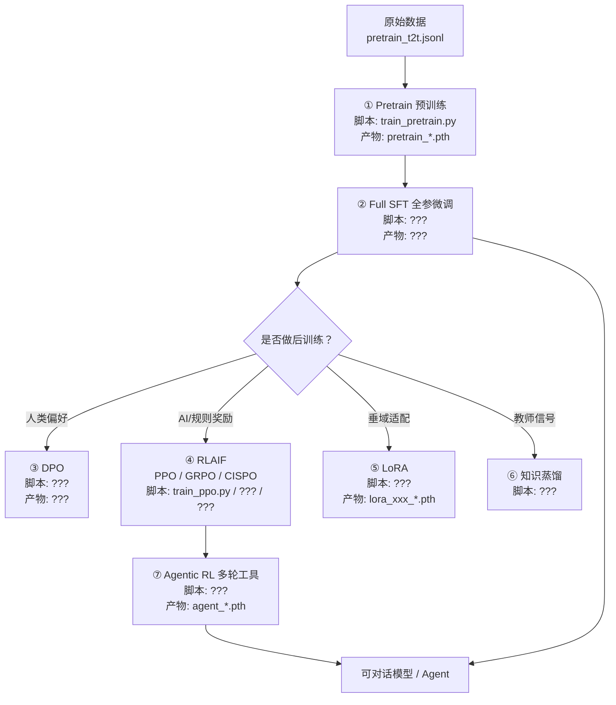

# MiniMind 是什么：项目定位与全链路全景

> 这是 MiniMind 学习手册的第一篇。本篇不写一行模型代码，而是带你「先站远一点」，看清楚 MiniMind 到底是什么、覆盖了哪些训练阶段、已经发布了哪些模型。建立全局认知之后，后续每一篇讲义才不会迷失在细节里。

---

## 1. 本讲目标

读完本讲，你应当能够：

- 用一句话说清楚 MiniMind 项目的定位与核心卖点。
- 列出项目覆盖的完整训练阶段：Pretrain / SFT / LoRA / 知识蒸馏 / DPO / PPO / GRPO / CISPO / Agentic RL。
- 说出当前主线模型 `minimind-3`（64M）与 `minimind-3-moe`（198M-A64M）的参数规模，以及它们「对齐 Qwen3 生态」的工程取向。
- 把 README 里提到的训练阶段，对应到 `trainer/` 目录下具体的训练脚本文件名。
- 理解为什么这个项目要强调「从 0 原生实现」。

---

## 2. 前置知识

本讲是全手册的起点，几乎不需要任何深度学习代码经验，但下面几个通俗概念会反复出现，先建立一个模糊印象即可，后面的讲义会逐一展开：

- **大语言模型（LLM）**：一个能根据上文「接龙」预测下一个字的大规模神经网络，ChatGPT、DeepSeek、Qwen 都属于这一类。
- **训练阶段（training stages）**：训练一个大模型不是一步完成的，而是分成「先读书学语言（Pretrain）→ 再学怎么当助手回答问题（SFT）→ 再学习人类/AI 的偏好（RLHF/RLAIF）」这样一条链路。
- **参数量（params）**：衡量模型规模的数字。`64M` 表示约 6400 万个可学习参数，相比 GPT-3（1750 亿）小了大约 2700 倍。
- **原生实现（from scratch）**：指不依赖 `transformers` / `trl` / `peft` 这类高层封装库，而是用 PyTorch 自己手写模型结构和训练算法。这是 MiniMind 最核心的设计理念。

> 如果你已经熟悉上面这些词，可以直接跳到第 4 节。

---

## 3. 本讲源码地图

本讲只读「项目说明书」，不碰模型内部代码。涉及的关键文件如下：

| 文件 | 作用 |
|------|------|
| [README.md](https://github.com/jingyaogong/minimind/blob/512eed0b6556e741d80864f054d45d271459772a/README.md) | 中文版项目说明，是 MiniMind 最完整的「自我介绍」，本讲的主要素材来源 |
| [README_en.md](https://github.com/jingyaogong/minimind/blob/512eed0b6556e741d80864f054d45d271459772a/README_en.md) | 英文版项目说明，内容与中文版对应，方便英文读者或对照术语 |

本讲引用的行号均以上述文件在当前 HEAD（`512eed0`）为准。后续讲义才会进入 `model/`、`dataset/`、`trainer/` 等目录。

---

## 4. 核心概念与源码讲解

本讲拆成三个最小模块：

- **4.1 项目介绍**：MiniMind 是什么、为什么存在、它的设计理念。
- **4.2 更新日志**：项目是如何一步步演化到今天的，重点理解 2026-04-01 的大版本更新。
- **4.3 已发布模型列表**：主线与历史模型都有哪些，参数规模如何。

### 4.1 项目介绍

#### 4.1.1 概念说明

MiniMind 是一个**从 0 开始、用 PyTorch 原生实现**的超小语言模型全链路训练项目。它的目标不是做出一个能打的工业模型，而是把「一个大模型从无到有训练出来」的整个过程，用最小、最透明的代码讲明白。

README 开篇的几条 bullet 概括了它的定位，先看原文：

> 此开源项目旨在完全从 0 开始，仅用 3 块钱成本与 2 小时训练时间，即可训练出规模约为 64M 的超小语言模型 MiniMind。
>
> MiniMind 系列极其轻量，主线最小版本体积约为 GPT-3 的 1/2700……

参见 [README.md:L34-L36](https://github.com/jingyaogong/minimind/blob/512eed0b6556e741d80864f054d45d271459772a/README.md#L34-L36)，这两行交代了三个关键数字：

- **约 64M 参数**：主线最小模型规模。
- **3 块钱 / 2 小时**：单张 RTX 3090 上跑完 SFT 一个 epoch 的实测门槛（注意这个注解在 [README.md:L42](https://github.com/jingyaogong/minimind/blob/512eed0b6556e741d80864f054d45d271459772a/README.md#L42)）。
- **GPT-3 的 1/2700**：直观感受它有多小。

#### 4.1.2 核心流程

理解 MiniMind 最重要的一点，是它**同时承担两个角色**：

1. **一个端到端可复现的 LLM 训练项目**：从分词器到模型，从预训练到强化学习，全部能跑。
2. **一套面向初学者的 LLM 入门教程**：每一行代码都尽量让你看懂，而不是依赖第三方黑盒。

这背后的设计理念可以用 README 里反复出现的一句话概括——**「大道至简」**（[README.md:L25](https://github.com/jingyaogong/minimind/blob/512eed0b6556e741d80864f054d45d271459772a/README.md#L25)）。为了兑现这一点，作者在 [README.md:L38-L39](https://github.com/jingyaogong/minimind/blob/512eed0b6556e741d80864f054d45d271459772a/README.md#L38-L39) 明确写道：

> 项目所有核心算法代码均从 0 使用 PyTorch 原生实现，不依赖第三方库提供的高层抽象接口。
>
> 这不仅是一个大语言模型全阶段开源复现项目，也是一套面向 LLM 入门与实践的教程。

为什么强调「不依赖第三方封装」？README 在「项目介绍」长文里给出了很直白的理由（[README.md:L77-L79](https://github.com/jingyaogong/minimind/blob/512eed0b6556e741d80864f054d45d271459772a/README.md#L77-L79)）：`transformers` / `trl` / `peft` 这类框架虽然「十几行代码就能跑完整条训练链路」，但高效封装也把开发者和底层实现隔离开了，削弱了真正理解 LLM 内核的机会。MiniMind 的取舍是：宁可代码长一点、慢一点，也要让你看清楚每一步在做什么。

#### 4.1.3 源码精读

「本项目包含以下内容」这一节是 MiniMind 能力清单的官方总结，建议逐条读一遍原文 [README.md:L85-L97](https://github.com/jingyaogong/minimind/blob/512eed0b6556e741d80864f054d45d271459772a/README.md#L85-L97)。把其中和「训练阶段」直接相关的几条摘出来：

> 覆盖 Pretrain、SFT、LoRA、RLHF-DPO、RLAIF（PPO / GRPO / CISPO）、Tool Use、Agentic RL、自适应思考与模型蒸馏等完整训练流程。

这句话是理解整本学习手册的「目录大纲」。把它拆开，就是后续各单元要逐个攻破的主题：

| 训练阶段 | 一句话理解 |
|---------|-----------|
| Pretrain（预训练） | 无监督地读大量文本，学会「词语接龙」 |
| SFT（监督微调） | 学会按多轮对话模板当「助手」 |
| LoRA（低秩微调） | 只训练少量新增参数，低成本适配垂域 |
| 知识蒸馏（Distillation） | 用教师模型的输出/分布来训练更小的学生模型 |
| RLHF-DPO | 用人类偏好对（chosen/rejected）做对齐 |
| RLAIF（PPO/GRPO/CISPO） | 用 AI/规则奖励做在线强化学习 |
| Tool Use / Agentic RL | 多轮工具调用、延迟奖励的智能体强化学习 |

另外两条同样值得留意（[README.md:L92-L96](https://github.com/jingyaogong/minimind/blob/512eed0b6556e741d80864f054d45d271459772a/README.md#L92-L96)）：兼容 `llama.cpp`/`vllm`/`ollama` 等推理引擎，并提供兼容 OpenAI API 协议的服务端与 Streamlit WebUI。这意味着 MiniMind 不是一个只能「自己跑给自己看」的玩具，而是能接进主流生态的。

#### 4.1.4 代码实践

> **实践目标**：用一个真实可查的方法，验证 MiniMind 主线模型的「3 块钱 / 2 小时」门槛和它的训练阶段脚本一一对应。

**操作步骤**：

1. 打开本仓库的 [README.md](https://github.com/jingyaogong/minimind/blob/512eed0b6556e741d80864f054d45d271459772a/README.md)，定位到「Ⅰ 训练开销」小节，对应 [README.md:L612-L645](https://github.com/jingyaogong/minimind/blob/512eed0b6556e741d80864f054d45d271459772a/README.md#L612-L645)。
2. 读表格里 `minimind-3` 那一行，记录 pretrain_t2t_mini、sft_t2t_mini、toolcall、RLAIF 各自的小时数与人民币成本。
3. 打开 `trainer/` 目录，确认下列脚本文件确实存在：
   - `trainer/train_pretrain.py`
   - `trainer/train_full_sft.py`
   - `trainer/train_dpo.py`
   - `trainer/train_ppo.py`
   - `trainer/train_grpo.py`
   - `trainer/train_agent.py`

**需要观察的现象**：

- README 里 `minimind-3` 的 `pretrain_t2t_mini + sft_t2t_mini` 两项时间相加大约在 2.3 小时量级（见 [README.md:L631-L634](https://github.com/jingyaogong/minimind/blob/512eed0b6556e741d80864f054d45d271459772a/README.md#L631-L634)），与开篇「2 小时」的说法基本吻合。
- 上述 6 个训练脚本都能在 `trainer/` 目录下找到真实文件。

**预期结果**：你会得到一张「训练阶段 → 脚本文件名 → 大致耗时」的对照表，亲手验证 README 的说法不是噱头，而是有脚本和耗时数据支撑的。

> 说明：本实践是「源码阅读型实践」，不要求你真的开始训练（那需要 GPU 和数据集，留给后续讲义）。

#### 4.1.5 小练习与答案

**练习 1**：README 为什么不推荐重新训练 tokenizer？请用一句话概括。
> 参考答案：词表和切分规则一旦变化，模型权重、数据格式、推理接口与社区生态兼容性都会下降，模型也更难传播（参见 [README.md:L371](https://github.com/jingyaogong/minimind/blob/512eed0b6556e741d80864f054d45d271459772a/README.md#L371)）。此外对小模型而言，过大的词表会显著拉高 embedding 层和输出层的参数占比。

**练习 2**：用你自己的话解释「从 0 原生实现」和「调用 transformers 高层 API」的区别。
> 参考答案：前者要求作者自己用 PyTorch 写出模型结构（如 Attention、RMSNorm）和训练算法（如 DPO、PPO 的损失函数），代码长但透明可学；后者只需调用 `AutoModelForCausalLM`、`DPOTrainer` 等封装好的接口，十几行就能跑通，但学习者看不到底层在做什么。

---

### 4.2 更新日志

#### 4.2.1 概念说明

更新日志（Changelog）记录了项目「为什么会变成今天这个样子」。对学习者来说，它的价值在于：能帮你分清「主线」和「历史包袱」。MiniMind 已经迭代到 `minimind-3` 系列，但仓库里仍残留 v1/v2 时代的命名与说明，如果不懂演化路径，很容易被旧信息误导。

#### 4.2.2 核心流程

MiniMind 的版本演化可以粗略划分为三段：

```
2024-08  minimind-v1 系列（108M / 26M / MoE）首次开源
   ↓
2025-02 ~ 2025-04  minimind2 系列：统一结构、对齐 transformers 命名、接入 llama.cpp/vllm/ollama
   ↓
2025-10  引入 RLAIF（PPO/GRPO/SPO）、断点续训、YaRN 外推
   ↓
2026-04  minimind-3 / minimind-3-moe：结构对齐 Qwen3，引入 Agentic RL、训推分离
```

对应原文见 [README.md:L115-L208](https://github.com/jingyaogong/minimind/blob/512eed0b6556e741d80864f054d45d271459772a/README.md#L115-L208)。

#### 4.2.3 源码精读

最重要的一条更新是 **2026-04-01** 这次大版本，原文见 [README.md:L117-L132](https://github.com/jingyaogong/minimind/blob/512eed0b6556e741d80864f054d45d271459772a/README.md#L117-L132)。它直接决定了本手册后续讲义的内容，重点提取这几条：

- **结构主线对齐 `Qwen3 / Qwen3-MoE` 生态**：Dense 约 `64M`，MoE 约 `198M-A64M`，并移除了 shared expert 设计。
- **默认训练数据切换**为 `pretrain_t2t(_mini).jsonl`、`sft_t2t(_mini).jsonl`、`rlaif.jsonl`、`agent_rl.jsonl`、`agent_rl_math.jsonl`。
- **移除独立的 `train_reason.py`**：思考能力统一由 `chat_template + <think>` 与 `open_thinking` 开关控制——这解释了为什么你在 `trainer/` 目录里找不到思考专用训练脚本。
- **toolcall 能力已混入主线 SFT 数据**：默认 `full_sft` 即具备基础 Tool Call 能力，无需再单独训一轮。
- **新增 `train_agent.py`**：原生支持多轮 Tool-Use 场景下的 GRPO / CISPO，即 Agentic RL。
- **RLAIF / Agentic RL 完成 rollout engine 解耦**：训练侧更新 policy，rollout 侧高吞吐采样，可灵活切换生成后端。

第二条值得单独记住的是 **2025-04-26**（[README.md:L149-L168](https://github.com/jingyaogong/minimind/blob/512eed0b6556e741d80864f054d45d271459772a/README.md#L149-L168)）：那一次把模型参数完全改名、对齐 transformers 库命名，并把词表从 `<s></s>` 换成 `<|im_start|><|im_end|>`，代价是不再「直接」支持更早的旧模型。这是为什么我们今天看到的特殊标记是 `<|im_start|>` 体系。

#### 4.2.4 代码实践

> **实践目标**：确认「思考能力」在当前主线里到底由哪个文件/机制负责。

**操作步骤**：

1. 在仓库根目录用文件搜索（如 `Glob` 模式 `trainer/train_*.py`）列出所有训练脚本，确认**不存在** `train_reason.py`。
2. 在 [README.md](https://github.com/jingyaogong/minimind/blob/512eed0b6556e741d80864f054d45d271459772a/README.md) 的「5.2 Adaptive Thinking」一节（[README.md:L859-L867](https://github.com/jingyaogong/minimind/blob/512eed0b6556e741d80864f054d45d271459772a/README.md#L859-L867)）里，找到「是否显式思考」是被哪个机制控制的。

**需要观察的现象**：

- `trainer/` 下只有 pretrain / full_sft / lora / distillation / dpo / ppo / grpo / agent / tokenizer 等脚本，没有 `train_reason.py`。
- 思考开关被「下沉」到了 `chat_template` 和 `open_thinking` 参数。

**预期结果**：你会得出结论——在当前主线里，「思考」不是一个独立训练阶段，而是模板层 + 推理开关的能力。这一点会贯穿后续讲义对 chat_template 的讲解。

#### 4.2.5 小练习与答案

**练习 1**：2025-04-26 那次更新「不再支持直接加载旧模型」，主要原因是什么？
> 参考答案：那次更新把模型参数完全改名、对齐 transformers 库命名，并把词表特殊标记从 `<s></s>` 换成 `<|im_start|><|im_end|>`；同时由于 Llama 位置编码方式与 minimind 存在差异，旧模型需要经过权重映射 + QKVO 线性层校准微调才能恢复（[README.md:L159-L166](https://github.com/jingyaogong/minimind/blob/512eed0b6556e741d80864f054d45d271459772a/README.md#L159-L166)）。

**练习 2**：2026-04-01 更新为什么把 toolcall 「混入」主线 SFT 数据，而不是单独训一轮？
> 参考答案：这样可以减少一条独立的训练分支，降低复现成本；默认 `full_sft` 权重即具备基础 Tool Call 能力，调用方无需再额外做一轮 Tool Calling 监督微调（[README.md:L124](https://github.com/jingyaogong/minimind/blob/512eed0b6556e741d80864f054d45d271459772a/README.md#L124)）。

---

### 4.3 已发布模型列表

#### 4.3.1 概念说明

「已发布模型列表」告诉你 MiniMind 家族里都有哪些模型、各自多大、什么时候发布的。对学习者最重要的是区分两类：

- **当前主线**：`minimind-3` 与 `minimind-3-moe`，这是本手册要逐层拆解的对象。
- **历史版本**：`minimind2`、`minimind-v1` 系列，已不再维护，了解即可。

#### 4.3.2 核心流程

README 的「已发布模型列表」原文是一张表，见 [README.md:L99-L111](https://github.com/jingyaogong/minimind/blob/512eed0b6556e741d80864f054d45d271459772a/README.md#L99-L111)。把它精简成下面这张「主线 vs 历史」对照表：

| 模型 | 参数量 | Release | 是否主线 |
|------|--------|---------|---------|
| minimind-3 | 64M | 2026.04.01 | ✅ 主线（Dense） |
| minimind-3-moe | 198M-A64M | 2026.04.01 | ✅ 主线（MoE） |
| minimind2-small | 26M | 2025.04.26 | 历史 |
| minimind2-moe | 145M | 2025.04.26 | 历史 |
| minimind2 | 104M | 2025.04.26 | 历史 |
| minimind-v1-small | 26M | 2024.08.28 | 历史 |
| minimind-v1-moe | 4×26M | 2024.09.17 | 历史 |
| minimind-v1 | 108M | 2024.09.01 | 历史 |

其中 `198M-A64M` 这种写法是 MoE 模型的典型记法：**总参数 198M，但每次推理只激活其中约 64M**（A = Active）。这正是 MoE「以更低激活参数换取更高容量」的卖点。

#### 4.3.3 源码精读

模型结构的关键参数表在 [README.md:L575-L581](https://github.com/jingyaogong/minimind/blob/512eed0b6556e741d80864f054d45d271459772a/README.md#L575-L581)，摘出主线两行：

| Model Name | params | n_layers | d_model | kv_heads | q_heads | note |
|------------|--------|----------|---------|----------|---------|------|
| minimind-3 | 64M | 8 | 768 | 4 | 8 | Dense |
| minimind-3-moe | 198M-A64M | 8 | 768 | 4 | 8 | 4 experts / top-1 |

这张表已经透露了主线模型的几项关键工程取舍（结构说明见 [README.md:L556-L566](https://github.com/jingyaogong/minimind/blob/512eed0b6556e741d80864f054d45d271459772a/README.md#L556-L566)）：

- **Decoder-Only Transformer + Qwen3 对齐**：采用 Pre-Norm + RMSNorm、SwiGLU 激活、RoPE 旋转位置编码（`rope_theta=1e6`，`max_position_embeddings=32768`）。
- **分组查询注意力 GQA**：`q_heads=8`、`kv_heads=4`，这是用更少的 KV 头来压缩 KV Cache。
- **`dim=768, n_layers=8`**：作者在 [README.md:L586-L588](https://github.com/jingyaogong/minimind/blob/512eed0b6556e741d80864f054d45d271459772a/README.md#L586-L588) 解释，这是一种工程取舍——更浅的网络训练更快，同时 `dim` 又不至于小到模式崩溃。
- **MoE 甜点配置 `4 experts / top-1`**：约只比 Dense 慢 50%，是一个「普适性 vs 性能」的现实折中。

另外，README 在「训练结果开源」一节给出了 Torch 权重的命名对照表 [README.md:L1287-L1302](https://github.com/jingyaogong/minimind/blob/512eed0b6556e741d80864f054d45d271459772a/README.md#L1287-L1302)，这张表非常关键，它把训练阶段和产物文件名绑在了一起：

- Dense：`pretrain_{hidden_size}.pth` / `full_sft_{hidden_size}.pth` / `dpo_{hidden_size}.pth` / `ppo_actor_{hidden_size}.pth` / `grpo_{hidden_size}.pth` / `agent_{hidden_size}.pth` / `lora_xxx_{hidden_size}.pth`
- MoE：在同名权重末尾追加 `_moe` 后缀。

> 记住这个命名规律：后续你看到 `full_sft_768.pth` 就知道它是「768 维 Dense 模型在全参数 SFT 后的权重」，看到 `agent_768_moe.pth` 就知道是「768 维 MoE 模型在 Agentic RL 后的权重」。

#### 4.3.4 代码实践

> **实践目标**：把「训练阶段 → 训练脚本 → 产物权重名」三者对齐，形成一张可查的速查表。

**操作步骤**：

1. 打开 [README.md:L1287-L1302](https://github.com/jingyaogong/minimind/blob/512eed0b6556e741d80864f054d45d271459772a/README.md#L1287-L1302)，记下每种训练阶段对应的 `.pth` 命名前缀。
2. 对照 `trainer/` 目录下的真实脚本文件，把下面这张表补全（留空处由你来填）：

   | 训练阶段 | 训练脚本 | 产物权重名（Dense） |
   |---------|---------|------------------|
   | 预训练 | `trainer/train_pretrain.py` | `pretrain_{dim}.pth` |
   | 全参 SFT | `trainer/train_full_sft.py` | `full_sft_{dim}.pth` |
   | LoRA | `trainer/train_lora.py` | `lora_xxx_{dim}.pth` |
   | 知识蒸馏 | `trainer/train_distillation.py` | （参考实现，见原文说明） |
   | DPO | `trainer/train_dpo.py` | `dpo_{dim}.pth` |
   | PPO | `trainer/train_ppo.py` | `ppo_actor_{dim}.pth` |
   | GRPO/CISPO | `trainer/train_grpo.py` | `grpo_{dim}.pth` |
   | Agentic RL | `trainer/train_agent.py` | `agent_{dim}.pth` |

3. 思考：`minimind-3-moe` 训练完 SFT 后，产物文件应该叫什么？
   > 预期答案：`full_sft_768_moe.pth`（在 Dense 命名基础上追加 `_moe` 后缀）。

**需要观察的现象**：你会看到训练脚本文件名、训练阶段名、权重产物名之间是高度规律对应的，这种规律性正是 MiniMind「大道至简」设计哲学的体现。

**预期结果**：得到一张可以贴在桌面的速查表，之后看任何一篇讲义里的 `xxx_768.pth`，都能立刻反推它是哪个阶段、哪种结构训出来的。

> 说明：本实践是纯阅读 + 整理型实践，无需运行任何代码。

#### 4.3.5 小练习与答案

**练习 1**：`minimind-3-moe` 标注为 `198M-A64M`，这个 `A64M` 代表什么？为什么 MoE 要这样标注？
> 参考答案：`A64M` 表示「激活参数约 64M」。MoE 模型总参数很大（198M），但每个 token 只被路由到少量专家（这里是 `4 experts / top-1`，即只激活 1 个专家），所以实际计算量接近一个 64M 的 Dense 模型，从而在「容量」和「计算成本」之间取得平衡（[README.md:L562-L566](https://github.com/jingyaogong/minimind/blob/512eed0b6556e741d80864f054d45d271459772a/README.md#L562-L566)）。

**练习 2**：为什么 README 说当前主线不再维护 `minimind-v1` 系列？
> 参考答案：2025-04-26 那次大更新统一了结构和命名、对齐了 transformers 库，并切换了词表特殊标记；这次更新「放弃对 minimind-v1 全系列的维护，并在仓库中下线」（[README.md:L165](https://github.com/jingyaogong/minimind/blob/512eed0b6556e741d80864f054d45d271459772a/README.md#L165)），所以 v1 系列属于历史包袱。

---

## 5. 综合实践

> **任务**：阅读 README，亲手绘制一张 **MiniMind 训练阶段流程图**，并在每个阶段上标注对应的训练脚本文件名与产物权重名。

这是本讲唯一需要你「动笔产出」的任务，目的是把三个最小模块（项目介绍、更新日志、已发布模型）串成一条完整的训练链路认知。

### 实践目标

产出一张你自己画的流程图（可以是纸笔、Mermaid、PPT 任意形式），要求覆盖：

1. 从「原始文本/对话数据」到「可对话 Agent 模型」的主线路径。
2. 每个阶段对应的 `trainer/train_*.py` 脚本。
3. 每个阶段产出的 `.pth` 权重名（参考 [README.md:L1287-L1302](https://github.com/jingyaogong/minimind/blob/512eed0b6556e741d80864f054d45d271459772a/README.md#L1287-L1302)）。
4. 区分「必须阶段」和「可选阶段」。

### 参考骨架（Mermaid，可直接渲染）

下面是一个可直接粘贴到 Mermaid Live Editor 渲染的参考骨架，**请你在每个 `[]` 里补全脚本名和权重名**后再渲染，作为完成证明：



### 操作步骤

1. 通读 [README.md](https://github.com/jingyaogong/minimind/blob/512eed0b6556e741d80864f054d45d271459772a/README.md) 的「Ⅱ 主要训练（必须）」与「Ⅲ 其它训练（可选）」「Ⅳ 强化学习（可选）」三节（[README.md:L669-L1276](https://github.com/jingyaogong/minimind/blob/512eed0b6556e741d80864f054d45d271459772a/README.md#L669-L1276)）。
2. 用权重命名表 [README.md:L1287-L1302](https://github.com/jingyaogong/minimind/blob/512eed0b6556e741d80864f054d45d271459772a/README.md#L1287-L1302) 填出每个阶段产物。
3. 把 Mermaid 骨架里的 `???` 全部补齐并渲染。

### 预期结果

你应当得到一张清晰的链路图，能回答这些问题：

- Pretrain 之后必须接哪个阶段才能「对话」？→ Full SFT。
- 想做垂域医疗模型，最省成本的是哪条路？→ 在 `full_sft` 基础上加 LoRA。
- 想做带工具调用的 Agent，最终走的是哪个脚本？→ `train_agent.py`。
- DPO 和 GRPO 的区别在反馈来源？→ DPO 用静态人类偏好对，GRPO 用 AI/规则奖励在线采样。

> 如果某一步你暂时无法确定（例如蒸馏阶段的产物命名），可以参考 [README.md:L735-L758](https://github.com/jingyaogong/minimind/blob/512eed0b6556e741d80864f054d45d271459772a/README.md#L735-L758)，或直接标注「待本地验证」。

---

## 6. 本讲小结

- MiniMind 是一个**从 0 用 PyTorch 原生实现**的超小语言模型（约 64M）全链路训练项目，门槛低到「3 块钱 / 2 小时」单卡可复现。
- 它同时是「可复现项目」和「入门教程」——核心卖点是**不依赖 transformers/trl/peft 的高层封装**，所有算法手写、透明可学。
- 项目覆盖完整训练阶段：**Pretrain → SFT →（LoRA / 蒸馏 / DPO / PPO / GRPO / CISPO / Agentic RL）**，这条链路就是本手册后续的目录。
- 当前主线是 **`minimind-3`（64M Dense）** 与 **`minimind-3-moe`（198M-A64M）**，结构对齐 Qwen3 生态；v1/v2 系列已成历史。
- 训练阶段、`trainer/train_*.py` 脚本、`xxx_{dim}.pth` 权重名三者高度规律对应，记住命名规律就能反推任意权重的来源。
- 2026-04-01 大版本后，「思考」不再是独立训练阶段，而是 `chat_template + <think> + open_thinking` 开关；`toolcall` 也已混入主线 SFT 数据。

---

## 7. 下一步学习建议

本讲建立的是「全景认知」，下一讲（`u1-l2 目录结构与本地运行环境搭建`）建议你继续：

1. **把项目跑起来**：阅读 [README.md:L227-L233](https://github.com/jingyaogong/minimind/blob/512eed0b6556e741d80864f054d45d271459772a/README.md#L227-L233) 的「第 0 步」，克隆仓库、安装 `requirements.txt`，用 `import torch; print(torch.cuda.is_available())` 确认后端。
2. **摸清目录结构**：对照 `model/`、`dataset/`、`trainer/`、`scripts/` 四大目录，理解每个目录在本讲流程图里扮演的角色。
3. **做一次推理**：第 3 讲（`u1-l3`）会带你用 `eval_llm.py` 体验第一次对话，那是你第一次真正「用上」MiniMind。

在进入模型内部代码（第 3 单元）之前，先保证你能：说出每个训练阶段对应的脚本名、产物名，并且能在本地把环境装好。这两件事是后续所有源码精读的前置条件。
