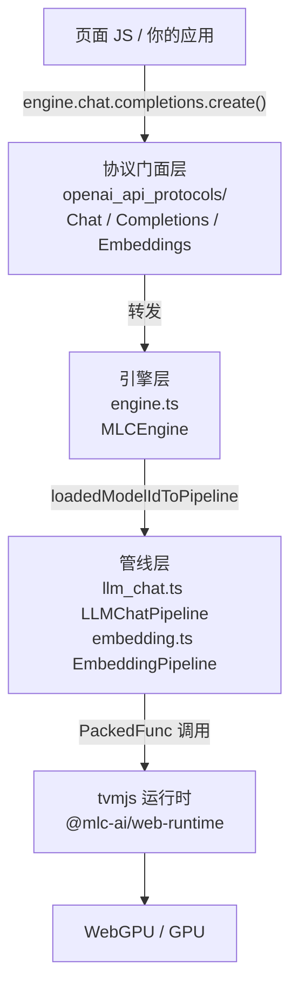

# 源码地图：目录结构与库入口 index.ts

## 1. 本讲目标

学完本讲，你应该能够：

1. 画出 web-llm 仓库的目录结构图，说出 `src/`、`examples/`、`tests/`、`docs/` 等目录各自的职责。
2. 逐段读懂库入口 [src/index.ts](https://github.com/mlc-ai/web-llm/blob/90f67096b68d3b77509c938f2221e4cef03b7d76/src/index.ts) 的全部导出，并能按「引擎类、Worker 类、配置类、缓存工具、OpenAI 协议、完整性校验」六类归类。
3. 理解 web-llm 内部的三层分层：OpenAI 协议门面层 → 引擎层（`MLCEngine`）→ 推理管线层（`LLMChatPipeline`），以及与之平行的 Worker 代理层。
4. 解释 rollup 如何把 TypeScript 源码打包成 `lib/index.js`，以及这个产物如何通过 npm 包和 CDN（esm.run）被你的页面使用。

## 2. 前置知识

本讲假设你已读过前两讲（u1-l1 项目总览、u1-l2 get-started 实战）。在此基础上补充几个概念：

- **库入口文件（barrel file）**：一个只做「重新导出」的文件，把散落在多个文件里的公开 API 汇总到一个出口。web-llm 的 `src/index.ts` 只有 63 行，几乎每行都是 `export { ... } from "./xxx"`。它的存在让你可以写 `import { CreateMLCEngine } from "@mlc-ai/web-llm"`，而不用关心 `CreateMLCEngine` 究竟定义在哪个源文件里。
- **打包器（bundler）与 rollup**：浏览器不能直接运行 TypeScript，也不能高效地加载几十个小模块文件。打包器把所有源码合并成一个（或少数几个）JavaScript 文件。web-llm 用的是 rollup，产物是单个 ESM 文件 `lib/index.js`。
- **ESM（ECMAScript Module）**：即 `import`/`export` 语法的模块标准。`package.json` 中的 `"type": "module"` 声明本包按 ESM 处理，`<script type="module">` 的页面和 CDN 的 esm.run 链接都依赖这一点。
- **门面模式（facade）**：给复杂子系统一个简化外观。`engine.chat.completions.create()` 就是典型的门面——它最终调用的还是 `engine.chatCompletion()`（u1-l2 已验证）。
- **tvmjs / PackedFunc**：TVM JS 运行时（现以 npm 包 `@mlc-ai/web-runtime` 引入），`PackedFunc` 是从 wasm 模型库里取出的可调用函数，例如 `prefill`、`decode`。本讲只在分层图里提到它，细节留到单元三。

## 3. 本讲源码地图

### 3.1 仓库根目录一览

| 目录/文件 | 作用 |
| --- | --- |
| `src/` | 库的全部 TypeScript 源码，共约 1.24 万行（`wc -l` 统计 12410 行） |
| `src/openai_api_protocols/` | OpenAI 风格请求/响应类型与门面类（chat、completion、embedding） |
| `examples/` | 28 个可运行示例（get-started、streaming、worker、vision 等），每个自带 README 与 package.json |
| `tests/` | 19 个测试文件（jest），含 mock 单测与真实加载模型的集成测试 |
| `docs/` | Sphinx 文档站源码（`conf.py`、`index.rst`、`user/`、`developer/`） |
| `site/` | GitHub Pages 用的简易站点（Hexo/Jekyll 风格 `_config.yml`） |
| `scripts/` | 辅助脚本（站点部署、依赖准备等） |
| `3rdparty/` | 目前为空目录。历史上放本地 tvmjs；现在运行时改由 npm 依赖 `@mlc-ai/web-runtime` 提供（见 [cleanup-index-js.sh:30](https://github.com/mlc-ai/web-llm/blob/90f67096b68d3b77509c938f2221e4cef03b7d76/cleanup-index-js.sh#L30) 的注释） |
| `package.json` / `rollup.config.js` / `tsconfig.json` | 构建、依赖与 lint/test 工具链配置 |
| `cleanup-index-js.sh` | 打包后对 `lib/index.js` 做文本修补的脚本（见 4.4 节） |
| `CONTRIBUTING.md` / `README.md` | 贡献指南与项目主文档 |

### 3.2 `src/` 各文件职责（按行数降序）

| 文件 | 行数 | 职责 | 是否从 index.ts 导出 |
| --- | --- | --- | --- |
| `config.ts` | 2603 | `ModelRecord`、`AppConfig`、`prebuiltAppConfig`（167 条预置模型）、`ChatOptions`、`GenerationConfig` 等全部配置类型 | 部分（9 项） |
| `llm_chat.ts` | 2286 | `LLMChatPipeline`：真正的推理管线（prefill/decode/采样/KV cache） | 否（内部层） |
| `engine.ts` | 1432 | `MLCEngine` 与 `CreateMLCEngine`：面向用户的引擎，管理多模型加载与请求分发 | 是（2 项） |
| `openai_api_protocols/chat_completion.ts` | 1227 | chat 协议类型、校验与 `Chat` 门面类 | 经 `export *` |
| `web_worker.ts` | 842 | `WebWorkerMLCEngine`（主线程代理）与 `WebWorkerMLCEngineHandler`（worker 内真身） | 是（3 项） |
| `error.ts` | 629 | 68 个错误类 | 仅 `IntegrityError` |
| `conversation.ts` | 568 | `Conversation` 对话模板：把 messages 拼成模型 prompt | 否（内部层） |
| `support.ts` | 449 | 杂项工具：模型记录查找 `findModelRecord`、函数调用 schema、图片转 ImageData 等 | 否（内部层） |
| `openai_api_protocols/completion.ts` | 381 | 文本补全协议与 `Completions` 门面类 | 经 `export *` |
| `embedding.ts` | 294 | `EmbeddingPipeline`：嵌入模型的专用管线 | 否（内部层） |
| `types.ts` | 262 | `MLCEngineInterface`、`InitProgressReport`、`LogitProcessor` 等公共接口 | 是（5 项） |
| `service_worker.ts` | 253 | Service Worker 版引擎与 Handler | 是（3 项） |
| `openai_api_protocols/embedding.ts` | 198 | 嵌入协议与 `Embeddings` 门面类 | 经 `export *` |
| `extension_service_worker.ts` | 195 | Chrome 扩展 MV3 适配（重导出为 `ExtensionServiceWorker*` 别名） | 是（3 项别名） |
| `cache_util.ts` | 194 | 缓存后端选择与查询/删除 API | 是（5 项） |
| `message.ts` | 163 | Worker 主线程↔worker 的消息协议（`WorkerRequest`/`WorkerResponse`） | 是（3 项） |
| `utils.ts` | 153 | 数组/配置对象相等性比较等纯工具 | 否 |
| `integrity.ts` | 150 | SRI 完整性校验 | 是（5 项） |
| `openai_api_protocols/index.ts` | 68 | 协议层的二级汇总出口 | 经 `export *` |
| `index.ts` | 63 | **库总入口**，本讲主角 | — |

一个值得注意的现象：**源码量最大的三个文件（config、llm_chat、engine）正好对应 web-llm 的三大复杂度来源——模型分发、推理管线、引擎编排**。后续单元的学习顺序也正是沿这条线展开的。

## 4. 核心概念与源码讲解

### 4.1 仓库目录结构总览

#### 4.1.1 概念说明

web-llm 是一个「**npm 库 + 示例集 + 文档站**」三合一的仓库：

- 发布给用户的是 **npm 包 `@mlc-ai/web-llm`**，源码在 `src/`；
- `examples/` 下每个子目录都是独立可运行的小工程（各自的 `package.json` 依赖着 npm 上的 web-llm），既是文档也是回归验证场；
- `tests/` 与 `examples/` 互补：tests 用 jest 断言行为，examples 供人肉观察行为；
- `docs/`（Sphinx）和 `site/` 是面向使用者的资料站，与源码不一致时以 `src/config.ts` 为准（u1-l1 的结论）。

#### 4.1.2 核心流程

拿到仓库后，代码从「源码」变成「用户可 import 的包」的路径是：

```text
src/*.ts（20 个 TS 文件）
   │  rollup 以 src/index.ts 为唯一入口，沿 import 依赖图收集代码
   ▼
lib/index.js + lib/index.js.map + lib/index.d.ts（单文件 ESM 产物）
   │  npm publish（package.json 的 "files": ["lib"] 只发布 lib 目录）
   ▼
npm registry → npm install / yarn add / pnpm
             → CDN（esm.run 等）→ import * as webllm from "https://esm.run/@mlc-ai/web-llm"
```

#### 4.1.3 源码精读

构建入口定义在 package.json 的 scripts 中：

- [package.json:8-14](https://github.com/mlc-ai/web-llm/blob/90f67096b68d3b77509c938f2221e4cef03b7d76/package.json#L8-L14)：五个核心脚本——`build`（rollup 打包 + 清理脚本）、`lint`、`test`（jest 带覆盖率）、`format`（prettier）、`prepare`（husky git 钩子）。这是理解仓库日常开发命令的第一站。
- [package.json:15-17](https://github.com/mlc-ai/web-llm/blob/90f67096b68d3b77509c938f2221e4cef03b7d76/package.json#L15-L17)：`"files": ["lib"]`，说明 npm 发布时**只带 lib 目录**——用户 `node_modules` 里看到的就是打包产物，不是 TS 源码。

`3rdparty/` 为空目录这一点值得展开：`.gitmodules` 也是空文件（0 字节），说明子模块已被移除。运行时改从 npm 依赖引入，见 [package.json:32-34](https://github.com/mlc-ai/web-llm/blob/90f67096b68d3b77509c938f2221e4cef03b7d76/package.json#L32-L34) 中的 `@mlc-ai/web-runtime`、`@mlc-ai/web-tokenizers`、`@mlc-ai/web-xgrammar` 三个 devDependencies——它们会被 rollup 一并打进 `lib/index.js`。

#### 4.1.4 代码实践

1. **实践目标**：亲手确认目录职责表，而不是背表格。
2. **操作步骤**：
   - 在仓库根目录运行 `ls examples/ | wc -l` 和 `ls tests/`；
   - 运行 `wc -l src/*.ts src/openai_api_protocols/*.ts | sort -rn | head -10`；
   - 打开 `examples/README.md`（[examples/README.md](https://github.com/mlc-ai/web-llm/blob/90f67096b68d3b77509c938f2221e4cef03b7d76/examples/README.md)），对照 28 个示例的简介。
3. **需要观察的现象**：`src/` 文件行数排序与本讲 3.2 表格是否一致；examples 里是否有你感兴趣的场景（如 `seed-to-reproduce`、`structural-tag-tool-use`）。
4. **预期结果**：命令输出与 3.2 节表格一致（本讲撰写时已实际运行核对）。若你 clone 的 commit 不同，行数可能有少量出入。

#### 4.1.5 小练习与答案

**练习 1**：为什么 `tests/` 下的文件不以 `src/` 的形式并入主库？

**答案**：`tests/` 是开发期质量保障，依赖 jest 与（部分测试依赖的）WebGPU 环境；而 `package.json` 的 `files` 只发布 `lib`，测试永远不会进入用户安装的包。分层上它属于仓库的工具链，不属于库的运行时代码。

**练习 2**：`3rdparty/` 是空的，那 tvmjs 运行时代码从哪来？

**答案**：从 npm 依赖 `@mlc-ai/web-runtime` 来（[package.json:32](https://github.com/mlc-ai/web-llm/blob/90f67096b68d3b77509c938f2221e4cef03b7d76/package.json#L32)），rollup 的 `nodeResolve` 插件会把它一起打包进 `lib/index.js`。[cleanup-index-js.sh:30-35](https://github.com/mlc-ai/web-llm/blob/90f67096b68d3b77509c938f2221e4cef03b7d76/cleanup-index-js.sh#L30-L35) 的注释也明确说明这些补丁是「include dependency @mlc-ai/web-runtime, rather than using local tvm_home」时引入的。

### 4.2 库入口 `src/index.ts` 导出结构

#### 4.2.1 概念说明

`src/index.ts` 是 web-llm 对外的**唯一门面**：全文件 63 行没有一行逻辑，只有 9 组 `export ... from`。它回答的问题是：「用户能 import 到什么？」反过来读它，也是快速掌握一个开源库 API 面的最快方法——比读 README 更权威，因为它就是打包入口（rollup 的 `input` 就是它）。

#### 4.2.2 核心流程

index.ts 的 9 组导出与来源模块的对应关系：

```text
src/index.ts
 ├─① config        → ModelRecord, AppConfig, OPFSAccessMode, ChatOptions,
 │                    MLCEngineConfig, GenerationConfig, ModelType,
 │                    prebuiltAppConfig, modelVersion, modelLibURLPrefix, functionCallingModelIds
 ├─② integrity      → verifyIntegrity, isValidSRI, ModelIntegrity, SRIString, FileIntegrityMap
 ├─③ error          → IntegrityError
 ├─④ types          → InitProgressCallback, InitProgressReport, MLCEngineInterface,
 │                    LogitProcessor, LogLevel
 ├─⑤ engine         → MLCEngine, CreateMLCEngine
 ├─⑥ cache_util     → hasModelInCache, deleteChatConfigInCache, deleteModelAllInfoInCache,
 │                    deleteModelWasmInCache, deleteModelInCache
 ├─⑦ web_worker     → WebWorkerMLCEngineHandler, WebWorkerMLCEngine, CreateWebWorkerMLCEngine
 ├─⑦' message       → WorkerRequest, WorkerResponse, CustomRequestParams
 ├─⑧ service_worker / extension_service_worker → Service* 三件套及 Extension* 别名
 └─⑨ openai_api_protocols/index（export *）→ Chat/Completions/Embeddings 门面 + 约 40 个协议类型
```

其中 ⑦ 与 ⑦' 配套：引擎类来自 `web_worker.ts`，消息协议类型来自 `message.ts`。

#### 4.2.3 源码精读

逐段精读（建议对照原文件）：

- [src/index.ts:1-13](https://github.com/mlc-ai/web-llm/blob/90f67096b68d3b77509c938f2221e4cef03b7d76/src/index.ts#L1-L13)：**配置类**第一组。`prebuiltAppConfig`（167 条预置模型记录）与 `modelLibURLPrefix`（wasm 模型库下载前缀）都来自这里，源头是 [src/config.ts:333-354](https://github.com/mlc-ai/web-llm/blob/90f67096b68d3b77509c938f2221e4cef03b7d76/src/config.ts#L333-L354)。u1-l1 讲过的 `ModelRecord` 三产物（model 权重、model_lib wasm、overrides）就定义在 [src/config.ts:275](https://github.com/mlc-ai/web-llm/blob/90f67096b68d3b77509c938f2221e4cef03b7d76/src/config.ts#L275)。
- [src/index.ts:15-23](https://github.com/mlc-ai/web-llm/blob/90f67096b68d3b77509c938f2221e4cef03b7d76/src/index.ts#L15-L23)：**完整性校验**。`verifyIntegrity`/`isValidSRI` 来自 [src/integrity.ts:104](https://github.com/mlc-ai/web-llm/blob/90f67096b68d3b77509c938f2221e4cef03b7d76/src/integrity.ts#L104) 与 [src/integrity.ts:148](https://github.com/mlc-ai/web-llm/blob/90f67096b68d3b77509c938f2221e4cef03b7d76/src/integrity.ts#L148)；`IntegrityError` 是 68 个错误类中唯一从入口导出的一个。
- [src/index.ts:25-31](https://github.com/mlc-ai/web-llm/blob/90f67096b68d3b77509c938f2221e4cef03b7d76/src/index.ts#L25-L31)：**公共接口类型**。`MLCEngineInterface`（[src/types.ts:62](https://github.com/mlc-ai/web-llm/blob/90f67096b68d3b77509c938f2221e4cef03b7d76/src/types.ts#L62)）是本讲 4.3 节分层的关键——所有引擎形态都实现它。
- [src/index.ts:33](https://github.com/mlc-ai/web-llm/blob/90f67096b68d3b77509c938f2221e4cef03b7d76/src/index.ts#L33)：**引擎类**，u1-l2 用过的 `CreateMLCEngine` 即由此导出。
- [src/index.ts:35-41](https://github.com/mlc-ai/web-llm/blob/90f67096b68d3b77509c938f2221e4cef03b7d76/src/index.ts#L35-L41)：**缓存工具**，5 个查询/删除函数，单元四将展开。
- [src/index.ts:43-49](https://github.com/mlc-ai/web-llm/blob/90f67096b68d3b77509c938f2221e4cef03b7d76/src/index.ts#L43-L49)：**Web Worker 类**及其消息协议。注意 [src/message.ts:137-163](https://github.com/mlc-ai/web-llm/blob/90f67096b68d3b77509c938f2221e4cef03b7d76/src/message.ts#L137-L163) 定义的 `WorkerRequest`/`WorkerResponse`：请求带 `kind`（如 `chatCompletionStreamInit`、`keepAlive`，见 [src/message.ts:20-38](https://github.com/mlc-ai/web-llm/blob/90f67096b68d3b77509c938f2221e4cef03b7d76/src/message.ts#L20-L38)）和 `uuid`，响应有 `return`/`throw`/`initProgressCallback`/`heartbeat` 四种——这是跨线程调用的「RPC 协议」。
- [src/index.ts:51-61](https://github.com/mlc-ai/web-llm/blob/90f67096b68d3b77509c938f2221e4cef03b7d76/src/index.ts#L51-L61)：**Service Worker 与扩展**。注意导出技巧：`as ExtensionServiceWorkerMLCEngineHandler` 等别名——两个文件里有**同名类**（`extension_service_worker.ts:34` 与 `service_worker.ts:38` 都叫 `ServiceWorkerMLCEngineHandler`），靠别名共存于一个命名空间。
- [src/index.ts:63](https://github.com/mlc-ai/web-llm/blob/90f67096b68d3b77509c938f2221e4cef03b7d76/src/index.ts#L63)：`export * from "./openai_api_protocols/index"`，**OpenAI 协议**全量转发。二级出口 [src/openai_api_protocols/index.ts:18-68](https://github.com/mlc-ai/web-llm/blob/90f67096b68d3b77509c938f2221e4cef03b7d76/src/openai_api_protocols/index.ts#L18-L68) 又分三段：chat（[chat_completion.ts:50](https://github.com/mlc-ai/web-llm/blob/90f67096b68d3b77509c938f2221e4cef03b7d76/src/openai_api_protocols/chat_completion.ts#L50) 的 `Chat` 门面）、completion（[completion.ts:32](https://github.com/mlc-ai/web-llm/blob/90f67096b68d3b77509c938f2221e4cef03b7d76/src/openai_api_protocols/completion.ts#L32) 的 `Completions`）、embedding（[embedding.ts:25](https://github.com/mlc-ai/web-llm/blob/90f67096b68d3b77509c938f2221e4cef03b7d76/src/openai_api_protocols/embedding.ts#L25) 的 `Embeddings`）。

一个容易忽略的推论：**`LLMChatPipeline`、`Conversation`、`error.ts` 里其余 67 个错误类都没有从入口导出**。它们是内部实现，用户代码不应直接依赖——这也意味着 web-llm 可以在不破坏 API 的情况下自由重构这些文件。

#### 4.2.4 代码实践

1. **实践目标**：不看本讲答案，独立产出「导出 → 源文件」对照表。
2. **操作步骤**：
   - 打开 [src/index.ts](https://github.com/mlc-ai/web-llm/blob/90f67096b68d3b77509c938f2221e4cef03b7d76/src/index.ts)，把每个 `export` 块的 `from` 路径抄成第一列；
   - 对每个名字，用编辑器「跳转到定义」确认真实源文件与行号（例如 `prebuiltAppConfig` → `src/config.ts:354`）；
   - 与本讲第 5 节综合实践中的参考表格比对。
3. **需要观察的现象**：`export *` 一行的展开量大（约 40 个协议类型），是否全部能在 [src/openai_api_protocols/index.ts](https://github.com/mlc-ai/web-llm/blob/90f67096b68d3b77509c938f2221e4cef03b7d76/src/openai_api_protocols/index.ts) 里找到出处。
4. **预期结果**：六类归组无遗漏、无重复；发现任何 index.ts 之外才有的导出（如 `support.ts` 的 `findModelRecord`）即记为「内部 API」。

#### 4.2.5 小练习与答案

**练习 1**：为什么 `error.ts` 有 68 个错误类，入口只导出 `IntegrityError` 一个？

**答案**：其余错误类（如 `WebGPUNotFoundError`、`ModelNotFoundError`）由引擎在运行时抛出，用户只需 `catch` 并读取 `.message`/`name`，通常不需要 `instanceof` 精确匹配，所以作者选择不把它们纳入公共 API 面；而 `IntegrityError` 配合 `verifyIntegrity`/`isValidSRI` 是用户会主动调用的功能（自定义模型配置 integrity 时需要判断校验结果），因此导出。

**练习 2**：`import { Chat } from "@mlc-ai/web-llm"` 之后 `new Chat(engine)` 能用吗？

**答案**：能。`Chat` 是从 [src/openai_api_protocols/chat_completion.ts:50-58](https://github.com/mlc-ai/web-llm/blob/90f67096b68d3b77509c938f2221e4cef03b7d76/src/openai_api_protocols/chat_completion.ts#L50-L58) 导出的公共类，构造参数是 `MLCEngineInterface`，内部持有 engine 并暴露 `completions` 子对象。但日常更自然的用法是直接用 `engine.chat`（u1-l2 已验证两者等价）。

### 4.3 engine / pipeline / worker 三层分层

#### 4.3.1 概念说明

web-llm 的运行时代码可以分为纵向三层加一个平行代理层：

1. **协议门面层**（`openai_api_protocols/`）：`Chat`/`Completions`/`Embeddings` 门面类与请求/响应类型，负责字段校验和 OpenAI 风格的调用体验。不含任何推理逻辑。
2. **引擎层**（`engine.ts` 的 `MLCEngine`）：编排者。管理「模型 id → pipeline」映射、多模型加载/卸载、每模型一把锁（防并发请求互踩）、进度回调、中断信号。
3. **管线层**（`llm_chat.ts` 的 `LLMChatPipeline` 与 `embedding.ts` 的 `EmbeddingPipeline`）：真正碰 GPU 的地方。持有 tvmjs 实例、`PackedFunc`（prefill/decode/采样）、KV cache 状态。
4. **Worker 代理层**（`web_worker.ts`、`service_worker.ts` 等）：与 1-3 平行。`WebWorkerMLCEngine` 在主线程当「遥控器」，`WebWorkerMLCEngineHandler` 在 worker 里包着一个真实 `MLCEngine`，两者按 `message.ts` 的协议通信。代理与真身实现同一个 `MLCEngineInterface`，所以页面代码**不用改一行**就能从主线程切到 worker。

#### 4.3.2 核心流程

一次「页面发起对话」的最简调用链（单元二、三会逐层展开）：

```text
页面 JS
  │ engine.chat.completions.create(...)        ← 协议门面层（openai_api_protocols）
  ▼
MLCEngine.chatCompletion(...)                  ← 引擎层（engine.ts）
  │ 取锁、校验请求、组装 GenerationConfig
  ▼
LLMChatPipeline.prefill / decode               ← 管线层（llm_chat.ts）
  │ 调 tvmjs PackedFunc 在 WebGPU 上前向
  ▼
tvmjs (@mlc-ai/web-runtime) → WebGPU → GPU
```

而引擎的诞生链是：`CreateMLCEngine(modelId)` → `new MLCEngine()` + `engine.reload(modelId)` → 在 reload 内部 `new LLMChatPipeline(tvm, tokenizer, config, logitProcessor)` → `pipeline.asyncLoadWebGPUPipelines()`（编译 shader）。

#### 4.3.3 源码精读

- [src/engine.ts:99-107](https://github.com/mlc-ai/web-llm/blob/90f67096b68d3b77509c938f2221e4cef03b7d76/src/engine.ts#L99-L107)：`CreateMLCEngine` 只有 4 行——`new MLCEngine(engineConfig)` 然后 `await engine.reload(modelId, chatOpts)`。这印证了 u1-l2 的结论：工厂函数 = 构造 + 加载。
- [src/engine.ts:115-166](https://github.com/mlc-ai/web-llm/blob/90f67096b68d3b77509c938f2221e4cef03b7d76/src/engine.ts#L115-L166)：`MLCEngine` 类头。注意三个关键成员：`chat`/`completions`/`embeddings` 三个门面（163-165 行在构造器里创建，门面持有 engine 自身）；`loadedModelIdToPipeline: Map<string, LLMChatPipeline | EmbeddingPipeline>`（126-129 行）——**引擎层对管线层的唯一持有方式**，也是多模型管理（单元七）的基础；`loadedModelIdToLock`（137 行）保证同一模型串行处理请求。
- [src/engine.ts:399-413](https://github.com/mlc-ai/web-llm/blob/90f67096b68d3b77509c938f2221e4cef03b7d76/src/engine.ts#L399-L413)：reload 中管线的实例化点。按 `modelRecord.model_type` 二选一：嵌入模型建 `EmbeddingPipeline`，否则建 `LLMChatPipeline`，随后 `await newPipeline.asyncLoadWebGPUPipelines()` 完成 WebGPU shader 异步预热，最后放进 `loadedModelIdToPipeline`。**这一段是引擎层与管线层的交界处**。
- [src/llm_chat.ts:60-108](https://github.com/mlc-ai/web-llm/blob/90f67096b68d3b77509c938f2221e4cef03b7d76/src/llm_chat.ts#L60-L108)：`LLMChatPipeline` 的字段区，能直观看到它管理的四类东西：tvmjs 运行时（`tvm`/`device`/`vm`）、PackedFunc（`prefill`/`decoding`/`image_embed`/采样函数族）、KV cache 相关函数族（`fclearKVCaches` 等）、元数据（`contextWindowSize`/`prefillChunkSize`/`stopStr`）。单元三将逐个精读。
- [src/types.ts:62-76](https://github.com/mlc-ai/web-llm/blob/90f67096b68d3b77509c938f2221e4cef03b7d76/src/types.ts#L62-L76)：`MLCEngineInterface` 的开头。它声明了 `chat`/`completions`/`embeddings` 三个门面属性——这是「代理层与真身可互换」的契约。
- [src/web_worker.ts:380-383](https://github.com/mlc-ai/web-llm/blob/90f67096b68d3b77509c938f2221e4cef03b7d76/src/web_worker.ts#L380-L383) 与 [src/web_worker.ts:401-422](https://github.com/mlc-ai/web-llm/blob/90f67096b68d3b77509c938f2221e4cef03b7d76/src/web_worker.ts#L401-L422)：`ChatWorker` 是对 Worker 的最小抽象（只要 `onmessage` + `postMessage`，这样 Service Worker 也能实现它）；`CreateWebWorkerMLCEngine` 与 `CreateMLCEngine` 形态完全一致（构造 + reload），`WebWorkerMLCEngine` 同样 `implements MLCEngineInterface`、同样暴露三个门面。对照 [src/engine.ts:99-107](https://github.com/mlc-ai/web-llm/blob/90f67096b68d3b77509c938f2221e4cef03b7d76/src/engine.ts#L99-L107) 可以看到刻意的 API 对称性。
- 继承关系（用 `git grep -n "extends WebWorkerMLCEngine"` 可自行验证）：`ServiceWorkerMLCEngine`（[src/service_worker.ts:218](https://github.com/mlc-ai/web-llm/blob/90f67096b68d3b77509c938f2221e4cef03b7d76/src/service_worker.ts#L218)）和扩展版（[src/extension_service_worker.ts:166](https://github.com/mlc-ai/web-llm/blob/90f67096b68d3b77509c938f2221e4cef03b7d76/src/extension_service_worker.ts#L166)）都继承自 `WebWorkerMLCEngine`；Handler 侧同理（[src/service_worker.ts:38](https://github.com/mlc-ai/web-llm/blob/90f67096b68d3b77509c938f2221e4cef03b7d76/src/service_worker.ts#L38)）。

#### 4.3.4 代码实践

1. **实践目标**：把三层分层画成 mermaid 图，并用 import 关系验证「依赖只能向下」。
2. **操作步骤**：
   - 在 `src/engine.ts` 头部查看 import（[src/engine.ts:1-40](https://github.com/mlc-ai/web-llm/blob/90f67096b68d3b77509c938f2221e4cef03b7d76/src/engine.ts#L1-L40) 可见它 import 了 `./llm_chat`、`./config`、`./openai_api_protocols/index`）；
   - 再看 `src/llm_chat.ts` 的 import，确认它**没有**反向 import `./engine`；
   - 把结果画成下面的 mermaid 图（可直接放进你自己的笔记渲染）。
3. **需要观察的现象**：依赖方向严格单向：门面层与管线层互不引用，都由引擎层组装。
4. **预期结果**：与你画出的图一致；如果发现反向依赖，说明你看的 commit 与本讲不同，值得去读 git log。



#### 4.3.5 小练习与答案

**练习 1**：`WebWorkerMLCEngine` 里有一份 `LLMChatPipeline` 吗？

**答案**：没有。它只持有 `worker: ChatWorker`（[src/web_worker.ts:422-423](https://github.com/mlc-ai/web-llm/blob/90f67096b68d3b77509c938f2221e4cef03b7d76/src/web_worker.ts#L422-L423)），真正持有 pipeline 的是 worker 线程里 `WebWorkerMLCEngineHandler` 包裹的那个 `MLCEngine`。代理层只做消息编解码。

**练习 2**：如果让你给 web-llm 加一个「本地模型市场」功能（列出所有预置模型），应该改哪一层？

**答案**：不需要改分层——数据已经在 `config.ts` 的 `prebuiltAppConfig.model_list` 里且已从入口导出，页面直接 `import { prebuiltAppConfig } from "@mlc-ai/web-llm"` 遍历即可。这个例子说明：入口导出过的数据层 API 往往足以支撑新功能，不必动引擎。

### 4.4 rollup 构建配置与 lib/index.js 的分发

#### 4.4.1 概念说明

`lib/index.js` 是 web-llm 真正被分发的形态：一个 sourcemap 齐全的 ESM 单文件。三个配置共同决定它的样子：

- `package.json` 的 `main`/`types`/`files` 声明「包的入口与发布范围」；
- `rollup.config.js` 声明「怎么打包」；
- `cleanup-index-js.sh` 在打包后做「文本修补」，解决打包器混入 Node 专属调用的问题。

#### 4.4.2 核心流程

```text
npm run build
  ├─ rollup -c                      # 读 rollup.config.js
  │    input: src/index.ts          # 从入口沿依赖图收集
  │    plugins:
  │      ignore(fs/path/crypto…)    # 把 Node 内置模块替换为空实现（浏览器没有它们）
  │      nodeResolve({browser:true})# 解析 npm 依赖，偏向 browser 字段
  │      commonjs                   # 把 CJS 依赖转 ESM
  │      typescript                 # 用 tsconfig.json 编译 TS（同时产出 .d.ts）
  │    output: lib/index.js (esm, named, sourcemap)
  └─ ./cleanup-index-js.sh          # sed 修补残留的 require('url')/perf_hooks/ws 等
```

#### 4.4.3 源码精读

- [rollup.config.js:6-16](https://github.com/mlc-ai/web-llm/blob/90f67096b68d3b77509c938f2221e4cef03b7d76/rollup.config.js#L6-L16)：`input: "src/index.ts"` 证实了 4.2 节的论断——index.ts 就是打包入口；输出是 `format: "es"`、`exports: "named"` 的 `lib/index.js`，带 sourcemap。
- [rollup.config.js:17-26](https://github.com/mlc-ai/web-llm/blob/90f67096b68d3b77509c938f2221e4cef03b7d76/rollup.config.js#L17-L26)：四个插件。注意 `ignore(["fs", "path", "crypto", ...])`：某些依赖（如 loglevel）会条件性引用 Node 模块，浏览器环境没有，直接替换为空实现最省事。
- [package.json:5-7](https://github.com/mlc-ai/web-llm/blob/90f67096b68d3b77509c938f2221e4cef03b7d76/package.json#L5-L7)：`"main": "lib/index.js"` + `"types": "lib/index.d.ts"` + `"type": "module"`。CDN 与打包器据此找到入口和类型。
- [cleanup-index-js.sh:1-35](https://github.com/mlc-ai/web-llm/blob/90f67096b68d3b77509c938f2221e4cef03b7d76/cleanup-index-js.sh#L1-L35)：一组 sed 替换，每段都有注释说明动机，例如第 11-17 行把 `require('url')` 的调用换成哑字符串，注释直接链接了 issue #383；第 22-35 行处理 `perf_hooks` 和 `ws`（`@mlc-ai/web-runtime` 引入后新增）。**这个脚本是「npm 库要跑在浏览器/Next.js/SvelteKit 等各种环境」的现实妥协的化石**，读注释就能学到不少打包坑。
- 使用侧：[README.md:92-105](https://github.com/mlc-ai/web-llm/blob/90f67096b68d3b77509c938f2221e4cef03b7d76/README.md#L92-L105) 给出 npm 安装与 `import * as webllm from "@mlc-ai/web-llm"`；[README.md:108-119](https://github.com/mlc-ai/web-llm/blob/90f67096b68d3b77509c938f2221e4cef03b7d76/README.md#L108-L119) 给出 CDN 用法 `import * as webllm from "https://esm.run/@mlc-ai/web-llm"`（jsdelivr 把 npm 包转成浏览器可用的 ESM URL）。两边的 `webllm` 对象内容相同，因为都源自 `lib/index.js` 的命名导出。
- 开发闭环：[README.md:460](https://github.com/mlc-ai/web-llm/blob/90f67096b68d3b77509c938f2221e4cef03b7d76/README.md#L460) 说明本地调试时把 `examples/get-started/package.json` 里的 `"@mlc-ai/web-llm": "^0.2.84"` 改成 `"../.."`，示例就会直接用仓库源码（ Parcel 会现场编译 TS），不必先发布 npm。

#### 4.4.4 代码实践

1. **实践目标**：亲眼看到「源码 → 产物」的变换。
2. **操作步骤**（两条路线任选）：
   - **路线 A（需要 Node 环境）**：`npm install` 后运行 `npm run build`，然后 `ls lib/`，用编辑器打开 `lib/index.js` 搜索 `prebuiltAppConfig` 与 `class LLMChatPipeline`，感受 1.2 万行 TS 如何变成一个文件；
   - **路线 B（源码阅读型，零依赖）**：不做本地构建，而是打开 CDN 上的产物 `https://esm.run/@mlc-ai/web-llm`（或 jsdelivr 上的 `https://cdn.jsdelivr.net/npm/@mlc-ai/web-llm/+esm`），在浏览器里查看其源码，确认能看到与 `src/` 对应的类名。
3. **需要观察的现象**：`lib/index.js` 中是否存在 `require(` 字样（被 cleanup 脚本处理过的位置应是哑字符串 `MLC_DUMMY_PATH`、`MLC_DUMMY_REQUIRE_VAR`）；`MLCEngine`、`WebWorkerMLCEngine` 等类名是否都可在产物中搜到。
4. **预期结果**：产物包含全部入口导出的类名；`perf_hooks`/`ws` 的引用被哑变量替换。路线 A 的构建耗时与警告信息：待本地验证（不同 rollup/TS 版本可能有差异）。

#### 4.4.5 小练习与答案

**练习 1**：为什么 `ignore(["fs", "path", "crypto", ...])` 不会破坏功能？

**答案**：这些 import 出现在依赖库的 Node 条件分支里，浏览器执行路径根本不会走到；rollup 的 ignore 插件只是把它们替换为空模块，避免打包阶段报「无法解析 Node 内置模块」的错误。真正会被用到的浏览器 API（WebGPU、CacheStorage、OPFS）不经过这层。

**练习 2**：如果不运行 `cleanup-index-js.sh` 直接用 `lib/index.js`，最可能在哪里出错？

**答案**：在特定宿主环境出错——例如 Chrome 扩展的 background worker（Parcel 打包时报 `createRequire` 相关问题，见脚本第 1-5 行注释）、Next.js 编译期对 `require()` 的报错（issue #383）、以及找不到 `perf_hooks`/`ws` 模块的 SSR 场景（issue #258、#127）。普通浏览器页面可能完全正常，这正是这类「补丁脚本」隐蔽的原因。

## 5. 综合实践

**任务**：产出一份《web-llm 公共 API 地图》，作为你后续阅读的随身手册。

**要求**：

1. 通读 [src/index.ts](https://github.com/mlc-ai/web-llm/blob/90f67096b68d3b77509c938f2221e4cef03b7d76/src/index.ts) 的所有导出，按「引擎类、Worker 类、配置类、缓存工具、OpenAI 协议、完整性校验」六类整理成表格，标注每个导出的源文件；
2. 用 mermaid 画出「页面 → MLCEngine → LLMChatPipeline」的一层调用关系图。

**参考答案**（先自己做，再对照）：

| 类别 | 导出项 | 源文件 |
| --- | --- | --- |
| 引擎类 | `MLCEngine`, `CreateMLCEngine`, `MLCEngineInterface`, `InitProgressCallback`, `InitProgressReport`, `LogitProcessor`, `LogLevel` | engine.ts / types.ts |
| Worker 类 | `WebWorkerMLCEngine`, `CreateWebWorkerMLCEngine`, `WebWorkerMLCEngineHandler`, `ServiceWorkerMLCEngine`, `CreateServiceWorkerMLCEngine`, `ServiceWorkerMLCEngineHandler`, `ExtensionServiceWorkerMLCEngine`, `CreateExtensionServiceWorkerMLCEngine`, `ExtensionServiceWorkerMLCEngineHandler`, `WorkerRequest`, `WorkerResponse`, `CustomRequestParams` | web_worker.ts / service_worker.ts / extension_service_worker.ts / message.ts |
| 配置类 | `ModelRecord`, `AppConfig`, `OPFSAccessMode`, `ChatOptions`, `MLCEngineConfig`, `GenerationConfig`, `ModelType`, `prebuiltAppConfig`, `modelVersion`, `modelLibURLPrefix`, `functionCallingModelIds` | config.ts |
| 缓存工具 | `hasModelInCache`, `deleteChatConfigInCache`, `deleteModelAllInfoInCache`, `deleteModelWasmInCache`, `deleteModelInCache` | cache_util.ts |
| OpenAI 协议 | `Chat`, `Completions`, `Embeddings` 门面 + `ChatCompletion*` / `Completion*` / `Embedding*` 全家族类型（约 40 项，经 `export *`） | openai_api_protocols/*.ts |
| 完整性校验 | `verifyIntegrity`, `isValidSRI`, `ModelIntegrity`, `SRIString`, `FileIntegrityMap`, `IntegrityError` | integrity.ts / error.ts |

 mermaid 调用关系图见 4.3.4 节（页面 → 门面 → `MLCEngine` → `LLMChatPipeline` → tvmjs → WebGPU）。在此基础上可再加一条平行支路：`页面 → WebWorkerMLCEngine（主线程代理）⇄ postMessage ⇄ WebWorkerMLCEngineHandler（worker 内）→ MLCEngine → …`，用不同颜色标注「跨线程边界」。

**验证方式**：把你表格里的每个名字放进 `import { ... } from "@mlc-ai/web-llm"` 的测试文件里，TypeScript 不报错即为导出无误（可在本地 get-started 工程里做，或用 CDN 版页面 + 动态 import 验证运行时可见性；运行结果待本地验证）。

## 6. 本讲小结

- 仓库是「npm 库 + 28 个示例 + 测试 + 文档站」的组合体；`src/` 约 1.24 万行，最大的三个文件 `config.ts`、`llm_chat.ts`、`engine.ts` 对应三大复杂度：模型分发、推理管线、引擎编排。
- [src/index.ts](https://github.com/mlc-ai/web-llm/blob/90f67096b68d3b77509c938f2221e4cef03b7d76/src/index.ts) 是 63 行的纯再导出门面，分 9 组：配置、完整性、错误、公共类型、引擎、缓存、Worker+消息协议、Service/Extension Worker、OpenAI 协议全量转发。
- 运行时呈三层+代理分层：协议门面层（`Chat`/`Completions`/`Embeddings`）→ 引擎层（`MLCEngine`，靠 `loadedModelIdToPipeline` 持有管线）→ 管线层（`LLMChatPipeline` 碰 GPU）；Worker 代理层与真身实现同一 `MLCEngineInterface`，页面代码可无感切换。
- 依赖方向严格单向向下，`LLMChatPipeline`、`Conversation`、绝大部分错误类都不在公共 API 面内，属可自由重构的内部实现。
- 构建链路：`npm run build` = rollup（入口 `src/index.ts` → ESM 单文件 `lib/index.js`）+ `cleanup-index-js.sh` 文本修补；npm 只发布 `lib` 目录，CDN（esm.run）与 npm 安装给用户的是同一份产物。

## 7. 下一步学习建议

下一讲（u1-l4）将钻进本讲反复出现的 `config.ts`：精读 `ModelRecord` 的字段、`AppConfig` 如何聚合模型列表与缓存配置、`ChatOptions` 如何覆盖模型默认值——这是接入自定义模型和读懂 `prebuiltAppConfig` 的地基。

在进入下一讲之前，建议你先做两件事巩固本讲：

1. 把第 5 节的 API 地图自己在编辑器里重做一遍（用「跳转到定义」而非复制本讲答案）；
2. 通读 [CONTRIBUTING.md](https://github.com/mlc-ai/web-llm/blob/90f67096b68d3b77509c938f2221e4cef03b7d76/CONTRIBUTING.md)，了解 lint/format/test 工具链——单元七讲二开路线图时会直接用到。
