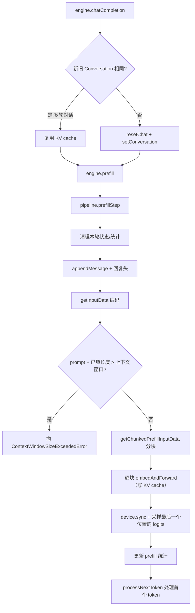

# u3-l3 prefillStep：预填充与 KV cache 写入

## 1. 本讲目标

学完本讲，你应该能够：

1. 说清楚一次请求中 prefill（预填充）阶段到底做了什么：它把整段 prompt 一次性（分块地）送入模型，写出全部位置的 KV cache，并只对**最后一个位置**的 logits 采样出第一个回复 token。
2. 解释 prefill 只取最后一个 token logits 的原因（因果语言模型 + 采样只需要一个位置）。
3. 掌握 `prefillChunkSize` 分块机制：为什么长 prompt 要切块、图片为什么不能切、`prefill_chunk_size` 在当前版本里来自哪里。
4. 追踪预填充阶段的耗时与 token 统计：`curRoundPrefillTotalTime/Tokens` 如何一路流到 `usage.extra` 的 `time_to_first_token_s` 与 `prefill_tokens_per_s`。
5. 读懂 KV cache 的写入事务：`kv_state_begin_forward` → prefill 内核 → `kv_state_end_forward`，以及 `filledKVCacheLength` 这个关键游标。

## 2. 前置知识

### 2.1 prefill 与 decode：一次生成的两段式结构

LLM 生成回复是**自回归**的：模型一次只「想」出一个 token，把它拼回输入末尾，再想下一个。于是每轮请求天然分成两段：

- **prefill（预填充）**：把整段 prompt（可能几百上千个 token）**并行**地一次性前向，为每个位置算出 Key/Value 并写入 KV cache，同时用最后一个位置的 logits 采样出**第一个**回复 token。
- **decode（解码）**：之后每次只前向 1 个 token，反复循环直到停止条件（下一讲 u3-l4 的主题）。

为什么不全部逐 token 做？因为 Transformer 的注意力可以按矩阵并行计算整段序列，prefill 吃的是「并行吞吐」，tokens/s 通常远高于 decode。你在 u2-l2 里已经观察到「首 token 延迟约等于 prefill 耗时」，本讲就下钻到管线内部看这句话为什么成立。

### 2.2 因果语言模型：为什么只需要最后一个位置的 logits

语言模型每前向一次，会在**每个**输入位置 \( i \) 上输出一套对全词表的大小为 \( V \) 的打分（logits）。但因果（causal）注意力保证位置 \( i \) 的输出只依赖 \( x_{\le i} \)：

\[ P(x_{t+1} \mid x_1, \dots, x_t) = P(x_{t+1} \mid x_{\le t}) \]

要预测「prompt 之后的下一个 token」，只有**最后一个位置** \( t = \text{seqLen}-1 \) 的 logits 有用；前面位置的 logits 对采样毫无贡献，如果对每个位置都做 softmax + 采样，会浪费 \( (\text{seqLen}-1)\times V \) 的无谓计算。所以 prefill 内核干脆只回传最后位置的 logits（batch ABI 下则由调用方显式指定要哪些位置，见 4.1.3）。

### 2.3 KV cache：用空间换时间的增量计算

注意力需要每个位置对「之前所有位置」的 Key/Value 做加权。如果没有 KV cache，每生成一个 token 都要重算整段历史。KV cache 把每层的 \( K_i, V_i \) 存下来，decode 时只需计算新 token 的 K/V 并追加。其显存占用近似为：

\[ \text{KVBytes} \approx 2 \times n_{\text{layers}} \times n_{\text{kv\_heads}} \times d_{\text{head}} \times \text{seqLen} \times b \]

其中 \( b \) 是每个元素的字节数（如 q4f16_1 模型的 KV 为 f16，\( b = 2 \)）。u3-l1 已经讲过：WebLLM 在管线构造时按窗口**一次性**分配好满分页 KV cache（`create_tir_paged_kv_cache`）；本讲关注的是**运行时如何往里写**。

### 2.4 为什么要分块（chunked prefill）

一次前向的激活显存（中间张量）随输入长度线性甚至平方增长，而 WebGPU 的 storage buffer 有 `maxStorageBufferBindingSize` 上限（u3-l1 提过）。于是把长 prompt 切成若干个不超过 `prefillChunkSize` 的块，逐块前向、逐块写 KV cache——用「多次小前向」换「可控的峰值显存」。代价是块与块之间有固定的调度与同步开销，且中间块的输出 logits 会被丢弃（它们本来就只需要最后一个位置）。

## 3. 本讲源码地图

| 文件 | 角色 | 本讲关注点 |
| --- | --- | --- |
| `src/llm_chat.ts` | 推理管线 `LLMChatPipeline` | `prefillStep` 主流程、`embedAndForward`、`invokePrefill`、`getInputData`、统计字段 |
| `src/engine.ts` | 引擎层 `MLCEngine` | `engine.prefill` 的多轮判定、`_generate`/`asyncGenerate` 中 prefill 的位置、`usage.extra` 组装 |
| `src/support.ts` | 工具函数 | `getChunkedPrefillInputData` 分块算法 |

调用层次回顾（承接 u1-l3 / u3-l1）：页面 → `MLCEngine`（协议门面与编排）→ `LLMChatPipeline`（本讲主角）→ tvmjs `PackedFunc`（WebGPU 内核）。

## 4. 核心概念与源码讲解

### 4.1 prefillStep 主循环：从消息到第一个 token

#### 4.1.1 概念说明

`prefillStep` 是管线的「开场动作」：给定本轮用户（或 tool）输入，它完成**一轮生成的全部前置工作**——把新消息追加进 Conversation（u3-l2）、把 prompt 编码成 token、分块送入模型前向、写 KV cache、采样出第一个回复 token，并把该 token 交给 `processNextToken` 做停止判定与消息拼接。

要点：`prefillStep` 只产出**一个** token。后续 token 由引擎反复调用 `decodeStep` 产出。所以「prefill 慢」直接表现为用户等待第一个字出现（TTFT）。

#### 4.1.2 核心流程

```text
engine.chatCompletion / completion（流式或非流式）
  └─ engine.prefill(input, pipeline, chatConfig, genConfig)     # 多轮判定 + 提取最后一条消息
       └─ pipeline.prefillStep(input_str, msgRole, input_role_str, genConfig)
            0. 守卫：msgRole 必须是 user 或 tool
            -1. 若有 response_format：异步初始化 GrammarMatcher（与 prefill 并行，隐藏开销）
            0.  conversation.appendMessage + appendReplyHeader；getInputData() 编码 prompt
                （全量 getPromptArray 或增量 getPromptArrayLastRound；图片留作 ImageURL）
            1.  getChunkedPrefillInputData(inputData, prefillChunkSize) → chunks[]
            2.  for 每个 chunk：embedAndForward(chunk, chunkLen)   # 写 KV cache，返回该块最后位置 logits
            4.  await Promise.all([device.sync(), grammarInitPromise]) → sampleTokenFromLogits(logits)
                → processNextToken(nextToken)（停止判定，见 u3-l4）
```

用 mermaid 画出来（本讲实践要求你亲手画一遍，这里给出参考答案）：



#### 4.1.3 源码精读

**入口守卫与每轮状态清理。** `prefillStep` 的签名要求消息角色必须是 `user` 或 `tool`，否则抛 `MessageOrderError`；随后清空上一轮遗留的输出状态（`outputIds`、`outputMessage`、`appearedTokensFreq`、logprob 数组、本轮统计），并启动计时器：

- [src/llm_chat.ts:L722-L737](https://github.com/mlc-ai/web-llm/blob/90f67096b68d3b77509c938f2221e4cef03b7d76/src/llm_chat.ts#L722-L737) — 函数签名、角色守卫、`resetStatsPerPrefill` 决定是否清空累计统计。
- [src/llm_chat.ts:L739-L758](https://github.com/mlc-ai/web-llm/blob/90f67096b68d3b77509c938f2221e4cef03b7d76/src/llm_chat.ts#L739-L758) — 清理本轮输出与统计字段，`tstart = performance.now()` 开始计时。

**GrammarMatcher 与 prefill 并行。** 如果请求带 `response_format`（JSON mode / grammar / structural tag，详见 u6-l3），初始化 GrammarMatcher 可能耗时；源码用一个不 await 的 Promise 把它与 prefill **重叠**执行，最后在第 4 步 `Promise.all` 汇合，从而隐藏这部分开销：

- [src/llm_chat.ts:L763-L831](https://github.com/mlc-ai/web-llm/blob/90f67096b68d3b77509c938f2221e4cef03b7d76/src/llm_chat.ts#L763-L831) — 命中缓存则 `grammarMatcher.reset()` 复用；否则在 Promise 内编译语法并创建 matcher。
- [src/llm_chat.ts:L887-L891](https://github.com/mlc-ai/web-llm/blob/90f67096b68d3b77509c938f2221e4cef03b7d76/src/llm_chat.ts#L887-L891) — `await Promise.all([this.device.sync(), grammarMatcherInitPromise])` 后才采样。

**追加消息并编码 prompt。** 非文本补全路径把新输入追加进 Conversation 并放上 assistant 回复头（u3-l2 讲过的「undefined 哨兵」）；随后 `getInputData()` 按「KV cache 是否为空」决定全量还是增量编码，并做上下文窗口检查：

- [src/llm_chat.ts:L833-L851](https://github.com/mlc-ai/web-llm/blob/90f67096b68d3b77509c938f2221e4cef03b7d76/src/llm_chat.ts#L833-L851) — 文本补全直接设 `conversation.prompt`；chat 路径 `appendMessage` + `appendReplyHeader`；随后调用 `getInputData()`。
- [src/llm_chat.ts:L2026-L2045](https://github.com/mlc-ai/web-llm/blob/90f67096b68d3b77509c938f2221e4cef03b7d76/src/llm_chat.ts#L2026-L2045) — `getInputData` 内部：文本补全要求 KV cache 为空（`TextCompletionExpectsKVEmptyError`）；chat 路径在 `filledKVCacheLength === 0` 时用全量 `getPromptArray`（可拼 `system_prefix_token_ids`），否则用增量 `getPromptArrayLastRound`。
- [src/llm_chat.ts:L2085-L2118](https://github.com/mlc-ai/web-llm/blob/90f67096b68d3b77509c938f2221e4cef03b7d76/src/llm_chat.ts#L2085-L2118) — 编码循环：文本段 `tokenizer.encode` 累加进 `curTokens`；遇到图片则把已积累的 token 数组与 `ImageURL` 依次压入返回数组（图片不编码，留待 `image_embed` 处理，见 u3-l6）。
- [src/llm_chat.ts:L2124-L2133](https://github.com/mlc-ai/web-llm/blob/90f67096b68d3b77509c938f2221e4cef03b7d76/src/llm_chat.ts#L2124-L2133) — 编码完成后检查 `numPromptTokens + filledKVCacheLength > contextWindowSize` 即抛 `ContextWindowSizeExceededError`（滑动窗口模型不受此限）。

**分块循环与不变量校验。** prompt 数据交给 `getChunkedPrefillInputData` 切块后，主循环逐块调用 `embedAndForward`（4.3 详述），并用 `filledKVCacheLength` 的增量做一致性断言；循环结束后丢弃中间块的 logits，只保留最后一块的：

- [src/llm_chat.ts:L859-L866](https://github.com/mlc-ai/web-llm/blob/90f67096b68d3b77509c938f2221e4cef03b7d76/src/llm_chat.ts#L859-L866) — 分块调用，得到 `chunks` 与每块长度 `chunkLens`。
- [src/llm_chat.ts:L868-L885](https://github.com/mlc-ai/web-llm/blob/90f67096b68d3b77509c938f2221e4cef03b7d76/src/llm_chat.ts#L868-L885) — `for` 循环逐块前向；`logits` 每轮被覆盖，只剩最后一块的；`filledKVCacheLength !== prevFilledLen + chunkLen` 时抛内部错误；循环后清空 `imageDataCache`。

**采样与统计。** 同步 GPU、等 grammar 初始化，采样第一个 token，最后把整段 prefill 的耗时与 token 数累计进统计：

- [src/llm_chat.ts:L894-L899](https://github.com/mlc-ai/web-llm/blob/90f67096b68d3b77509c938f2221e4cef03b7d76/src/llm_chat.ts#L894-L899) — `prefillTotalTime/Tokens`（累计）与 `curRoundPrefill*`（本轮）更新；`processNextToken(nextToken)` 做停止判定并写 `outputMessage`。

**「只取最后一个位置 logits」的直接证据。** u3-l1 讲过管线会按模型 ABI 绑定 `prefill` 或 `batch_prefill` 内核。两种 ABI 都只索取最后位置的 logits：

- [src/llm_chat.ts:L1528-L1537](https://github.com/mlc-ai/web-llm/blob/90f67096b68d3b77509c938f2221e4cef03b7d76/src/llm_chat.ts#L1528-L1537) — `single` ABI：`this.prefill(embeddings, state, params)`，内核契约即「只返回序列末位置的 logits」。
- [src/llm_chat.ts:L1540-L1566](https://github.com/mlc-ai/web-llm/blob/90f67096b68d3b77509c938f2221e4cef03b7d76/src/llm_chat.ts#L1540-L1566) — `batch` ABI：调用方显式传入 `prefillLogitPositions` 张量，代码里写死 `prefillLogitPositionHost[0] = inputDataLen - 1`——**只要该块最后一个位置**的 logits。这正是 2.2 节原理的代码落点。

**引擎侧的调用位置。** prefill 在两类生成路径里都只执行一次：

- [src/engine.ts:L457-L479](https://github.com/mlc-ai/web-llm/blob/90f67096b68d3b77509c938f2221e4cef03b7d76/src/engine.ts#L457-L479) — 非流式 `_generate`：`await this.prefill(...)` 一次，之后 `while (!pipeline.stopped())` 循环 decode。注意 `interruptSignal` 只在 decode 循环里被检查——**prefill 一旦开始就会跑完整个 prompt**，中断最快也要等 prefill 结束才生效。
- [src/engine.ts:L608-L619](https://github.com/mlc-ai/web-llm/blob/90f67096b68d3b77509c938f2221e4cef03b7d76/src/engine.ts#L608-L619) — 流式 `asyncGenerate`：prefill 后立刻 `_getChunk(pipeline)` 产出**首个 chunk** 并 yield——这就是「首帧 ≈ TTFT ≈ prefill 耗时」的代码依据。
- [src/engine.ts:L1366-L1424](https://github.com/mlc-ai/web-llm/blob/90f67096b68d3b77509c938f2221e4cef03b7d76/src/engine.ts#L1366-L1424) — `engine.prefill`：用 `compareConversationObject` 比对新旧会话决定复用还是重置（u2-l2 讲过多轮 KV 复用，此处是它的实现现场）；chat 请求取最后一条消息作为本轮输入，completion 请求则每次 `resetChat()`。

#### 4.1.4 代码实践：标注调用链 + 观察日志

1. **实践目标**：把 4.1.2 的流程图与真实源码逐行对上，并在浏览器控制台里亲眼看到 prefill 的发生。
2. **操作步骤**：
   - 运行 `examples/get-started`（步骤见 u1-l2：`npm install` 后 `npm start`，用支持 WebGPU 的浏览器打开 `localhost:8888`）。
   - 在 `examples/get-started/src/get_started.ts` 创建引擎处加上 `logLevel: "INFO"`（参照 `examples/get-started-latency-breakdown/src/get_started_latency_breakdown.ts` 的写法）：
     ```ts
     // 示例代码：基于 get-started 修改
     const engine = await webllm.CreateMLCEngine(selectedModel, {
       initProgressCallback,
       logLevel: "INFO",
     });
     ```
   - 发起两轮对话（第二轮沿用第一轮的 messages 历史并追加新 user 消息）。
3. **需要观察的现象**：控制台会出现 `Using prefillChunkSize: ...`（模型库 metadata 里的分块大小）；第二轮会出现 `Multiround chatting, reuse KVCache.`。
4. **预期结果**：第二轮的 `usage.prompt_tokens` 明显小于第一轮（只计增量）——这是 `getPromptArrayLastRound` 增量编码（[src/llm_chat.ts:L2042-L2044](https://github.com/mlc-ai/web-llm/blob/90f67096b68d3b77509c938f2221e4cef03b7d76/src/llm_chat.ts#L2042-L2044)）的直接体现。具体数值与日志文案随浏览器/模型而异，待本地验证。
5. 然后对照 4.1.3 的各个链接行号，在源码里从 `engine.prefill` 一路点到 `invokePrefill`，确认流程图每个框对应的函数。

#### 4.1.5 小练习与答案

**练习 1**：为什么 `prefillStep` 的采样只针对最后一块的 logits？中间块的 logits 去哪了？
答案：因果模型中只有最后一个位置的 logits 对「下一个 token」的预测有意义（2.2 节）；分块循环中 `logits` 变量每轮被 `embedAndForward` 的返回值覆盖（[src/llm_chat.ts:L871-L883](https://github.com/mlc-ai/web-llm/blob/90f67096b68d3b77509c938f2221e4cef03b7d76/src/llm_chat.ts#L871-L883)），中间块的返回值自然丢弃；且内核本来就只算最后位置的 logits（single ABI 契约 / batch ABI 的 `inputDataLen - 1`），中间块并没有产生全位置 logits 的浪费。

**练习 2**：如果用户在 prefill 进行中点击「停止」（`interruptGenerate`），prefill 会被立刻打断吗？
答案：不会。`interruptSignal` 只在 decode 循环每轮开始处被检查（[src/engine.ts:L471-L477](https://github.com/mlc-ai/web-llm/blob/90f67096b68d3b77509c938f2221e4cef03b7d76/src/engine.ts#L471-L477)），prefill 是一个完整的 `await`，必须跑完整个 prompt（所有块）之后，第一次 decode 前中断才生效。

**练习 3**：`prefillStep` 开头为什么要清空 `appearedTokensFreq`？
答案：它是 frequency/presence penalty 与 repetition penalty 的输入（u3-l5 主题），统计「到目前出现了哪些 token」。注释标明它在每次 `prefillStep` 后刷新——新一轮请求的历史 token 不应计入惩罚（[src/llm_chat.ts:L114-L115](https://github.com/mlc-ai/web-llm/blob/90f67096b68d3b77509c938f2221e4cef03b7d76/src/llm_chat.ts#L114-L115)、[src/llm_chat.ts:L740-L742](https://github.com/mlc-ai/web-llm/blob/90f67096b68d3b77509c938f2221e4cef03b7d76/src/llm_chat.ts#L740-L742)）。

### 4.2 分块与统计上报：`getChunkedPrefillInputData` 与 prefill 指标

#### 4.2.1 概念说明

**分块**解决「一次前向的峰值显存/缓冲上限」问题（2.4 节）：贪心地往当前块里塞数据，塞满 `prefillChunkSize` 就封块，直到耗尽全部输入。文本 token 数组可以被随意切开；图片的 embedding 是一个不可分割的整体，块装不下就得另起一块——若图片本身的 embedding 比 `prefillChunkSize` 还大，直接抛 `PrefillChunkSizeSmallerThanImageError`（u3-l6 会再遇到它）。

**统计上报**需要先澄清一个事实：在当前 HEAD（`90f6709`）的源码里，**不存在逐块的 prefill 进度回调**——全仓检索不到 per-chunk progress 相关代码。prefill 的「进度/性能上报」由三层构成：

1. 过程日志：loglevel INFO 输出 `Using prefillChunkSize`、`Multiround chatting, reuse KVCache.` 等；
2. 管线统计：`prefillStep` 末尾一次性写入 `curRoundPrefillTotalTokens/Time`（本轮）与 `prefillTotalTokens/Time`（累计）；
3. 引擎汇总：非流式与流式（`stream_options.include_usage`）路径把这些统计组装进 `usage.extra`，字段包括 `time_to_first_token_s`、`prefill_tokens_per_s`。

还有一个容易踩的坑：**`prefill_chunk_size` 现在来自模型库 metadata（wasm 内部），而不是 ChatConfig/AppConfig**。管线从 VM 的 `_metadata()` 里读它（[src/llm_chat.ts:L352-L357](https://github.com/mlc-ai/web-llm/blob/90f67096b68d3b77509c938f2221e4cef03b7d76/src/llm_chat.ts#L352-L357)），`src/config.ts` 中已无此字段——因此**无法通过 appConfig 的 overrides 把它调小**。想改分块大小，需要在 MLC LLM 侧重新编译模型库时指定（待本地验证；见 4.2.4）。

#### 4.2.2 核心流程

分块算法（贪心）伪代码：

```text
curChunk, curChunkLen = [], 0
for 每段数据 d（token 数组或图片）:
    len(d) = token 数 或 图片 embedding 大小
    若 d 是图片且 len(d) > prefillChunkSize: 抛 PrefillChunkSizeSmallerThanImageError
    1) 若 curChunkLen + len(d) <= prefillChunkSize:
           放入 curChunk；恰好装满则封块
    2) 否则:
           2.1) token 数组: 反复切出「剩余空间」大小的切片填块，直到切完
           2.2) 图片: 先封掉当前块，图片独占新块
收尾: 剩余 curChunk 作为最后一块
```

统计的数据流：

```text
prefillStep 末尾: curRoundPrefillTotalTokens/Time += promptLen / 耗时
      │ (同时累计 prefillTotalTokens/Time)
      ▼
pipeline.getCurRoundPrefillTotalTime() / getCurRoundPrefillTokensPerSec()
      ▼
engine 非流式: usage.extra = { time_to_first_token_s: prefill_time,
                               prefill_tokens_per_s: prompt_tokens / prefill_time, ... }
engine 流式:   末尾 usage chunk 携带同样的 extra（需 stream_options.include_usage）
```

#### 4.2.3 源码精读

**分块函数本体（`src/support.ts`）**：

- [src/support.ts:L285-L305](https://github.com/mlc-ai/web-llm/blob/90f67096b68d3b77509c938f2221e4cef03b7d76/src/support.ts#L285-L305) — 入口：返回 `[chunks, chunkLens]`；图片大于块直接抛 `PrefillChunkSizeSmallerThanImageError`。
- [src/support.ts:L305-L316](https://github.com/mlc-ai/web-llm/blob/90f67096b68d3b77509c938f2221e4cef03b7d76/src/support.ts#L305-L316) — 情形 1：当前数据能放进本块就放入，装满即封块。
- [src/support.ts:L318-L337](https://github.com/mlc-ai/web-llm/blob/90f67096b68d3b77509c938f2221e4cef03b7d76/src/support.ts#L318-L337) — 情形 2.1：token 数组用 `slice` 循环切片填块。
- [src/support.ts:L338-L357](https://github.com/mlc-ai/web-llm/blob/90f67096b68d3b77509c938f2221e4cef03b7d76/src/support.ts#L338-L357) — 情形 2.2：图片不可切，先封当前块、图片独占新块。
- [src/support.ts:L359-L365](https://github.com/mlc-ai/web-llm/blob/90f67096b68d3b77509c938f2221e4cef03b7d76/src/support.ts#L359-L365) — 最后一块收尾。
- [src/support.ts:L258-L277](https://github.com/mlc-ai/web-llm/blob/90f67096b68d3b77509c938f2221e4cef03b7d76/src/support.ts#L258-L277) — 作者注释：贪心策略与 mlc-llm 对齐，并用一个 2048 块 + 两张图的例子说明当前切法未必最优（可能多一次 embedding 内核），但「更直观、更通用」。

**块大小从哪来**：

- [src/llm_chat.ts:L352-L357](https://github.com/mlc-ai/web-llm/blob/90f67096b68d3b77509c938f2221e4cef03b7d76/src/llm_chat.ts#L352-L357) — `this.prefillChunkSize = metadata.prefill_chunk_size`，来自模型库 `_metadata()`，非正数直接抛 `MinValueError`。
- [src/llm_chat.ts:L426-L440](https://github.com/mlc-ai/web-llm/blob/90f67096b68d3b77509c938f2221e4cef03b7d76/src/llm_chat.ts#L426-L440) — 创建分页 KV cache 时把 `prefillChunkSize` 作为参数传入（决定单次前向的预留规模）——块大小影响的不只是循环次数，还有 KV cache 的构造参数。

**统计的写入与读取**：

- [src/llm_chat.ts:L892-L897](https://github.com/mlc-ai/web-llm/blob/90f67096b68d3b77509c938f2221e4cef03b7d76/src/llm_chat.ts#L892-L897) — prefill 计时结束（`tend`），同时更新累计与本轮两组统计。
- [src/llm_chat.ts:L593-L609](https://github.com/mlc-ai/web-llm/blob/90f67096b68d3b77509c938f2221e4cef03b7d76/src/llm_chat.ts#L593-L609) — `getCurRoundPrefillTotalTokens/TotalTime` 读取器，供引擎组装 usage。
- [src/llm_chat.ts:L636-L658](https://github.com/mlc-ai/web-llm/blob/90f67096b68d3b77509c938f2221e4cef03b7d76/src/llm_chat.ts#L636-L658) — `runtimeStatsText` / `curRoundRuntimeStatsText` 输出 `prefill: x tokens/sec` 文本（`engine.runtimeStatsText` 已标记将弃用，[src/engine.ts:L1315-L1323](https://github.com/mlc-ai/web-llm/blob/90f67096b68d3b77509c938f2221e4cef03b7d76/src/engine.ts#L1315-L1323)，推荐用 usage.extra）。

**引擎侧组装 `usage.extra`**：

- [src/engine.ts:L909-L916](https://github.com/mlc-ai/web-llm/blob/90f67096b68d3b77509c938f2221e4cef03b7d76/src/engine.ts#L909-L916) — 非流式：每个 choice（`n`）各跑一次 `_generate`，逐个累加 `prompt_tokens`、`prefill_time` 等。
- [src/engine.ts:L925-L934](https://github.com/mlc-ai/web-llm/blob/90f67096b68d3b77509c938f2221e4cef03b7d76/src/engine.ts#L925-L934) — 非流式 `defaultExtra`：`time_to_first_token_s: prefill_time`、`prefill_tokens_per_s: prompt_tokens / prefill_time`。注意 `n > 1` 时多个 choice 的 prefill 时间被**求和**，TTFT 语义会有偏差。
- [src/engine.ts:L703-L744](https://github.com/mlc-ai/web-llm/blob/90f67096b68d3b77509c938f2221e4cef03b7d76/src/engine.ts#L703-L744) — 流式：只有 `stream_options.include_usage` 为真时，在流末尾追加一个 `choices: []` 的 usage chunk，携带同样的 extra 字段。

#### 4.2.4 代码实践：TTFT 随 prompt 长度的变化实验

原定实践「把 appConfig 中模型的 `prefill_chunk_size` 调小」在当前版本**不可行**（该字段读自 wasm metadata，见 4.2.1）。改用等价的、完全可运行的实验：**固定模型，改变 prompt 长度，观察 prefill 开销如何线性增长**。

1. **实践目标**：量化「prompt 越长，首 token 越慢」，并验证 `usage.extra` 统计口径。
2. **操作步骤**：
   - 复制 `examples/get-started-latency-breakdown` 为模板（它已经演示了如何读 `usage.extra`），或在其 `src/get_started_latency_breakdown.ts` 基础上改造（示例代码）：
     ```ts
     // 示例代码：长度递增的 prefill 实验
     const engine = await webllm.CreateMLCEngine("Qwen3-0.6B-q0f32-MLC", {
       logLevel: "INFO",
     });
     const filler = "The quick brown fox jumps over the lazy dog. ".repeat(30); // ~330 tokens
     for (const copies of [1, 4, 8]) {
       await engine.resetChat(); // 关键：每轮清 KV cache，保证测的是全量 prefill
       const t0 = performance.now();
       const reply = await engine.chatCompletion({
         messages: [{ role: "user", content: filler.repeat(copies) + "\nSay hi." }],
         max_tokens: 5,
       });
       console.log({
         copies,
         prompt_tokens: reply.usage.prompt_tokens,
         ttft_from_extra: reply.usage.extra.time_to_first_token_s,
         prefill_tokens_per_s: reply.usage.extra.prefill_tokens_per_s,
         wall_first_token: (performance.now() - t0) / 1000, // 含引擎调度，应略大于 ttft_from_extra
       });
     }
     ```
   - 同时记录控制台 `Using prefillChunkSize: ...` 的数值，用 `prompt_tokens / prefillChunkSize` 估算块数。
3. **需要观察的现象**：`prompt_tokens` 随 `copies` 线性增长；`time_to_first_token_s` 大致线性增长；`prefill_tokens_per_s` 量级稳定（吞吐不随长度骤降）。
4. **预期结果**：长 prompt 的 TTFT 明显更高，且 `ttft_from_extra` 与 `wall_first_token` 接近（`max_tokens: 5` 使 decode 占比很小）。具体数值待本地验证。
5. **权衡分析（对应原实践的讨论题）**：块越小 → 单次前向的激活显存越小、越不容易触碰 `maxStorageBufferBindingSize` 上限，但块数更多，块间调度/同步开销占比上升，中间块被丢弃的 logits 计算也更多，prefill 吞吐一般更低；块越大 → 吞吐更高但峰值显存更大。要实际改变块大小，需要在 MLC LLM 编译模型库时设置（本仓库内无可验证入口，待本地验证）。

#### 4.2.5 小练习与答案

**练习 1**：`prefill_chunk_size = 4096`，输入是一段 9000 token 的纯文本，会被切成几块？各多大？
答案：贪心切块：4096 + 4096 + 808，共 3 块（[src/support.ts:L318-L337](https://github.com/mlc-ai/web-llm/blob/90f67096b68d3b77509c938f2221e4cef03b7d76/src/support.ts#L318-L337) 的循环切片逻辑）。最后一块 808 token 前向时长度 > 1，走的仍是 prefill 内核（见 4.3）。

**练习 2**：为什么图片不能像 token 数组那样被切开 prefill？
答案：图片经 `image_embed` 内核一次性产出整张图的 embedding 序列（u3-l6），它是一个语义整体，切开会导致注意力看到「半张图」的残缺 embedding；而 token 数组在任意位置切分不改变任何位置的内容。所以图片只能整块处理，块装不下就另起一块，图片本身超过块大小时直接报 `PrefillChunkSizeSmallerThanImageError`（[src/support.ts:L299-L304](https://github.com/mlc-ai/web-llm/blob/90f67096b68d3b77509c938f2221e4cef03b7d76/src/support.ts#L299-L304)）。

**练习 3**：非流式请求设置 `n: 2`（两个候选）时，`usage.extra.time_to_first_token_s` 的语义是什么？
答案：两个 choice 各自执行一次完整 prefill（[src/engine.ts:L858-L870](https://github.com/mlc-ai/web-llm/blob/90f67096b68d3b77509c938f2221e4cef03b7d76/src/engine.ts#L858-L870) 的 `for (let i = 0; i < n; i++)` 循环），`prefill_time` 是两轮之和（[src/engine.ts:L911](https://github.com/mlc-ai/web-llm/blob/90f67096b68d3b77509c938f2221e4cef03b7d76/src/engine.ts#L911)），因此该字段此时是「两倍单轮 prefill 时间」，并非任一候选的真实 TTFT——读指标时要留意 `n` 的影响。

### 4.3 KV cache 写入：`embedAndForward` 与分页 KV cache 的事务

#### 4.3.1 概念说明

`embedAndForward` 是 prefill 与 decode 共用的「单次前向」原语：把一块输入（token 或图片混合）先变成 embedding 张量，然后在**事务式**的分页 KV cache 上执行一次前向。说它「事务式」，是因为写入被三步包裹：

1. `vm.builtin.kv_state_begin_forward(state, seqIds, inputLen)`——为序列 0 预留本次前向要写入的 KV 槽位；
2. prefill/decode 内核执行注意力并把新位置的 K/V 写进预留槽位；
3. `vm.builtin.kv_state_end_forward(state)`——提交写入。

管线用一个整型游标 `filledKVCacheLength` 记录「KV cache 里已经有多少个位置」，每次前向后 `+= inputDataLen`。它是多轮复用判断、增量编码（`getPromptArrayLastRound`）、上下文窗口检查、停止条件 4（填满窗口即停）的共同依据——是本讲最重要的一个状态变量。

另一个细节：`embedAndForward` 按**本块长度**分派内核——长度 > 1 走 prefill 内核，长度 == 1 走 decode 内核。所以 prefill 的最后一块如果恰好只剩 1 个 token，实际执行的是 decode 内核（两者数学等价，decode 是 prefill 的长度为 1 特例，但内核实现针对单 token 深度优化）。

#### 4.3.2 核心流程

```text
embedAndForward(chunk, chunkLen)        # 前置：chunkLen <= prefillChunkSize
  1. 逐段嵌入：token 段 → getTokensEmbeddings（embed 内核）
                  图片段 → getImageEmbeddings（image_embed 内核，u3-l6）
  2. 拼接：多段 concat 成 allEmbeddings；校验 shape[0] == chunkLen；升维成 [1, ...]
  3. 事务写入：
       for state in (kvCache, rnnState?) : kv_state_begin_forward(state, [0], [chunkLen])
       chunkLen > 1 ? invokePrefill(allEmbeddings, chunkLen) : invokeDecode(allEmbeddings)
       for state (逆序)               : kv_state_end_forward(state)
       filledKVCacheLength += chunkLen
  4. 返回 retValue.get(0)——本块最后位置的 logits 张量（GPU 上）
```

prefill 与 decode 复用同一函数的对照（`decodeStep` 每次传长度为 1 的块）：

- [src/llm_chat.ts:L902-L936](https://github.com/mlc-ai/web-llm/blob/90f67096b68d3b77509c938f2221e4cef03b7d76/src/llm_chat.ts#L902-L936) — `decodeStep` 取 `outputIds` 最后一个 token 组成长度 1 的块，走同样的 `embedAndForward`。

#### 4.3.3 源码精读

- [src/llm_chat.ts:L1227-L1235](https://github.com/mlc-ai/web-llm/blob/90f67096b68d3b77509c938f2221e4cef03b7d76/src/llm_chat.ts#L1227-L1235) — 入口守卫：`inputDataLen > prefillChunkSize` 即内部错误（分块由上游保证）。
- [src/llm_chat.ts:L1239-L1249](https://github.com/mlc-ai/web-llm/blob/90f67096b68d3b77509c938f2221e4cef03b7d76/src/llm_chat.ts#L1239-L1249) — 第 1 步：遍历块内数据，token 数组与图片分别走两条嵌入路径。
- [src/llm_chat.ts:L1060-L1079](https://github.com/mlc-ai/web-llm/blob/90f67096b68d3b77509c938f2221e4cef03b7d76/src/llm_chat.ts#L1060-L1079) — `getTokensEmbeddings`：token id 拷入 int32 张量，调 `embed` 内核查 embedding 表；同样有 `<= prefillChunkSize` 断言。
- [src/llm_chat.ts:L1251-L1261](https://github.com/mlc-ai/web-llm/blob/90f67096b68d3b77509c938f2221e4cef03b7d76/src/llm_chat.ts#L1251-L1261) — 第 2 步：单段直接用，多段 `concatEmbeddings` 拼接；`shape[0] != inputDataLen` 抛内部错误；`view([1, ...])` 加 batch 维。
- [src/llm_chat.ts:L1265-L1277](https://github.com/mlc-ai/web-llm/blob/90f67096b68d3b77509c938f2221e4cef03b7d76/src/llm_chat.ts#L1265-L1277) — 第 3 步核心：对每个状态（KV cache、混合架构模型的 RNN state）`fKVCacheBeginForward`；随后按 `inputDataLen > 1` 分派 `invokePrefill` / `invokeDecode`。`getActiveKVStates` 会把 kvCache 与 rnnState（若存在）都纳入（[src/llm_chat.ts:L1514-L1526](https://github.com/mlc-ai/web-llm/blob/90f67096b68d3b77509c938f2221e4cef03b7d76/src/llm_chat.ts#L1514-L1526)）。
- [src/llm_chat.ts:L1279-L1287](https://github.com/mlc-ai/web-llm/blob/90f67096b68d3b77509c938f2221e4cef03b7d76/src/llm_chat.ts#L1279-L1287) — 逆序 `fKVCacheEndForward` 提交；**`filledKVCacheLength += inputDataLen`**；取返回值第 0 个张量作为本块 logits。
- [src/llm_chat.ts:L878-L882](https://github.com/mlc-ai/web-llm/blob/90f67096b68d3b77509c938f2221e4cef03b7d76/src/llm_chat.ts#L878-L882) — `prefillStep` 循环内对 `filledKVCacheLength` 增量的不变量断言：每块前向必须恰好推进 `chunkLen`。
- [src/llm_chat.ts:L545-L559](https://github.com/mlc-ai/web-llm/blob/90f67096b68d3b77509c938f2221e4cef03b7d76/src/llm_chat.ts#L545-L559) — `resetKVCache`：`kv_state_clear` 清空后重新 `kv_state_add_sequence` 注册序列 0（构造函数末尾与 `resetChat` 都会走到，这就是「清空会话 = 清 KV cache」的实现）。

#### 4.3.4 代码实践：从管线内部验证 KV 复用

1. **实践目标**：用 `filledKVCacheLength` 相关的可观测现象，验证 u2-l2 讲过的「多轮对话只对增量做 prefill」在管线层是如何发生的。
2. **操作步骤**（示例代码，可加在 4.2.4 实验的页面里）：
   ```ts
   await engine.resetChat();
   const r1 = await engine.chatCompletion({
     messages: [{ role: "user", content: "给我讲一个长故事的开头。" }],
     max_tokens: 5,
   });
   const r2 = await engine.chatCompletion({
     messages: [
       { role: "user", content: "给我讲一个长故事的开头。" },
       { role: "assistant", content: r1.choices[0].message.content ?? "" },
       { role: "user", content: "继续。" },
     ],
     max_tokens: 5,
   });
   console.log(r1.usage.prompt_tokens, r2.usage.prompt_tokens);
   ```
   注意第二轮必须原样带回第一轮的完整历史（含 assistant 回复），否则 `compareConversationObject` 判定不等、走全量重置（[src/engine.ts:L1387-L1397](https://github.com/mlc-ai/web-llm/blob/90f67096b68d3b77509c938f2221e4cef03b7d76/src/engine.ts#L1387-L1397)）。
3. **需要观察的现象**：控制台第二轮打印 `Multiround chatting, reuse KVCache.`；`r2.usage.prompt_tokens` 远小于完整历史的 token 数，只接近「继续。」加上回复头模板的增量。
4. **预期结果**：链路上，`filledKVCacheLength != 0` 使 `getInputData` 走 `getPromptArrayLastRound`（[src/llm_chat.ts:L2042-L2044](https://github.com/mlc-ai/web-llm/blob/90f67096b68d3b77509c938f2221e4cef03b7d76/src/llm_chat.ts#L2042-L2044)），prompt 只编码增量，块数更少、TTFT 更短。若第二轮把历史改写一个字，现象立刻消失（全量 prefill）。具体 token 数待本地验证。
5. 进阶：在 DevTools Performance 面板录制两轮请求，对比第二轮主线程/WebGPU 任务更短的前向段。

#### 4.3.5 小练习与答案

**练习 1**：`kv_state_begin_forward` / `kv_state_end_forward` 为什么要在前向前后各调一次，而不是写完就完事？
答案：分页 KV cache 需要先知道本次前向要写入多少个位置才能预留槽位（避免与其他序列冲突、处理页分配），写完后再提交（commit）使这些槽位对后续前向可见。两步之间内核只管往预留区写 K/V——这是典型的事务式接口（[src/llm_chat.ts:L1265-L1282](https://github.com/mlc-ai/web-llm/blob/90f67096b68d3b77509c938f2221e4cef03b7d76/src/llm_chat.ts#L1265-L1282)）。多状态（hybrid 模型同时有 KV cache 与 RNN state）时逆序提交，类似锁的释放顺序。

**练习 2**：prefill 的最后一块只剩 1 个 token 时会发生什么？
答案：`embedAndForward` 里 `inputDataLen > 1` 为假，走 `invokeDecode`（[src/llm_chat.ts:L1272-L1277](https://github.com/mlc-ai/web-llm/blob/90f67096b68d3b77509c938f2221e4cef03b7d76/src/llm_chat.ts#L1272-L1277)），即用针对单 token 优化的 decode 内核完成这「一块」；KV cache 照常 `+1`。数学上与长度 1 的 prefill 等价。

**练习 3**：`resetChat` 之后 `filledKVCacheLength` 是多少？此时下一条 chat 请求会发生什么？
答案：`resetChat` → `resetKVCache` 清空 KV cache，`filledKVCacheLength = 0`（[src/llm_chat.ts:L530-L540](https://github.com/mlc-ai/web-llm/blob/90f67096b68d3b77509c938f2221e4cef03b7d76/src/llm_chat.ts#L530-L540)）。下一条请求的 `getInputData` 走 `filledKVCacheLength === 0` 分支，用全量 `getPromptArray` 编码整个会话并可能拼上 `system_prefix_token_ids`（[src/llm_chat.ts:L2034-L2041](https://github.com/mlc-ai/web-llm/blob/90f67096b68d3b77509c938f2221e4cef03b7d76/src/llm_chat.ts#L2034-L2041)），prompt_tokens 恢复为全量。

## 5. 综合实践

**任务：给「长 prompt 为什么拖慢首字出现」做一份完整的实验报告。**

把 4.2.4 与 4.3.4 的实验合并成一个页面，产出三个交付物：

1. **流程图**：对照源码（不是抄本讲 4.1.2），用 mermaid 画出从 `chatCompletion` 到 `invokePrefill` 再到 `kv_state_end_forward` 的完整 prefill 链路，节点上标注文件名与行号区间。
2. **数据表**：对同一模型（如 `Qwen3-0.6B-q0f32-MLC`），在 `resetChat()` 后分别发送约 100 / 400 / 1000 / 1600 token 的 prompt（`max_tokens: 5`），记录四组 `{prompt_tokens, time_to_first_token_s, prefill_tokens_per_s, 估算块数 = ceil(prompt_tokens / 控制台读到的 prefillChunkSize)}`。
3. **结论**：回答三个问题——(a) TTFT 与 prompt 长度是什么关系？(b) `prefill_tokens_per_s` 随长度稳定还是下降，说明什么？(c) 结合 [src/llm_chat.ts:L426-L440](https://github.com/mlc-ai/web-llm/blob/90f67096b68d3b77509c938f2221e4cef03b7d76/src/llm_chat.ts#L426-L440)（KV cache 构造参数含 `prefillChunkSize`）与 `maxStorageBufferBindingSize`（u3-l1），解释块大小在「显存峰值」与「吞吐」之间的取舍，以及为什么当前版本无法在浏览器端调整它。

所有测量数值标注为本地实测；无法在无 WebGPU 环境完成的部分标注「待本地验证」。

## 6. 本讲小结

- 一次生成分两段：`prefillStep` 一次处理整段 prompt 并产出**第一个** token，之后 `decodeStep` 每次 1 个 token；TTFT ≈ prefill 耗时，代码依据是 `asyncGenerate` 在 prefill 后立刻 yield 首个 chunk。
- 因果模型只有最后一个位置的 logits 对预测下一 token 有用：single ABI 内核契约只返回末位置 logits，batch ABI 由 `prefillLogitPositions = inputDataLen - 1` 显式指定——这是「prefill 只取最后一个 token logits」的两处代码落点。
- 长 prompt 被 `getChunkedPrefillInputData` 贪心切成不超过 `prefillChunkSize` 的块：token 数组可切、图片不可切（超块即抛 `PrefillChunkSizeSmallerThanImageError`）；`prefill_chunk_size` 读自模型库 metadata，**不能**通过 appConfig 修改。
- KV cache 写入是事务式的：`kv_state_begin_forward`（预留）→ prefill/decode 内核（写 K/V）→ `kv_state_end_forward`（提交），游标 `filledKVCacheLength` 每次 `+= 块长`，是多轮复用、增量编码、窗口检查的共同依据。
- prefill 统计在 `prefillStep` 末尾一次写入 `curRoundPrefill*` 与累计字段，经引擎组装成 `usage.extra.time_to_first_token_s / prefill_tokens_per_s`；当前 HEAD 无逐块进度回调。
- `embedAndForward` 是 prefill/decode 共用原语，按块长分派内核（>1 用 prefill、==1 用 decode）；GrammarMatcher 初始化与 prefill 并行执行以隐藏开销。

## 7. 下一步学习建议

- **下一讲 u3-l4（decodeStep：解码循环与终止条件）**：本讲 `prefillStep` 产出的第一个 token 由 `processNextToken` 判定停止与否；u3-l4 将沿 `decodeStep` 主循环精读全部四个停止条件（stop token、stop 字符串、`max_tokens`、上下文窗口填满）与 `filledKVCacheLength == contextWindowSize` 的收尾路径。
- 建议顺手阅读：`src/llm_chat.ts` 的 `sampleTokenFromLogits`（L1609 起，u3-l5 采样控制的主战场），观察 prefill 产出的 logits 如何被温度/top-p/惩罚加工。
- 若你对「块大小如何影响吞吐」感兴趣，可以在 MLC LLM 仓库中查找模型库编译时 `prefill_chunk_size` 的来源，并对照本讲 4.2.4 的权衡分析（待本地验证）。
