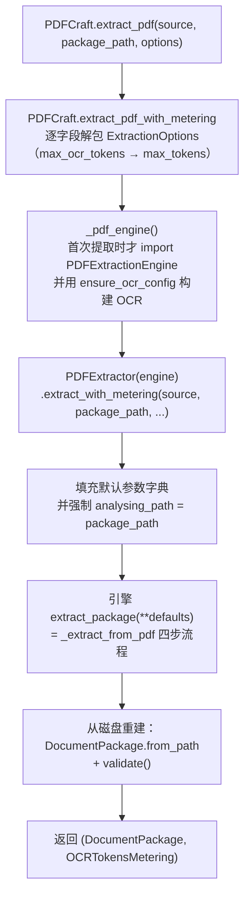
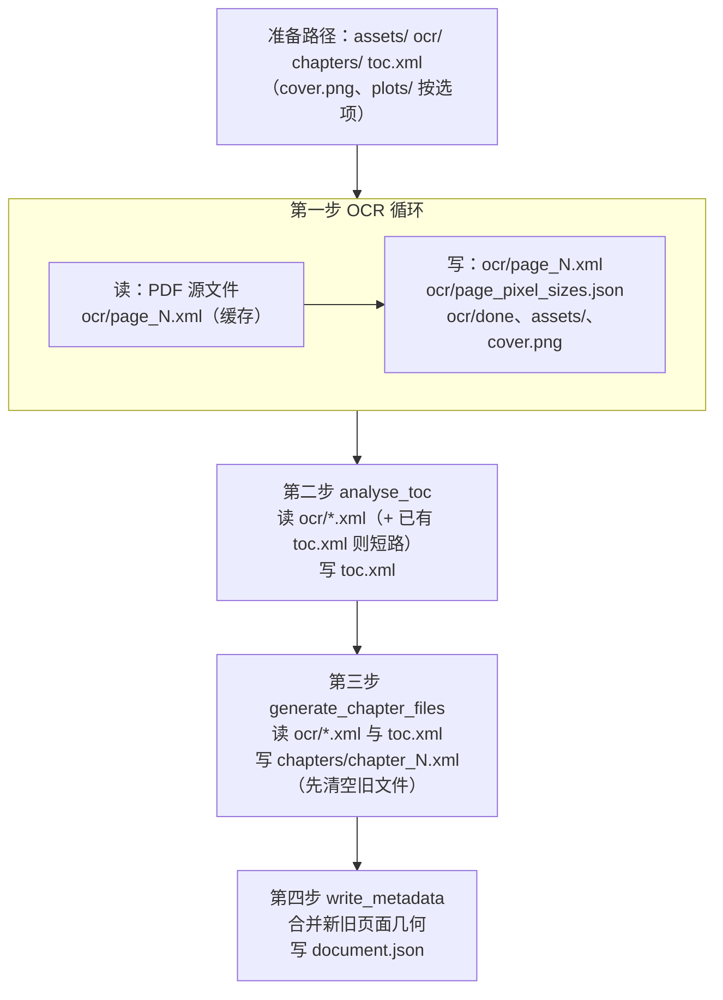

# 提取主链路：从门面到引擎

## 1. 本讲目标

学完本讲，你应该能够：

- 完整追踪一次 PDF 提取的调用链：`PDFCraft.extract_pdf` → `PDFExtractor.extract_with_metering` → `PDFExtractionEngine._extract_from_pdf`，说出每一层各自负责什么。
- 理解 OCR 事件循环的工作方式：引擎如何消费 `OCR.recognize` 生成器产生的事件流，如何累计 token 计量、统计可用页、收集失败页，以及全部页失败时的保护机制。
- 理解「包落盘」：`ocr/`、`toc.xml`、`chapters/`、`document.json` 各自在四步流程中的哪一步被读写，为什么引擎与提取器之间以磁盘文件为契约。
- 说清「懒加载引擎」这条贯穿三层的设计：为什么只翻译现成 EPUB 的用户永远不会加载 OCR 相关代码。

## 2. 前置知识

本讲建立在前面几讲的概念之上，先用两段话帮你说复述关键点：

- **门面与惰性初始化（u1-l4）**：`PDFCraft` 是库对外的唯一门面类，构造它不会初始化 OCR。`PDFOptions` 描述长期基础设施（OCR 后端、PDF 处理器），`ExtractionOptions` 描述单次运行的 15 个控制项（页面范围、DPI、token 预算、回调等）。`DocumentPackage` 是提取器与渲染器之间的中立契约。
- **OCR 配置（u2-l1/u2-l2）**：六种 `OCRConfig` 配置对象经 `ensure_ocr_config` 归一化后才交给执行侧；`on_ocr_event` 是只读观测回调，`aborted` 是协作式中止检查，`ignore_pdf_errors`/`ignore_ocr_errors` 决定失败页是被吞掉还是直接抛异常。

再补充两个本讲要用到的 Python 概念：

- **生成器（generator）**：带 `yield` 的函数调用时不立即执行，而是返回一个惰性序列；每次被消费才推进到下一个 `yield`。OCR 驱动器就是一个生成器，引擎用 `for event in ...` 逐个拉取事件——这是「拉」模式的事件流，消费节奏由引擎控制。
- **磁盘作为契约**：两个模块之间不通过内存对象传递结果，而是「一方写文件、另一方读文件」。提取链路里，引擎把所有产物写进 `package_path` 目录，上层再从目录重建 `DocumentPackage`。好处是任何一步中断后磁盘状态仍然可用（断点续跑的基础）。

## 3. 本讲源码地图

| 文件 | 角色 | 本讲关注点 |
|---|---|---|
| `pdf_craft/craft.py` | 门面层 | `extract_pdf` / `extract_pdf_with_metering` 的转发、`_pdf_engine()` 的惰性导入 |
| `pdf_craft/extractor/pdf/extractor.py` | 公开提取边界 | 参数默认值填充、锁定 `analysing_path`、从磁盘重建包并校验 |
| `pdf_craft/transform.py` | 内部提取引擎 | `_extract_from_pdf` 四步主流程：OCR 循环 → 目录分析 → 章节生成 → 元数据落盘 |
| `pdf_craft/pdf/ocr.py` | OCR 驱动器 | `recognize` 生成器、六种事件、`page_N.xml` 缓存与 `done` 标记 |
| `pdf_craft/document/package.py` | 包契约 | `write_metadata` 写 `document.json`、`validate` 校验、`page_pixel_sizes` |
| `pdf_craft/metering.py` | 计量 | `OCRTokensMetering` 数据类 |

辅助参考（只看入口签名，细节留给后续讲义）：

- `pdf_craft/extractor/toc/analysing.py` 的 `analyse_toc`（目录分析入口，u4 精读）
- `pdf_craft/extractor/chapter/generation.py` 的 `generate_chapter_files`（章节生成入口，u5 精读）

## 4. 核心概念与源码讲解

### 4.1 门面到引擎：三层调用链

#### 4.1.1 概念说明

一次 PDF 提取要穿过三层对象，每层职责分明：

1. **`PDFCraft`（门面层）**：对用户提供友好签名（`PathLike | str` 路径、`ExtractionOptions` 聚合对象），对内把聚合对象**逐字段解包**成引擎需要的扁平关键字参数。
2. **`PDFExtractor`（公开提取边界）**：一个很薄的适配层。它补齐所有参数默认值、**锁定落盘位置**、调用引擎，然后从磁盘重建并校验 `DocumentPackage`。它也被单独导出（`pdf_craft/__init__.py`），高级用户可以绕过门面、注入自定义引擎直接使用它。
3. **`PDFExtractionEngine`（内部引擎）**：真正干活的地方，实现 `_extract_from_pdf` 四步主流程。它的构造函数里才创建 OCR 对象、才触碰 OCR 配置。

为什么要拆三层而不是门面直接调引擎？关键在**懒加载**：`transform.py`（引擎所在模块）及其背后的 OCR 机器只在真正提取 PDF 时才被 import。只调用 `translate_epub` 翻译现成 EPUB 的用户，从头到尾不会加载这些代码，也不需要任何 OCR 凭据。这条「懒」是三层共同维护的：

- `pdf_craft/__init__.py` 不导入 `transform`；
- `craft.py` 只在 `_pdf_engine()` 方法体内部 `from .transform import PDFExtractionEngine`；
- `extractor.py` 把引擎参数标注为 `Any`，模块本身不导入 `transform`。

#### 4.1.2 核心流程



注意两个关键转换：

- **参数改名**：用户视角的 `ExtractionOptions.max_ocr_tokens`（强调「OCR 的 token 预算」）在门面层转发时改名为引擎侧的 `max_tokens`。
- **返回值瘦身**：引擎其实返回一个五元组（assets 路径、chapters 路径、toc 路径、封面路径、metering），但提取器只取第五个元素 `metering`——路径信息不靠返回值传递，而是随后从磁盘目录重建。

#### 4.1.3 源码精读

先看门面的两个公开方法。`extract_pdf` 是纯转发，把 metering 丢掉只留包：

- [pdf_craft/craft.py:L84-L89](https://github.com/oomol-lab/pdf-craft/blob/bbb2d20a93178f9bc3b7be6b23e8f5b23f551c50/pdf_craft/craft.py#L84-L89) —— `extract_pdf` 内部调用 `extract_pdf_with_metering`，丢弃计量只返回 `DocumentPackage`。
- [pdf_craft/craft.py:L91-L110](https://github.com/oomol-lab/pdf-craft/blob/bbb2d20a93178f9bc3b7be6b23e8f5b23f551c50/pdf_craft/craft.py#L91-L110) —— `extract_pdf_with_metering` 是真正的转发点：构造 `PDFExtractor(self._pdf_engine())`，然后把 `ExtractionOptions` 的 15 个字段逐一展开成关键字参数。注意第 101 行 `max_tokens=options.max_ocr_tokens` 正是改名处。

再看懒加载的核心：

- [pdf_craft/craft.py:L70-L82](https://github.com/oomol-lab/pdf-craft/blob/bbb2d20a93178f9bc3b7be6b23e8f5b23f551c50/pdf_craft/craft.py#L70-L82) —— 类文档字符串明说「构造门面不会初始化 OCR，EPUB-only 调用者可以用 `PDFCraft()` 而无需 PDF 基础设施或凭据」；`__init__` 只存两个引用，`from_engine` 支持注入测试用引擎。
- [pdf_craft/craft.py:L253-L262](https://github.com/oomol-lab/pdf-craft/blob/bbb2d20a93178f9bc3b7be6b23e8f5b23f551c50/pdf_craft/craft.py#L253-L262) —— `_pdf_engine()`：已有注入引擎直接返回；没配 `PDFOptions` 则抛 `ValueError`；否则**在函数体内**才 `from .transform import PDFExtractionEngine`（第 259 行注释点明这是为了让 EPUB-only 调用者永远不导入历史适配器），并用 `ensure_ocr_config` 归一化 OCR 配置。

然后是中间层 `PDFExtractor`：

- [pdf_craft/extractor/pdf/extractor.py:L5-L12](https://github.com/oomol-lab/pdf-craft/blob/bbb2d20a93178f9bc3b7be6b23e8f5b23f551c50/pdf_craft/extractor/pdf/extractor.py#L5-L12) —— 文档字符串「Heavy OCR imports remain lazy」：引擎以 `Any` 类型持有（第 7-8 行），本模块不导入 `transform`。
- [pdf_craft/extractor/pdf/extractor.py:L14-L36](https://github.com/oomol-lab/pdf-craft/blob/bbb2d20a93178f9bc3b7be6b23e8f5b23f551c50/pdf_craft/extractor/pdf/extractor.py#L14-L36) —— `extract_with_metering` 的五步：① `mkdir` 包目录；② 组装默认参数字典并用 kwargs 覆盖；③ **第 28 行再次强制 `defaults["analysing_path"] = package_path`**，保证落盘位置不可被任何 kwargs 意外改写；④ 第 29-30 行调用引擎的 `extract_package` 并只解包第五个返回值 `metering`；⑤ 第 33-36 行补建 `assets/` 目录、`DocumentPackage.from_path` 重建包、`validate()` 校验后返回。

最后看引擎的入口与构造：

- [pdf_craft/transform.py:L21-L34](https://github.com/oomol-lab/pdf-craft/blob/bbb2d20a93178f9bc3b7be6b23e8f5b23f551c50/pdf_craft/transform.py#L21-L34) —— `PDFExtractionEngine` 构造函数：此刻才创建 `OCR` 对象并调用 `ensure_ocr_config`（u2-l1 讲过的兜底与互斥校验就在这里生效）。
- [pdf_craft/transform.py:L42-L44](https://github.com/oomol-lab/pdf-craft/blob/bbb2d20a93178f9bc3b7be6b23e8f5b23f551c50/pdf_craft/transform.py#L42-L44) —— `extract_package` 是给 `PDFExtractor` 用的钩子，直接委托 `_extract_from_pdf`。

#### 4.1.4 代码实践

**实践目标**：不动任何 OCR 服务，用一个「假引擎」验证三层调用链的参数流转与磁盘重建行为。

**操作步骤**：

1. 写入以下脚本（示例代码，非项目原有代码）：

   ```python
   # fake_engine_demo.py —— 用注入引擎观察门面到引擎的参数流转
   from pathlib import Path
   from pdf_craft import PDFCraft, ExtractionOptions, OCRTokensMetering

   class FakeEngine:
       def __init__(self):
           self.calls = []  # 记录每一次 extract_package 收到的参数

       def extract_package(self, **kwargs):
           self.calls.append(kwargs)
           analysing_path = kwargs["analysing_path"]
           # 引擎的真实职责是落盘；这里最小化地满足包契约
           (analysing_path / "chapters").mkdir(parents=True, exist_ok=True)
           return (analysing_path / "assets", analysing_path / "chapters",
                   analysing_path / "toc.xml", None,
                   OCRTokensMetering(input_tokens=0, output_tokens=0))

   engine = FakeEngine()
   craft = PDFCraft.from_engine(engine)
   package = craft.extract_pdf(
       "dummy.pdf", "pkg_out",
       ExtractionOptions(max_ocr_tokens=5000, page_indexes=range(1, 4)),
   )

   call = engine.calls[0]
   print("max_tokens =", call["max_tokens"])        # 观察点 1：改名
   print("page_indexes =", call["page_indexes"])    # 观察点 2：透传
   print("analysing_path =", call["analysing_path"])
   print("chapters_path =", package.chapters_path)  # 观察点 3：磁盘重建
   print("validate ->", package.validate() is package)
   ```

2. 运行 `python fake_engine_demo.py`。

**需要观察的现象**：

- `max_tokens` 打印出 `5000`——你传入的字段名是 `max_ocr_tokens`，到达引擎时已改名。
- `analysing_path` 等于 `pkg_out` 的绝对路径形式，且假引擎**没有**创建 `assets/`，最终包里却存在该目录。
- `validate()` 通过：说明重建只要求 `chapters/` 与 `assets/` 两个目录存在。

**预期结果**：脚本零 OCR 依赖即可运行；输出证明门面只做「解包 + 改名」，提取器补默认值并兜底建 `assets/`，引擎参数中的路径就是最终落盘位置。若想进一步确认懒加载，可在 `import pdf_craft` 后检查 `"pdf_craft.transform" not in sys.modules`，再调用 `craft.extract_pdf` 前后各看一次。

#### 4.1.5 小练习与答案

**练习 1**：`ExtractionOptions.max_ocr_tokens` 在哪一层、被改成了什么名字？为什么要改名？

**答案**：在门面层 `craft.py` 第 101 行转发时改名为 `max_tokens`。用户视角强调「这是 OCR 的预算」；引擎侧参数是通用执行参数，且引擎还会把它继续传给 OCR 驱动器（`pdf/ocr.py` 中同名参数）。

**练习 2**：`extractor.py` 第 28 行已经在第 17 行设置过 `analysing_path` 后又设置了一次，为什么？

**答案**：第 27 行 `defaults.update(kwargs)` 允许调用方的 kwargs 覆盖默认值，第 28 行在覆盖之后**再次强制** `analysing_path = package_path`，确保任何调用方式都不能把落盘位置改到别处——落盘位置是这个边界层的不变量。

**练习 3**：为什么 `PDFExtractor._transform` 的类型标注是 `Any` 而不是 `PDFExtractionEngine`？

**答案**：若标注为引擎类型，模块导入时就要 `import transform`，从而把 OCR 相关的重依赖带进「公开提取边界」，破坏三层共同维护的懒加载链。`Any` + 鸭子类型让 `extractor.py` 保持轻量，这也正是假引擎实践能工作的原因。

### 4.2 OCR 事件循环：token 统计与失败页收集

#### 4.2.1 概念说明

引擎主流程的第一步是驱动 OCR。设计上，**OCR 驱动器不回调引擎，而是作为生成器吐事件**：每处理一页，产出若干 `OCREvent` 对象（页开始、被忽略、缓存命中、渲染完成、OCR 完成/失败）。引擎在 `for` 循环里消费这些事件，做三件事：

1. **转发观测**：调用用户的 `on_ocr_event` 回调（只读，不影响流程）；
2. **累计计量**：把每页的 `input_tokens` / `output_tokens` 加进 `OCRTokensMetering`，这就是 `convert_pdf_to_markdown` 最终返回给用户的成本数据；
3. **分类统计**：`COMPLETE` 与 `SKIP` 计入「可用页」，`FAILED` 收集页码进失败列表。循环结束后，若**存在失败页且可用页为零**，抛 `NoUsableOCRPagesError` 阻止产出一个空包。

为什么 `SKIP` 也算可用页？因为 `SKIP` 意味着 `page_N.xml` 缓存命中——这一页在上次运行已经成功 OCR 过，内容是可用的。

#### 4.2.2 核心流程

六种事件（`OCREventKind`）的含义与触发时机：

| 事件 | 触发时机 | 计入 usable？ | 关键携带信息 |
|---|---|---|---|
| `START` | 每页循环开始（中止检查点也在此前） | 否 | `page_index`、`total_pages` |
| `IGNORE` | 页码不在 `page_indexes` 选区 | 否 | `cost_time_ms` |
| `SKIP` | `page_N.xml` 已存在且无同名 `.failed`（缓存命中） | **是** | `cost_time_ms` |
| `RENDERED` | 页面已渲染成图像、尚未 OCR | 否 | `cost_time_ms` |
| `COMPLETE` | 本页 OCR 成功 | **是** | `input_tokens`、`output_tokens` |
| `FAILED` | OCR/PDF 错误被忽略策略吞下 | 否（进失败列表） | `error`、token 数 |

引擎侧消费循环（伪代码）：

```text
metering = (input=0, output=0); usable = 0; failed = []
for event in ocr.recognize(...):
    on_ocr_event(event)                      # 用户观测回调
    metering.input  += event.input_tokens
    metering.output += event.output_tokens
    if event.kind in (COMPLETE, SKIP): usable += 1
    elif event.kind == FAILED: failed.append(event.page_index)
if failed and usable == 0:
    raise NoUsableOCRPagesError(tuple(failed))   # 空包保护
```

驱动器内部还有一条 **token 预算递减**逻辑：每页 OCR 完成后

\[ \text{remain\_tokens} \leftarrow \text{remain\_tokens} - (\text{input\_tokens} + \text{output\_tokens}) \]

且在渲染下一页之前检查 \( \text{remain\_tokens} \le 0 \)，预算耗尽立即抛 `TokenLimitError` 终止整个生成器（u2-l2 讲过它可被转换为带计量信息的 `InterruptedError`）。

#### 4.2.3 源码精读

- [pdf_craft/pdf/ocr.py:L22-L39](https://github.com/oomol-lab/pdf-craft/blob/bbb2d20a93178f9bc3b7be6b23e8f5b23f551c50/pdf_craft/pdf/ocr.py#L22-L39) —— `OCREventKind` 六值枚举与 `OCREvent` 数据类：`kind`、`page_index`、`total_pages`、`cost_time_ms`、`input_tokens`、`output_tokens`、`error`。
- [pdf_craft/transform.py:L78-L101](https://github.com/oomol-lab/pdf-craft/blob/bbb2d20a93178f9bc3b7be6b23e8f5b23f551c50/pdf_craft/transform.py#L78-L101) —— 引擎的事件消费循环：第 95 行先调 `on_ocr_event(event)`，第 96-97 行累计计量，第 98-101 行按事件种类分类统计可用页与失败页。
- [pdf_craft/transform.py:L103-L104](https://github.com/oomol-lab/pdf-craft/blob/bbb2d20a93178f9bc3b7be6b23e8f5b23f551c50/pdf_craft/transform.py#L103-L104) —— 空包保护：`failed_page_indexes and usable_pages == 0` 时抛 `NoUsableOCRPagesError(tuple(failed_page_indexes))`，把失败页码一并告知调用方。（这正是 HEAD 提交 `bbb2d20`「reject extraction with no usable OCR pages」引入的行为。）
- [pdf_craft/metering.py:L15-L18](https://github.com/oomol-lab/pdf-craft/blob/bbb2d20a93178f9bc3b7be6b23e8f5b23f551c50/pdf_craft/metering.py#L15-L18) —— `OCRTokensMetering` 只是两个字段的 dataclass；引擎在 [pdf_craft/transform.py:L73](https://github.com/oomol-lab/pdf-craft/blob/bbb2d20a93178f9bc3b7be6b23e8f5b23f551c50/pdf_craft/transform.py#L73) 从零初始化它。

驱动器侧的对应实现（本讲只看事件与预算，缓存细节留给 u3-l3）：

- [pdf_craft/pdf/ocr.py:L107-L137](https://github.com/oomol-lab/pdf-craft/blob/bbb2d20a93178f9bc3b7be6b23e8f5b23f551c50/pdf_craft/pdf/ocr.py#L107-L137) —— 每页先 `check_aborted`（协作式中止检查点），`yield START`；页码不在选区 `yield IGNORE` 并 `continue`；`page_N.xml` 存在且无 `.failed` 时 `yield SKIP`。
- [pdf_craft/pdf/ocr.py:L141-L144](https://github.com/oomol-lab/pdf-craft/blob/bbb2d20a93178f9bc3b7be6b23e8f5b23f551c50/pdf_craft/pdf/ocr.py#L141-L144) —— 预算预检：渲染下一页之前，输入或输出预算任一耗尽即抛 `TokenLimitError`。
- [pdf_craft/pdf/ocr.py:L150-L178](https://github.com/oomol-lab/pdf-craft/blob/bbb2d20a93178f9bc3b7be6b23e8f5b23f551c50/pdf_craft/pdf/ocr.py#L150-L178) —— 渲染页面（缺省 DPI=300）、记录页面几何、`yield RENDERED`，随后调用 `image2page` 真正执行 OCR。
- [pdf_craft/pdf/ocr.py:L211-L227](https://github.com/oomol-lab/pdf-craft/blob/bbb2d20a93178f9bc3b7be6b23e8f5b23f551c50/pdf_craft/pdf/ocr.py#L211-L227) —— 页末事件：有被吞的错误则 `yield FAILED`（带 `error`），否则 `yield COMPLETE`；随后按上面的公式递减两个剩余预算。

#### 4.2.4 代码实践

**实践目标**：用合成事件复现引擎的统计循环，验证计量累计、可用页规则与 `NoUsableOCRPagesError` 的精确触发条件——不需要任何 OCR 服务。

**操作步骤**：

1. 写入以下脚本（示例代码）：

   ```python
   # event_replay.py —— 复现 transform.py 的 OCR 事件消费循环
   from pdf_craft import OCREvent, OCREventKind, NoUsableOCRPagesError
   from pdf_craft.metering import OCRTokensMetering

   def replay(events):
       metering = OCRTokensMetering(input_tokens=0, output_tokens=0)
       usable, failed = 0, []
       for event in events:
           metering.input_tokens += event.input_tokens
           metering.output_tokens += event.output_tokens
           if event.kind in (OCREventKind.COMPLETE, OCREventKind.SKIP):
               usable += 1
           elif event.kind == OCREventKind.FAILED:
               failed.append(event.page_index)
       if failed and usable == 0:
           raise NoUsableOCRPagesError(tuple(failed))
       return metering, usable, failed

   def ev(kind, page, tin=0, tout=0):
       return OCREvent(kind=kind, page_index=page, total_pages=3,
                       input_tokens=tin, output_tokens=tout)

   # 场景一：两页成功 + 一页缓存命中
   print(replay([ev(OCREventKind.COMPLETE, 1, 100, 40),
                 ev(OCREventKind.COMPLETE, 2, 120, 60),
                 ev(OCREventKind.SKIP, 3)]))
   # 场景二：全部失败
   try:
       replay([ev(OCREventKind.FAILED, 1), ev(OCREventKind.FAILED, 2)])
   except NoUsableOCRPagesError as error:
       print("raised:", type(error).__name__)
   # 场景三：一页失败但另一页成功
   print(replay([ev(OCREventKind.FAILED, 1), ev(OCREventKind.COMPLETE, 2, 50, 20)]))
   ```

2. 运行 `python event_replay.py`。

**需要观察的现象**：场景一的 metering 是否等于三页 token 之和（SKIP 页贡献为 0）、usable 是否为 3；场景二是否抛异常；场景三是否**不**抛异常。

**预期结果**：场景一输出 `input_tokens=220, output_tokens=100, usable=3`；场景二抛 `NoUsableOCRPagesError`；场景三正常返回 `usable=1, failed=[1]`——证明保护条件是「有失败页**且**可用页为零」的合取，而不是「存在失败页」。

#### 4.2.5 小练习与答案

**练习 1**：`on_ocr_event` 回调是在驱动器内部调用的，还是在引擎循环里调用的？这有什么区别？

**答案**：在引擎循环里（`transform.py` 第 95 行），驱动器只 `yield` 事件、不知道回调的存在。区别在于回调异常会打断引擎的消费循环进而终止提取，而驱动器本身保持纯粹；同时即使用户不注册回调，驱动器的行为也不变。

**练习 2**：如果 `page_indexes` 选区一页都不包含（例如 `page_indexes=range(99, 100)` 而 PDF 只有 3 页），会抛 `NoUsableOCRPagesError` 吗？

**答案**：不会。所有页只会产生 `START` + `IGNORE` 事件：`IGNORE` 既不计入可用页也不进入失败列表，触发条件 `failed_page_indexes and usable_pages == 0` 中前者为空（`transform.py` 第 103 行）。结果是得到一个没有任何 OCR 页的空包——这是一个值得注意的边缘行为。

**练习 3**：`done` 标记文件什么时候写入？它存在时再跑一次会发生什么？

**答案**：仅当本轮既没有 `IGNORE` 也没有任何失败页时才写入（[pdf_craft/pdf/ocr.py:L229-L230](https://github.com/oomol-lab/pdf-craft/blob/bbb2d20a93178f9bc3b7be6b23e8f5b23f551c50/pdf_craft/pdf/ocr.py#L229-L230)）。再跑时若 `done` 存在且没有任何 `page_*.failed` 文件，`recognize` 在 [pdf_craft/pdf/ocr.py:L94-L95](https://github.com/oomol-lab/pdf-craft/blob/bbb2d20a93178f9bc3b7be6b23e8f5b23f551c50/pdf_craft/pdf/ocr.py#L94-L95) 直接 `return`，OCR 循环零成本跳过，直接进入目录分析与章节生成。

### 4.3 包落盘：从 ocr/ 到 document.json

#### 4.3.1 概念说明

引擎与上层之间**没有内存中的大对象传递**，一切以 `package_path` 目录下的文件为契约。`_extract_from_pdf` 把一次提取组织成固定四步，每一步明确读写哪些文件：



两个容易忽略的要点：

- **缓存短路在每一步都存在**：OCR 步靠 `page_N.xml` + `done` 跳过整轮；目录分析步靠 `toc.xml` 存在直接解码返回。因此复用同一 `package_path` 重跑时，成本集中在真正缺失的部分。
- **几何信息双份保存、一次合并**：OCR 循环把每页图像尺寸写进 `ocr/page_pixel_sizes.json`（供断点续跑时恢复），第四步又把它与上一次 `document.json` 中的记录做并集写入新的 `document.json`。这些像素几何是后续「翻译回写 PDF」把文本块 bbox 对回原页面的坐标系基础（u10 会用到）。

#### 4.3.2 核心流程

以 `package_path` 为根，四步流程读写的文件清单：

| 路径 | 由哪一步写 | 由哪一步读 | 作用 |
|---|---|---|---|
| `ocr/page_N.xml` | 第一步（OCR 循环） | 第一/二/三步 | 单页 OCR 结果，断点续跑的缓存单元 |
| `ocr/page_N.failed` | 第一步（失败时） | 第一步（决定重试还是 SKIP） | 失败标记：存在则该页下次重新 OCR |
| `ocr/page_pixel_sizes.json` | 第一步（每页追加） | 第一步启动时 | 页面像素几何缓存 |
| `ocr/done` | 第一步（全部干净完成） | 第一步启动时 | 整轮完成标记 |
| `assets/` | 第一步（图片剪辑落盘） | 渲染器 | 章节引用的图片资源 |
| `cover.png` | 第一步（`includes_cover` 且首页有图） | 渲染器 | 封面 |
| `toc.xml` | 第二步 | 第二步（短路）、第三步 | 目录树 |
| `chapters/chapter_N.xml` | 第三步 | 渲染器/转换器 | 章节内容 |
| `document.json` | 第四步 | 提取器 `validate`、渲染器、PDF 回写 | schema、dpi、页面几何元数据 |

第四步的几何合并可以写成集合等式：

\[ \text{page\_pixel\_sizes} = \text{existing} \cup \text{this\_run} \]

其中 existing 来自上次 `document.json`，this_run 来自 `OCR.last_page_pixel_sizes`（本次循环记录 + `page_pixel_sizes.json` 恢复的历史）。用「并集」而不是「覆盖」，使得分批提取（先 1-10 页、再 11-20 页进同一个包）不丢前一批的几何。

#### 4.3.3 源码精读

- [pdf_craft/transform.py:L66-L76](https://github.com/oomol-lab/pdf-craft/blob/bbb2d20a93178f9bc3b7be6b23e8f5b23f551c50/pdf_craft/transform.py#L66-L76) —— 路径准备：从 `analysing_path` 派生 `assets/`、`ocr/`、`chapters/`、`toc.xml`；`cover.png` 与 `plots/` 按选项才启用；第 76 行先读出上一次 `document.json` 的页面几何备用。
- [pdf_craft/transform.py:L106-L112](https://github.com/oomol-lab/pdf-craft/blob/bbb2d20a93178f9bc3b7be6b23e8f5b23f551c50/pdf_craft/transform.py#L106-L112) —— 第二、三步：`analyse_toc(pages_path, toc_path, toc_llm, toc_assumed)` 与 `generate_chapter_files(pages_path, chapters_path, toc)`。
- [pdf_craft/extractor/toc/analysing.py:L25-L38](https://github.com/oomol-lab/pdf-craft/blob/bbb2d20a93178f9bc3b7be6b23e8f5b23f551c50/pdf_craft/extractor/toc/analysing.py#L25-L38) —— `analyse_toc` 开头的缓存短路：第 31-32 行 `toc_path.exists()` 直接解码返回；否则分析后第 36 行写回 `toc.xml`。
- [pdf_craft/extractor/chapter/generation.py:L23-L26](https://github.com/oomol-lab/pdf-craft/blob/bbb2d20a93178f9bc3b7be6b23e8f5b23f551c50/pdf_craft/extractor/chapter/generation.py#L23-L26) —— `generate_chapter_files` 先删除旧的 `chapter_*.xml` 再生成：章节文件没有逐个缓存，每次都由 `ocr/` + `toc.xml` 重算（这两者才是缓存层）。
- [pdf_craft/transform.py:L113-L121](https://github.com/oomol-lab/pdf-craft/blob/bbb2d20a93178f9bc3b7be6b23e8f5b23f551c50/pdf_craft/transform.py#L113-L121) —— 第四步与收尾：第 116 行用 `|`（字典合并）把新旧几何取并集；第 117-120 行构造 `DocumentPackage` 并 `write_metadata`（缺省 dpi 记为 300）；第 121 行返回五元组。
- [pdf_craft/document/package.py:L42-L50](https://github.com/oomol-lab/pdf-craft/blob/bbb2d20a93178f9bc3b7be6b23e8f5b23f551c50/pdf_craft/document/package.py#L42-L50) —— `write_metadata` 写出的 `document.json` 固定包含：`schema: 1`、`bbox_coordinate_space: "ocr_pixels"`、`page_index_base: 1`、`dpi`、`page_pixel_sizes`。
- [pdf_craft/document/package.py:L28-L40](https://github.com/oomol-lab/pdf-craft/blob/bbb2d20a93178f9bc3b7be6b23e8f5b23f551c50/pdf_craft/document/package.py#L28-L40) —— `validate` 的最低要求是 `chapters/` 与 `assets/` 两个目录存在；`document.json` 存在时额外校验 `schema == 1` 与几何格式。
- [pdf_craft/extractor/pdf/extractor.py:L29-L36](https://github.com/oomol-lab/pdf-craft/blob/bbb2d20a93178f9bc3b7be6b23e8f5b23f551c50/pdf_craft/extractor/pdf/extractor.py#L29-L36) —— 「磁盘是契约」的直接证据：五元组中四个路径全部被 `_` 丢弃，包由 `DocumentPackage.from_path(package_path)` 从目录结构重建，唯一被使用的返回值是 metering。

#### 4.3.4 代码实践

**实践目标**：手工构造一个最小合法包并校验，弄清 `validate` 的底线与 `document.json` 的确切结构。

**操作步骤**：

1. 写入以下脚本（示例代码）：

   ```python
   # mini_package.py —— 最小 DocumentPackage 与元数据
   import json
   from pathlib import Path
   from pdf_craft import DocumentPackage

   root = Path("mini_pkg")
   (root / "chapters").mkdir(parents=True, exist_ok=True)
   (root / "assets").mkdir(exist_ok=True)
   (root / "document.json").write_text(json.dumps({
       "schema": 1,
       "bbox_coordinate_space": "ocr_pixels",
       "page_index_base": 1,
       "dpi": 300,
       "page_pixel_sizes": {"1": [2481, 3508]},
   }, ensure_ascii=False), encoding="utf-8")

   package = DocumentPackage.from_path(root)
   package.validate()
   print("pixel sizes:", package.page_pixel_sizes())
   print("has_toc:", package.has_toc())

   # 让 write_metadata 自己写一份，对比字段
   DocumentPackage(root / "chapters", root / "assets").write_metadata(
       dpi=300, page_pixel_sizes={2: (100, 200)}
   )
   print((root / "document.json").read_text(encoding="utf-8"))

   # 破坏性验证：删掉 assets 再校验
   (root / "assets").rmdir()
   try:
       package.validate()
   except ValueError as error:
       print("validate raised:", error)
   ```

2. 运行 `python mini_package.py`。

**需要观察的现象**：`page_pixel_sizes()` 返回的键类型与值元组形式；`write_metadata` 重写后 `document.json` 是否只剩你传入的那一页几何（说明它是**整体覆盖**而非增量合并——合并逻辑在引擎第 116 行，不在数据类里）；删除 `assets/` 后 `validate` 报什么错。

**预期结果**：打印 `{1: (2481, 3508)}`；重写后文件中 `page_pixel_sizes` 只含 `"2": [100, 200]`；最后抛出 `ValueError: missing assets directory: mini_pkg/assets`。

#### 4.3.5 小练习与答案

**练习 1**：`document.json` 缺失时 `validate()` 会失败吗？什么情况下会？

**答案**：不会。`validate` 只在 `metadata_path` 存在时才解析并校验它（`package.py` 第 35-39 行）；失败的是 `chapters/` 或 `assets/` 目录缺失，或 `document.json` 里 `schema != 1`、几何字段格式非法。

**练习 2**：引擎为什么在第 116 行做 `existing_page_pixel_sizes | self._ocr.last_page_pixel_sizes` 的并集，而不是直接用本次结果覆盖？

**答案**：`last_page_pixel_sizes` 只包含「本次 OCR 循环实际渲染/恢复过」的页面；若这次只提取了部分页（`page_indexes` 选区），直接覆盖会抹掉上一次运行写入 `document.json` 的其他页几何，导致后续 PDF 回写（u10）缺少坐标系依据。并集保证分批提取累积完整。

**练习 3**：复用同一个 `package_path` 重跑两次提取，第二次会重新生成 `chapters/chapter_N.xml` 吗？

**答案**：会。`generate_chapter_files` 每次先删除全部旧 `chapter_*.xml` 再重算（`generation.py` 第 24-26 行）；缓存层是它的输入（`ocr/page_N.xml` 与 `toc.xml`），不是它的输出。章节生成是纯本地 CPU 逻辑，重算成本远低于 OCR。

## 5. 综合实践

**任务**：把 `_extract_from_pdf` 的四步流程画成你自己的图，并用假引擎跑一遍验证目录结构——这正是把本讲三个模块串起来的练手。

**步骤**：

1. **画图**：合上讲义，凭源码 [pdf_craft/transform.py:L46-L121](https://github.com/oomol-lab/pdf-craft/blob/bbb2d20a93178f9bc3b7be6b23e8f5b23f551c50/pdf_craft/transform.py#L46-L121) 画一张 mermaid 或文字流程图，必须包含：
   - 四个步骤：OCR `recognize` 循环 → `analyse_toc` → `generate_chapter_files` → `write_metadata`；
   - 每步的读写路径：`ocr/`（page_N.xml、done、page_pixel_sizes.json）、`toc.xml`、`chapters/`、`document.json`，以及可选的 `assets/`、`cover.png`、`plots/`；
   - 两个缓存短路点：`done` 标记让 OCR 整轮跳过、`toc.xml` 存在让目录分析短路；
   - 一个保护点：全部页失败抛 `NoUsableOCRPagesError`。
2. **验证**：把 4.1.4 的假引擎脚本扩展一下——在 `extract_package` 里按四步真正落盘一个假包（建 `ocr/` 放一个空的 `page_1.xml`、写一个只有根节点的 `toc.xml`、建 `chapters/` 并写 `chapter_1.xml`），再用 `DocumentPackage.from_path(...).validate()` 校验，最后用 `list(Path("pkg_out").rglob("*"))` 列出全部产物，与你画的图逐一对照。
3. **对照检查**：你的图里每个箭头是否都能对应到 `transform.py` 的一行代码？多出来的文件（如 `document.json`）是引擎写的还是提取器补的？

**预期结果**：一张与 4.3.1 参考图等价的流程图，以及一次零 OCR 依赖的「目录结构演练」——你会直观看到：提取链路的全部中间状态都活在磁盘上，这就是断点续跑与 `package_path` 复用的根基。

## 6. 本讲小结

- 提取链路共三层：`PDFCraft`（解包参数、改名 `max_ocr_tokens`→`max_tokens`）→ `PDFExtractor`（补默认值、锁定 `analysing_path`、从磁盘重建并校验包）→ `PDFExtractionEngine`（四步主流程）。
- 懒加载由三层共同维护：`transform` 模块只在 `_pdf_engine()` 内部导入，EPUB-only 用户全程不加载 OCR 代码与凭据。
- OCR 驱动器是生成器事件流：六种事件中 `COMPLETE` 与 `SKIP` 计入可用页，`FAILED` 进失败列表；引擎在消费循环里累计 token 计量并转发用户回调。
- 空包保护：存在失败页且可用页为零时抛 `NoUsableOCRPagesError`（HEAD 提交 `bbb2d20` 的修复行为）。
- 引擎四步固定：OCR 循环 → `analyse_toc` → `generate_chapter_files` → `write_metadata`；每步读写明确，`ocr/page_N.xml` 与 `toc.xml` 是缓存层，`chapters/` 每次重算。
- 磁盘是契约：引擎返回的路径元组被丢弃，`DocumentPackage` 由目录结构重建；页面像素几何在 `page_pixel_sizes.json` 与 `document.json` 双份保存、以并集合并，为 PDF 回写保留坐标系。

## 7. 下一步学习建议

- **u3-l2（PDF 处理抽象）**：本讲的 `ref.render(dpi=...)`、`refs.pages_count` 背后是 `PDFHandler`/`PDFDocument` 协议与 `PageRefContext`，下一讲拆开看页面如何被逐页迭代与渲染。
- **u3-l3（OCR 驱动器）**：本讲只用了 `recognize` 的事件与预算视角，下一讲深入 `page_N.xml` 缓存、`.failed` 标记与 `done` 的完整断点续跑语义。
- **u4（目录分析）**：本讲把 `analyse_toc` 当黑盒，单元四会展开 Aho-Corasick 标题匹配与统计/LLM 两条层级推断路径。
