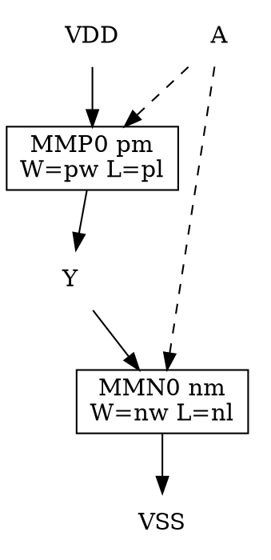

# CDL 晶体管级网表

## 1. 本讲目标

学完本讲，你应该能够：

1. 逐字段读懂一条 CDL 语句：`.SUBCKT` 端口表、`*.PININFO` 的 `I/O/B` 方向标记、MOS 器件行的「漏栅源衬底 + 模型 + W/L/m」，以及 `X` 子电路实例行。
2. 通过器件模型名（`nm1p2_hvt_lp` / `nm1p2_lvt_lp` / `nm1p2_svt_lp`）一眼分辨 H7CH/H7CL/H7CR 三个阈值库，并用 diff 实证「三库电路拓扑逐行相同、只有名字不同」。
3. 拿着一个单元的网表，在纸上（或用 graphviz）重建出晶体管级电路图，数出 NMOS/PMOS 数量——既包括平铺晶体管的全加器，也包括全部由模板实例搭成的 DFFX1。
4. 解开标题里的数字之谜：为什么 CDL 有 1174 个 `.SUBCKT`，而 cell_list 只有 748 个单元。

本讲是手册第一次从「单元外部」（LEF 抽象、liberty 时序）沉到「单元内部」——看每个标准单元到底由哪些晶体管、怎样连起来。

## 2. 前置知识

### 2.1 CDL 是什么：给 LVS 看的网表

CDL（Circuit Description Language）可以理解为 **SPICE 网表的一个方言子集**。u1-l1 讲过 PDK 用多视图描述同一批单元：LEF 描述「外壳」（尺寸、引脚、障碍），liberty 描述「电学行为」（延时、功耗），而 CDL 描述「里子」——单元内部每一只晶体管的连接关系。它的主要消费者是 **LVS（Layout Versus Schematic）工具**：流片前要把 GDS 版图提取出的网表与 CDL 原理图网表逐管比对，证明「画的」和「设计的」是同一个电路。它同时是人工审查单元电路（本讲主战场）和 SPICE 仿真的底料。

三个库各有一份 CDL，每份约 890 KB、23100 余行，是仓库里最大的文本视图。

### 2.2 MOSFET 的四个端子

CDL 里每只 MOS 管写四个端子，顺序固定为 **漏极 D、栅极 G、源极 S、衬底 B**（bulk）。数字电路习惯上「源漏对称」，但网表必须写清衬底接哪儿——它决定这只管子躺在哪种阱里，是 LVS 检查阱连接的依据。NMOS 衬底接 VSS、PMOS 衬底接 VDD，是标准单元库的铁律。

### 2.3 SPICE 器件行的通用语法

SPICE 用**首字母**区分器件类型，本讲会遇到三种：

| 首字母 | 器件 | 语句骨架 |
| --- | --- | --- |
| `M` | MOS 场效应管 | `M<名> 漏 栅 源 衬底 <模型> W=<宽> L=<长> m=<并联数>` |
| `D` | 二极管 | `D<名> 阳极 阴极 <模型> AREA=... PJ=...` |
| `X` | 子电路实例 | `X<名> <按端口表顺序的连线> / <模板名> <参数=值...>` |

以 `*` 开头的行是注释；以 `+` 开头的行是上一行的**续行**。

### 2.4 承接 u3-l1：三个阈值家族

u3-l1 从单元名后缀认识了 HVT/LVT/RVT 三种阈值电压家族：H7CH 的单元以 `H7H` 结尾、H7CL 以 `H7L`、H7CR 以 `H7R`。本讲将从**器件模型名**再次印证这件事：三个库的 CDL 除名字外逐行相同，唯一实质差别是每只管子引用的模型名里的 `hvt/lvt/svt` 三个字母。

## 3. 本讲源码地图

| 文件 | 作用 |
| --- | --- |
| [IP/STD_cell/ics55_LLSC_H7C_V1p10C100/ics55_LLSC_H7CH/cdl/ics55_LLSC_H7CH.cdl](https://github.com/openecos-projects/icsprout55-pdk/blob/68d89edb47847671e18f9e65d66c0cd883995e05/IP/STD_cell/ics55_LLSC_H7C_V1p10C100/ics55_LLSC_H7CH/cdl/ics55_LLSC_H7CH.cdl) | 本讲主角。HVT 库（H7CH）全部网表：1174 个 `.SUBCKT`、23102 行 |
| [IP/STD_cell/ics55_LLSC_H7C_V1p10C100/ics55_LLSC_H7CL/cdl/ics55_LLSC_H7CL.cdl](https://github.com/openecos-projects/icsprout55-pdk/blob/68d89edb47847671e18f9e65d66c0cd883995e05/IP/STD_cell/ics55_LLSC_H7C_V1p10C100/ics55_LLSC_H7CL/cdl/ics55_LLSC_H7CL.cdl) | LVT 库（H7CL）网表，23101 行，用于三库对比 |
| [IP/STD_cell/ics55_LLSC_H7C_V1p10C100/ics55_LLSC_H7CR/cdl/ics55_LLSC_H7CR.cdl](https://github.com/openecos-projects/icsprout55-pdk/blob/68d89edb47847671e18f9e65d66c0cd883995e05/IP/STD_cell/ics55_LLSC_H7C_V1p10C100/ics55_LLSC_H7CR/cdl/ics55_LLSC_H7CR.cdl) | RVT 库（H7CR）网表，用于三库对比 |
| [IP/STD_cell/ics55_LLSC_H7C_V1p10C100/ics55_LLSC_H7CH/cell_list/ics55_LLSC_H7CH.txt](https://github.com/openecos-projects/icsprout55-pdk/blob/68d89edb47847671e18f9e65d66c0cd883995e05/IP/STD_cell/ics55_LLSC_H7C_V1p10C100/ics55_LLSC_H7CH/cell_list/ics55_LLSC_H7CH.txt) | 对照基准：748 个单元的官方名单（u3-l1 已盘点） |

> 命名提醒：H7CL 库的 CDL 文件名是 `ics55_LLSC_H7CL.cdl`（与目录、LEF 一致），但库内**单元名**后缀是 `H7L`（如 `DFFX1H7L`）而非 `H7CL`——文件名与单元后缀差一个字母，查库时别被迷惑。

## 4. 核心概念与源码讲解

### 4.1 模块一：CDL 语法——.SUBCKT、*.PININFO 与器件行

#### 4.1.1 概念说明

一个 CDL 文件是上千个「块」的顺序拼接，每块描述一个子电路：

```
******** 注释横幅：Library Name / Cell Name / View Name ********
.SUBCKT <子电路名> <端口表...>
*.PININFO <端口:方向 ...>
<器件行...（M/D 器件或 X 子电路实例）>
.ENDS
```

- `.SUBCKT`（subcircuit）声明子电路名与对外端口，`.ENDS` 收尾；块与块之间用星号横幅分隔。
- `*.PININFO` 以注释形式标注每个端口的方向：`I` 输入、`O` 输出、`B` 双向（bidirectional）。电源 VDD/VSS 一律标 `B`；传输门这种电流可反流的信号端也标 `B`。LVS 与原理图工具靠它对齐端口语义。
- 器件行的 `W`（沟道宽度）、`L`（沟道长度）以米为单位、带工程后缀（`190n` = 190 nm），也可写成科学计数法（`6E-08` 同样是 60 nm）；`m=1` 是并联倍数。

#### 4.1.2 核心流程

读一个块的固定动作：

```
1. 看横幅四行   → 知道这是哪个库的哪个单元（横幅只是注释，以 .SUBCKT 名为准）
2. 读 .SUBCKT   → 记下端口表与顺序（X 实例行按这个顺序连线）
3. 读 *.PININFO → 给每个端口标方向（I/O/B）
4. 逐条器件行   → M 行画一只管子并连四端；X 行展开一层模板
5. .ENDS        → 本块结束
```

#### 4.1.3 源码精读

文件开头 13 行是 Apache-2.0 许可头（u1-l1 讲过逐文件保留要求）：

[IP/STD_cell/ics55_LLSC_H7C_V1p10C100/ics55_LLSC_H7CH/cdl/ics55_LLSC_H7CH.cdl:1-13](https://github.com/openecos-projects/icsprout55-pdk/blob/68d89edb47847671e18f9e65d66c0cd883995e05/IP/STD_cell/ics55_LLSC_H7C_V1p10C100/ics55_LLSC_H7CH/cdl/ics55_LLSC_H7CH.cdl#L1-L13)
—— 与 LEF、liberty 完全相同的版权声明，说明 CDL 与其他视图同源同许可发布。

紧跟其后是全文件第一个块——库开头的**模板反相器 INV**（横幅里 Library Name 是 `ICSCORE` 而非 HVT 库名，它是被所有单元共用的「积木」）：

[IP/STD_cell/ics55_LLSC_H7C_V1p10C100/ics55_LLSC_H7CH/cdl/ics55_LLSC_H7CH.cdl:21-25](https://github.com/openecos-projects/icsprout55-pdk/blob/68d89edb47847671e18f9e65d66c0cd883995e05/IP/STD_cell/ics55_LLSC_H7C_V1p10C100/ics55_LLSC_H7CH/cdl/ics55_LLSC_H7CH.cdl#L21-L25)
—— `.SUBCKT INV A VDD VSS Y` 声明端口表（输入 A、电源 VDD、地 VSS、输出 Y），`*.PININFO A:I Y:O VDD:B VSS:B` 标方向。两条 MOS 行就是一只标准 CMOS 反相器，逐字段拆解：

```text
MMN0  Y    A    VSS  VSS  nm1p2_hvt_lp  W=nw  L=nl  m=1
└─┬─┘ └─┬─┘ └─┬─┘ └─┬─┘ └─┬─┘ └────┬─────┘ └─┬──┘ └─┬─┘ └┬─┘
实例名  漏D  栅G  源S  衬底B  N管模型名   宽(形参) 长(形参) 并联数
```

两管栅极同接 A、漏极同接 Y；NMOS 源/衬底接 VSS，PMOS 源/衬底接 VDD——教科书式反相器。注意 `W=nw L=nl` 不是数值而是**形参**：模板自身不定尺寸，由调用它的 `X` 实例行传参（4.3 展开）。

再看一条真实的器件行（一位全加器 ADDFX1H7H 的第一只管子）：

[IP/STD_cell/ics55_LLSC_H7C_V1p10C100/ics55_LLSC_H7CH/cdl/ics55_LLSC_H7CH.cdl:35-35](https://github.com/openecos-projects/icsprout55-pdk/blob/68d89edb47847671e18f9e65d66c0cd883995e05/IP/STD_cell/ics55_LLSC_H7C_V1p10C100/ics55_LLSC_H7CH/cdl/ics55_LLSC_H7CH.cdl#L35-L35)
—— `MMM12 net90 A net29 VDD pm1p2_hvt_lp W=190n L=60n m=1`：PMOS，漏接内部节点 net90、栅接输入 A、源接内部节点 net29、衬底接 VDD，宽 190 nm、长 60 nm。逻辑管的 L 几乎全库统一为 60 nm（工艺最小沟道），设计者只调 W 控制驱动强度——宽长比 \( W/L = 190/60 \approx 3.2 \) 决定这只管子的电流能力。

语句过长会拆行。全文件共 93 处 `+` 续行，例如 XOR3X6H7H：

[IP/STD_cell/ics55_LLSC_H7C_V1p10C100/ics55_LLSC_H7CH/cdl/ics55_LLSC_H7CH.cdl:23080-23081](https://github.com/openecos-projects/icsprout55-pdk/blob/68d89edb47847671e18f9e65d66c0cd883995e05/IP/STD_cell/ics55_LLSC_H7C_V1p10C100/ics55_LLSC_H7CH/cdl/ics55_LLSC_H7CH.cdl#L23080-L23081)
—— `XXI14` 这条 X 实例行的最后一个参数 `nw=2e-07` 放不下，挪到下一行以 `+` 开头。**写解析脚本必须先拼接续行再切字段**，否则会丢参数。

`*.PININFO` 有两处不完美，读脚本时会踩到：

- 全库 1174 块里有 2 个没有 PININFO 行——文件末尾的 ANT2H7H/ANT4H7H（见 4.4.3）。
- 阱接触填充单元把电源标成了输入：[IP/STD_cell/ics55_LLSC_H7C_V1p10C100/ics55_LLSC_H7CH/cdl/ics55_LLSC_H7CH.cdl:8001-8003](https://github.com/openecos-projects/icsprout55-pdk/blob/68d89edb47847671e18f9e65d66c0cd883995e05/IP/STD_cell/ics55_LLSC_H7C_V1p10C100/ics55_LLSC_H7CH/cdl/ics55_LLSC_H7CH.cdl#L8001-L8003) —— FILLTAPH7H 的 PININFO 写的是 `VDD:I VSS:I`，全库唯一一处把电源标成 `I`。对 LVS 无伤大雅，但一致性检查脚本要容错——u5-l2 正式处理。

#### 4.1.4 代码实践

1. **实践目标**：用三条 grep 给全库做「人口普查」，验证本讲所有统计数字。
2. **操作步骤**（仓库根目录执行，`CDL` 指三个库任一 `.cdl` 文件）：

```bash
# ① 块数量：三个库都应得 1174，且与 .ENDS 数量相等
grep -c '^\.SUBCKT ' IP/STD_cell/ics55_LLSC_H7C_V1p10C100/ics55_LLSC_H7CH/cdl/ics55_LLSC_H7CH.cdl
grep -c '^\.ENDS'     IP/STD_cell/ics55_LLSC_H7C_V1p10C100/ics55_LLSC_H7CH/cdl/ics55_LLSC_H7CH.cdl

# ② 器件人口：N 管与 P 管各应得 2909
grep -c 'nm1p2_hvt_lp' IP/STD_cell/ics55_LLSC_H7C_V1p10C100/ics55_LLSC_H7CH/cdl/ics55_LLSC_H7CH.cdl
grep -c 'pm1p2_hvt_lp' IP/STD_cell/ics55_LLSC_H7C_V1p10C100/ics55_LLSC_H7CH/cdl/ics55_LLSC_H7CH.cdl

# ③ PININFO 方向标记统计（应得 :I 3595 / :O 889 / :B 2886）
#    正则里的 \b 是关键：行尾最后一个标记后面没有空格，不能写 ':[IOB] '
grep '^\*\.PININFO' IP/STD_cell/ics55_LLSC_H7C_V1p10C100/ics55_LLSC_H7CH/cdl/ics55_LLSC_H7CH.cdl \
  | grep -oE ':[IOB]\b' | sort | uniq -c
```

3. **需要观察的现象**：`.SUBCKT` 与 `.ENDS` 严格配对；NMOS 与 PMOS 数量相等（CMOS 逻辑成对出现）；`:B` 里除电源外全是 TG/TSINV 的信号端。
4. **预期结果**：1174 / 1174 / 2909 / 2909；方向标记 3595 I、889 O、2886 B。数字为作者在 HEAD `68d89ed` 实测，可直接对照。

#### 4.1.5 小练习与答案

**练习 1**：`*.PININFO D:B Q:B` 出现在什么模板上？为什么信号端要标 `B`？

答案：传输门 TG（4.3.3 精读）。TG 是 NMOS 与 PMOS 并联的模拟开关，电流可从任一端流向另一端，信号端没有固定方向，故标双向 `B`。全库 `:B` 信号端恰为 TG 的 D/Q 各 184 个加 TSINV 的 Y 176 个，共 544 个。

**练习 2**：一条 MOS 行 `MMM1 net5 net7 VSS VSS nm1p2_hvt_lp W=200n L=380n m=1`，漏/栅/源/衬底各接哪里？L=380n 与逻辑管的 60n 相比意味着什么？

答案：漏=net5、栅=net7、源=VSS、衬底=VSS。L 长达 380 nm（逻辑管的 6 倍多）说明它不追求开关速度——这是 FILLCAP 去耦电容单元里的 MOS 电容（4.4.3），长沟道是为了在同等宽度下拿到更大栅电容。

**练习 3**：为什么 CDL 解析脚本必须先处理 `+` 续行？全库有多少处？

答案：`+` 行是上一条语句的尾巴，不拼接的话 `X` 实例的最后一个参数（如 `nw=2e-07`）会丢失，展开模板时形参未定义。共 93 处，`grep -c '^+' <文件>` 可验证。

### 4.2 模块二：器件模型命名与三个阈值家族

#### 4.2.1 概念说明

器件行里的模型名（如 `nm1p2_hvt_lp`）不是网表自己发明的，它指向**工艺提供的 SPICE 器件模型卡**。注意：本 PDK 的 SPICE 模型文件尚未随仓库发布（README 的 Todo 清单有记录，待确认）——当前 CDL 的价值主要是 LVS 与电路阅读，晶体管级仿真要等模型到位。模型名本身是一份「器件身份证」，按段拆解：

```text
nm 1p2 _hvt_ lp
│    │     │   └── lp：低功耗（low-power）器件档（依命名推断，待确认）
│    │     └────── hvt / lvt / svt：阈值电压家族——高/低/常规阈值
│    └──────────── 1p2：1.2 V 器件族，对应核电压（与 IO 库 liberty 文件名
│                    里的 1p2 一致，见 u3-l6：tt_1p2_3p3_25c）
└───────────────── nm：N 沟道 MOS（pm 则为 P 沟道）
```

三个库的差异浓缩在 `hvt/lvt/svt` 三个字母上。u3-l1 讲过阈值电压 \( V_{th} \) 与漏电的指数关系——LVT 快但漏电大，HVT 省电但慢，RVT 居中。CDL 从器件层坐实了「三库同一套电路、三种晶体管」的设计。

#### 4.2.2 核心流程

验证「三库只有名字不同」的方法论：

```
1. 取三个库的 CDL，逐行 diff（H7CH 为基准）
2. 把差异行按内容分类
3. 预期只有四类：库横幅、单元横幅、.SUBCKT 名、器件模型名
4. 若出现第五类（连线、参数、管子数量不同）→ 电路真的不同，需人工审查
```

#### 4.2.3 源码精读

三个库的模板反相器并排看（各文件第 23 行，行号严格对齐）：

| 库 | NMOS 模型 | PMOS 模型 | 库横幅 | 单元后缀 |
| --- | --- | --- | --- | --- |
| H7CH（HVT） | `nm1p2_hvt_lp` | `pm1p2_hvt_lp` | `ICSN55H7HVT` | `H7H` |
| H7CL（LVT） | `nm1p2_lvt_lp` | `pm1p2_lvt_lp` | `ICSN55H7LVT` | `H7L` |
| H7CR（RVT） | `nm1p2_svt_lp` | `pm1p2_svt_lp` | `ICSN55H7RVT` | `H7R` |

[IP/STD_cell/ics55_LLSC_H7C_V1p10C100/ics55_LLSC_H7CH/cdl/ics55_LLSC_H7CH.cdl:21-25](https://github.com/openecos-projects/icsprout55-pdk/blob/68d89edb47847671e18f9e65d66c0cd883995e05/IP/STD_cell/ics55_LLSC_H7C_V1p10C100/ics55_LLSC_H7CH/cdl/ics55_LLSC_H7CH.cdl#L21-L25)
—— H7CH 的 INV。与 H7CL/H7CR 的对应块逐字符比对，只有 `hvt` 一段不同。每库 2909 只 N 管配 2909 只 P 管（4.1.4 已实测），管子总数三库一致。

diff 实证（H7CH 对 H7CL 全文比对）：差异行共 16353 行；把含模型名的器件行滤掉后剩 4709 行，全部属于三类——`* Library Name:` 横幅（784 对）、`* Cell Name:` 横幅（784 对）、`.SUBCKT` 名（786 对，`H7H→H7L`），外加 1 行 H7CH 多出的空行（L23091，ANT2 块前）。也就是说：**拓扑、连线、W/L/m 参数一个字符都没变**。

模型家族不只有 MOS。文件末尾的天线二极管单元用的是二极管模型，同样带阈值家族标记：

[IP/STD_cell/ics55_LLSC_H7C_V1p10C100/ics55_LLSC_H7CH/cdl/ics55_LLSC_H7CH.cdl:23092-23096](https://github.com/openecos-projects/icsprout55-pdk/blob/68d89edb47847671e18f9e65d66c0cd883995e05/IP/STD_cell/ics55_LLSC_H7C_V1p10C100/ics55_LLSC_H7CH/cdl/ics55_LLSC_H7CH.cdl#L23092-L23096)
—— `D0 VSS A dio_1p2_np_pw_hvt_lp ...` 与 `D1 A VDD dio_1p2_pp_nw_hvt_lp ...`：ANT2H7H 内部只有两只二极管。模型名里 `np`（n+ 对 p 阱）/`pp`（p+ 对 n 阱）标明结的方向：D0 阳极 VSS、阴极 A，钳住 A 的负过冲；D1 阳极 A、阴极 VDD，钳住正过冲——把天线节点 A 夹在 \( [V_{SS}-V_F,\ V_{DD}+V_F] \) 之间，正是 u3-l4 天线效应修复原理的电路实现。`$X/$Y/$D` 是版图坐标提示，`** N=3 EP=3 IP=0 FDC=3` 是导出工具的统计注释（N 节点数、EP 外部引脚数、IP 内部节点数；FDC 的确切含义待确认）。

一个真实的命名不一致：H7CR 的两只二极管模型名是 `dio_1p2_np_pw_lp` / `dio_1p2_pp_nw_lp`——**少了 `svt` 段**（MOS 模型却规规矩矩用 `nm1p2_svt_lp`）。同一库内两套器件命名规则不统一，做模型名检查脚本时不能想当然。

#### 4.2.4 代码实践

1. **实践目标**：亲手复现「三库只有名字不同」，并量化差异。
2. **操作步骤**：

```bash
# ① 模型名清单与计数（三个文件分别执行；H7CL/H7CR 换对应路径）
grep -ohE '(nm|pm|dio)[0-9a-z_]+' \
  IP/STD_cell/ics55_LLSC_H7C_V1p10C100/ics55_LLSC_H7CH/cdl/ics55_LLSC_H7CH.cdl \
  | sort | uniq -c
# 预期：nm1p2_hvt_lp 2909、pm1p2_hvt_lp 2909、两个 dio 模型各 2

# ② 全文 diff 并把器件行滤掉，看剩下什么
diff IP/STD_cell/ics55_LLSC_H7C_V1p10C100/ics55_LLSC_H7CH/cdl/ics55_LLSC_H7CH.cdl \
     IP/STD_cell/ics55_LLSC_H7C_V1p10C100/ics55_LLSC_H7CL/cdl/ics55_LLSC_H7CL.cdl \
  | grep '^[<>]' | grep -v '_lp ' | sort | uniq -c | sort -rn | head
```

3. **需要观察的现象**：① 每库只出现一种 N 管 + 一种 P 管模型（外加 ANT 的两种二极管模型）；② 滤掉器件行后，差异只剩 `Library Name`、`Cell Name`、`.SUBCKT` 三类，逐条成对出现。
4. **预期结果**：H7CH 得 `nm1p2_hvt_lp 2909 / pm1p2_hvt_lp 2909`；H7CL 把 `hvt` 换 `lvt`、H7CR 换 `svt`，计数不变（H7CR 的 dio 行例外，见 4.2.3）。若 ② 出现第四类差异行，先查 `git status` 确认文件未改动、HEAD 仍为 `68d89ed`。

#### 4.2.5 小练习与答案

**练习 1**：`nm1p2_lvt_lp` 里的 `1p2` 依据什么解释为 1.2 V？

答案：与 IO 库 liberty 文件名互证：`ICSIOA_N55_3P3_tt_1p2_3p3_25c.lib` 中 `1p2`/`3p3` 分别是核 1.2 V 与 IO 3.3 V（u3-l6 解码过）；标准单元是核域器件，故 `1p2` 指 1.2 V 器件族。这是跨视图命名互相印证的好例子。

**练习 2**：为什么 H7CH 和 H7CL 的 DFFX1 块（见 4.4.3）diff 出来的差异里**看不到**模型名？

答案：时序单元的块内全部是 `X` 实例行，而 X 行只引用模板名（INV/TSINV），不直接写模型名；模型名出现在紧跟该块的模板定义里。所以对比时序单元时要么连模板一起看，要么改用 ADDFX1 这类含 MOS 行的组合单元。

**练习 3**：假如未来 PDK 发布第四个阈值库，如何用一条命令查出它的模型名？

答案：`grep -ohE '(nm|pm)[0-9a-z_]+' <新库.cdl> | sort -u`。按三库实证的规律，模型名应当是 `nm1p2_<vt>_lp` / `pm1p2_<vt>_lp` 形态（H7CR 的二极管模型提醒你：规律有例外，务必实查）。

### 4.3 模块三：电路重建（一）——五种模板与组合单元

#### 4.3.1 概念说明

如果每个单元都把所有晶体管平铺写出，文件会冗长且重复严重。本库的做法是**层次化**：定义少量参数化「积木」（模板），单元块里用 `X` 实例行引用并传尺寸。全库只用五种模板：

| 模板 | 管子数 | 功能 |
| --- | --- | --- |
| `INV` | 1N+1P | 反相器 |
| `NAND2` | 2N+2P | 2 输入与非 |
| `NOR2` | 2N+2P | 2 输入或非 |
| `TG` | 1N+1P | 传输门 |
| `TSINV` | 2N+2P | 钟控反相器（C²MOS 结构，时钟控制的三态反相器） |

`X` 实例行的连线规则：`.SUBCKT` 端口表第几位，实例行第几个网络名就连到哪。例如 TG 端口表是 `CK CKN D Q VDD VSS`，那么 `XI13 BN B net45 net_25 VDD VSS / TG ...` 表示 BN 接模板的 CK、B 接 CKN、net45 接 D、net_25 接 Q。斜杠 `/` 后是模板名，再后面 `pl=... pw=... nl=... nw=...` 是传给形参的尺寸——注意 `pl` 配 PMOS 的 L、`nw` 配 NMOS 的 W，四个形参正好覆盖 P/N 管的宽长。

#### 4.3.2 核心流程

从网表重建一个单元的电路图：

```
1. 找到 .SUBCKT 端口表与 PININFO → 画出对外引脚
2. 逐条 M/D 行：画管子、标四端、记 W/L
3. 逐条 X 行：按端口表顺序展开成模板内部电路（代入传来的 W/L 实参）
4. 内部节点（net90、net33 这类）即飞线，连完即得完整电路
5. 校验：数管子、检查每个节点至少连着栅或两个端子——漏连线是最常见错误
```

#### 4.3.3 源码精读

先认识两个最常用的模板。传输门 TG：

[IP/STD_cell/ics55_LLSC_H7C_V1p10C100/ics55_LLSC_H7CH/cdl/ics55_LLSC_H7CH.cdl:153-157](https://github.com/openecos-projects/icsprout55-pdk/blob/68d89edb47847671e18f9e65d66c0cd883995e05/IP/STD_cell/ics55_LLSC_H7C_V1p10C100/ics55_LLSC_H7CH/cdl/ics55_LLSC_H7CH.cdl#L153-L157)
—— `MMN0 D CK Q VSS ...` 与 `MMP0 D CKN Q VDD ...`：N 管栅接 CK、P 管栅接 CKN，两管 D/Q 并联——CK=1 且 CKN=0 时双管导通，D 与 Q 之间等效一根导线；反之断开。这是 D 触发器里传递数据的「门闩开关」。

与非门 NAND2：

[IP/STD_cell/ics55_LLSC_H7C_V1p10C100/ics55_LLSC_H7CH/cdl/ics55_LLSC_H7CH.cdl:171-177](https://github.com/openecos-projects/icsprout55-pdk/blob/68d89edb47847671e18f9e65d66c0cd883995e05/IP/STD_cell/ics55_LLSC_H7C_V1p10C100/ics55_LLSC_H7CH/cdl/ics55_LLSC_H7CH.cdl#L171-L177)
—— 两只 NMOS 经 net15 串联在 Y 与 VSS 之间，两只 PMOS 并联在 VDD 与 Y 之间——标准 CMOS 与非结构。（NOR2 模板结构对偶，在 [L8011](https://github.com/openecos-projects/icsprout55-pdk/blob/68d89edb47847671e18f9e65d66c0cd883995e05/IP/STD_cell/ics55_LLSC_H7C_V1p10C100/ics55_LLSC_H7CH/cdl/ics55_LLSC_H7CH.cdl#L8011-L8017)：两只 NMOS 并联、两只 PMOS 串联。）

现在重建组合单元 ADDFX1H7H（一位全加器）。端口：

[IP/STD_cell/ics55_LLSC_H7C_V1p10C100/ics55_LLSC_H7CH/cdl/ics55_LLSC_H7CH.cdl:33-34](https://github.com/openecos-projects/icsprout55-pdk/blob/68d89edb47847671e18f9e65d66c0cd883995e05/IP/STD_cell/ics55_LLSC_H7C_V1p10C100/ics55_LLSC_H7CH/cdl/ics55_LLSC_H7CH.cdl#L33-L34)
—— `A B CI CO S VDD VSS`：三输入（含进位输入 CI），输出进位 CO 与和 S。

P 网络（12 条 PMOS 行）：

[IP/STD_cell/ics55_LLSC_H7C_V1p10C100/ics55_LLSC_H7CH/cdl/ics55_LLSC_H7CH.cdl:35-46](https://github.com/openecos-projects/icsprout55-pdk/blob/68d89edb47847671e18f9e65d66c0cd883995e05/IP/STD_cell/ics55_LLSC_H7C_V1p10C100/ics55_LLSC_H7CH/cdl/ics55_LLSC_H7CH.cdl#L35-L46)
—— 栅极接 A/B/CI 的管子经 net9、net25、net29、net49、net53 等内部节点，把两条输出链引向 net90（后反相输出 S）与 net62（后反相输出 CO）。宽度分两档：多数 190n，`MMM25/23/22` 加宽到 230n——不同信号路径被赋予不同驱动能力。

N 网络与输出级：

[IP/STD_cell/ics55_LLSC_H7C_V1p10C100/ics55_LLSC_H7CH/cdl/ics55_LLSC_H7CH.cdl:47-60](https://github.com/openecos-projects/icsprout55-pdk/blob/68d89edb47847671e18f9e65d66c0cd883995e05/IP/STD_cell/ics55_LLSC_H7C_V1p10C100/ics55_LLSC_H7CH/cdl/ics55_LLSC_H7CH.cdl#L47-L60)
—— L47-58 是与 P 网络对偶的 12 条 NMOS 行（W=150n/180n 两档），经 net66/net77/net93/net102/net110 汇到 net90/net62；L59-60 两条 X 实例行收尾：`XI2 net90 VDD VSS S / INV pl=6e-08 pw=2.7e-07 nl=6e-08 nw=2.1e-07`（net90 反相后输出 S）、`XXI2 net62 VDD VSS CO / INV ...`。展开后整个全加器共 12 PMOS + 12 NMOS + 2×(1N+1P) = **28 只晶体管（14N+14P）**。

一个更有「层次味」的例子是半加器 ADDHX1H7H，四种模板用上三种：

[IP/STD_cell/ics55_LLSC_H7C_V1p10C100/ics55_LLSC_H7CH/cdl/ics55_LLSC_H7CH.cdl:185-195](https://github.com/openecos-projects/icsprout55-pdk/blob/68d89edb47847671e18f9e65d66c0cd883995e05/IP/STD_cell/ics55_LLSC_H7C_V1p10C100/ics55_LLSC_H7CH/cdl/ics55_LLSC_H7CH.cdl#L185-L195)
—— 8 条 X 实例行、零条 MOS 行：两只 TG（`XI13`/`XXI12`）按 B 的极性二选一，把 `net45`（=¬A）或 `net034`（=A）送到 `net_25`，再反相输出 S——这正是选择器实现 \( S = A \oplus B \) 的手法；一只 NAND2（`XI10`）加反相器（`XI11`）产生 \( CO = A \cdot B \)；其余 4 只 INV 做缓冲与极性整理。**组合单元既可以平铺晶体管，也可以全模板搭积木**，库设计者按面积/速度权衡选择实现风格。

#### 4.3.4 代码实践

1. **实践目标**：验证 ADDFX1H7H 的晶体管数（28 只），体验「模板展开」计算。
2. **操作步骤**：

```bash
# 取出 ADDFX1H7H 整块（横幅从 L27 开始）
sed -n '27,61p' IP/STD_cell/ics55_LLSC_H7C_V1p10C100/ics55_LLSC_H7CH/cdl/ics55_LLSC_H7CH.cdl

# 分段数 P 管、N 管、X 实例
sed -n '35,46p' IP/STD_cell/ics55_LLSC_H7C_V1p10C100/ics55_LLSC_H7CH/cdl/ics55_LLSC_H7CH.cdl | grep -c pm1p2_hvt_lp
sed -n '47,58p' IP/STD_cell/ics55_LLSC_H7C_V1p10C100/ics55_LLSC_H7CH/cdl/ics55_LLSC_H7CH.cdl | grep -c nm1p2_hvt_lp
sed -n '33,61p' IP/STD_cell/ics55_LLSC_H7C_V1p10C100/ics55_LLSC_H7CH/cdl/ics55_LLSC_H7CH.cdl | grep -c '^X'

# 对照：纯模板搭建的半加器
sed -n '185,195p' IP/STD_cell/ics55_LLSC_H7C_V1p10C100/ics55_LLSC_H7CH/cdl/ics55_LLSC_H7CH.cdl
```

3. **需要观察的现象**：全加器 P 管行 12 条、N 管行 12 条、X 实例 2 条（均为 INV）；半加器 X 实例 8 条（2 TG + 5 INV + 1 NAND2）、MOS 行 0 条。
4. **预期结果**：全加器总管数 \( 12 + 12 + 2\times2 = 28 \)；半加器 \( 2\times2 + 5\times2 + 1\times4 = 18 \)。

#### 4.3.5 小练习与答案

**练习 1**：`XI2 net90 VDD VSS S / INV pl=6e-08 pw=2.7e-07 nl=6e-08 nw=2.1e-07` 中，`pl/pw/nl/nw` 分别落到模板里的哪个形参？

答案：INV 模板内部 PMOS 行写 `W=pw L=pl`、NMOS 行写 `W=nw L=nl`（见 4.1.3 的 L23-L24）。故 `pl=6e-08` 是 PMOS 沟长 60 nm、`pw=2.7e-07` 是 PMOS 沟宽 270 nm，`nl/nw` 是 NMOS 的 60 nm/210 nm。

**练习 2**：NAND2 模板本身就输出与非，为什么 ADDHX1H7H 产生 CO 时 NAND2 后面还跟一只 INV？

答案：NAND2 输出是 \( \overline{AB} \)，而半加器进位 \( CO = A\cdot B \) 需要「与」，所以 NAND2 之后再反相一次得 \( AB \)。

**练习 3**：库开头的 INV 模板横幅写 `Library Name: ICSCORE`，而 ADDFX1H7H 横幅写 `ICSN55H7HVT`，说明什么？

答案：模板积木属于独立的「核心积水库」ICSCORE，被三个阈值库共用（模板体内的 W/L 形参在各库分别实例化）；带 `H7H` 后缀的单元才属于 HVT 库。这也解释了为什么三库 diff 里模板块的横幅两边完全相同。

### 4.4 模块四：电路重建（二）——时序单元、特殊单元与「1174 之谜」

#### 4.4.1 概念说明

时序单元（D 触发器）是标准单元库里电路最精巧的部分。ICS55 的 DFF 用 **C²MOS（钟控 CMOS）主从结构**：主级、从级各由一对钟控反相器 TSINV 构成，时钟电平决定谁透明、谁保持。库里还有一批「非逻辑」特殊单元——填充、去耦电容、电位钳制、天线二极管——它们的 CDL 往往只有一两行，却是电源网络与可制造性不可缺少的成员。

最后，把全文件 `.SUBCKT` 数量做一次对账，解开 1174 与 748 的差距。

#### 4.4.2 核心流程

DFFX1H7H 的重建路线（4.4.4 实践里动手走一遍）：

```
1. 时钟链：XXI4 把 CK 反相成 CKN；XI0 再把 CKN 反相成 CKP（=CK）
2. 主级：XXI6（时钟脚接 CKN）与 XI2（时钟脚接 CKP）对顶驱动 net33
   —— CK=0 时 XXI6 导通，D 进入（采样）；CK=1 时 XI2 与反馈 INV XI1 闭环自持（保持）
3. 从级：结构对偶 —— XI3 在 CK=1 时把 net46 送到 net25，XI4 在 CK=0 时闭环自持
4. 输出缓冲：net25→INV→Q（XXI12），net25→INV→net9→INV→QN
5. 结论：主级低电平采样、从级高电平输出 ⇒ 上升沿触发的 D 触发器
```

「1174 之谜」的对账表（全部可用 grep 复现）：

| 类别 | 数量 |
| --- | --- |
| 单元子电路（名字带 `H7H` 后缀） | 786 |
| TG 模板副本 | 184 |
| TSINV 模板副本 | 176 |
| NAND2 模板副本 | 22 |
| NOR2 模板副本 | 5 |
| INV 模板副本 | 1 |
| **合计 `.SUBCKT`** | **1174** |

模板为什么重复这么多次？因为 CDL 是**按单元自包含导出**的扁平化网表：每个用到模板的单元块后面紧跟一份它用到的模板定义（内容相同、W/L 仍为形参），LVS 工具逐块消化、无需全局查表。这是从数据组织方式推断的结论（仓库无文档明说，待确认）。

而 786 个单元对 cell_list 的 748，差 38 个，可精确点名：

- **ANT2/ANT4**（2 个）：天线二极管，u3-l4 讲过它们不在 cell_list；
- **FILLER×7 + FILLTAP**（8 个）：填充与阱接触单元；
- **28 个触发器变体**：EDFFQ、MDFFQ、MSDFFQ、SDFF 系列（带使能/扫描功能的 DFF）各若干驱动档。

u1-l2 曾粗略说「LEF 比 cell_list 多 37 个」（LEF 的 MACRO 恰为 785）；现在能对得更准：**CDL 的 786 = LEF 的 785 + 1**，多出的那 1 个是 SDFFRQX3H7H——它只在 CDL 出现（LEF、verilog、cell_list 里都搜不到），是真实的跨视图缺口，留给 u5-l2 处理。

#### 4.4.3 源码精读

D 触发器 DFFX1H7H：

[IP/STD_cell/ics55_LLSC_H7C_V1p10C100/ics55_LLSC_H7CH/cdl/ics55_LLSC_H7CH.cdl:7289-7290](https://github.com/openecos-projects/icsprout55-pdk/blob/68d89edb47847671e18f9e65d66c0cd883995e05/IP/STD_cell/ics55_LLSC_H7C_V1p10C100/ics55_LLSC_H7CH/cdl/ics55_LLSC_H7CH.cdl#L7289-L7290)
—— 端口 `CK D Q QN VDD VSS`：时钟、数据、正反相输出。块内**没有一条 MOS 行**，整个触发器由 10 条 X 实例行搭成。

[IP/STD_cell/ics55_LLSC_H7C_V1p10C100/ics55_LLSC_H7CH/cdl/ics55_LLSC_H7CH.cdl:7291-7300](https://github.com/openecos-projects/icsprout55-pdk/blob/68d89edb47847671e18f9e65d66c0cd883995e05/IP/STD_cell/ics55_LLSC_H7C_V1p10C100/ics55_LLSC_H7CH/cdl/ics55_LLSC_H7CH.cdl#L7291-L7300)
—— 10 条实例行。前四条 TSINV 是心脏：`XXI6 D CKN CKP VDD VSS net33`（主级采样门）、`XI2 net46 CKP CKN VDD VSS net33`（主级保持回路）、`XI3 net46 CKP CKN VDD VSS net25`（从级输出门）、`XI4 net9 CKN CKP VDD VSS net25`（从级保持回路）；后六条 INV 完成时钟链（`XXI4` 生成 CKN、`XI0` 生成 CKP、`XI1` 闭环）与输出缓冲（`XXI12`→Q、`XXI10`+`XI5`→QN）。

紧跟其后的就是 TSINV 模板定义（横幅又是 `ICSCORE`）：

[IP/STD_cell/ics55_LLSC_H7C_V1p10C100/ics55_LLSC_H7CH/cdl/ics55_LLSC_H7CH.cdl:7315-7321](https://github.com/openecos-projects/icsprout55-pdk/blob/68d89edb47847671e18f9e65d66c0cd883995e05/IP/STD_cell/ics55_LLSC_H7C_V1p10C100/ics55_LLSC_H7CH/cdl/ics55_LLSC_H7CH.cdl#L7315-L7321)
—— 四管结构：NMOS 支路 `MMN0 Y CK net18 VSS`（栅接 CK 的钟控管）串 `MMN1 net18 A VSS VSS`（数据管）；PMOS 支路 `MMP0 Y CKN net024 VDD` 串 `MMP1 net024 A VDD VDD`。CK=1 且 CKN=0 时两支都导通，Y = ¬A；否则输出悬空（高阻）——这就是「钟控反相器」。PININFO 里 `Y:B` 正源于它的三态属性。

特殊单元速览（每只都很短，值得全读一遍）：

[IP/STD_cell/ics55_LLSC_H7C_V1p10C100/ics55_LLSC_H7CH/cdl/ics55_LLSC_H7CH.cdl:7941-7943](https://github.com/openecos-projects/icsprout55-pdk/blob/68d89edb47847671e18f9e65d66c0cd883995e05/IP/STD_cell/ics55_LLSC_H7C_V1p10C100/ics55_LLSC_H7CH/cdl/ics55_LLSC_H7CH.cdl#L7941-L7943)
—— FILLER1H7H：空壳子电路，只有 VDD/VSS 两个端口、零器件。填充单元必须在网表里存在，好让行内电源轨道在网表层连通。

[IP/STD_cell/ics55_LLSC_H7C_V1p10C100/ics55_LLSC_H7CH/cdl/ics55_LLSC_H7CH.cdl:7907-7911](https://github.com/openecos-projects/icsprout55-pdk/blob/68d89edb47847671e18f9e65d66c0cd883995e05/IP/STD_cell/ics55_LLSC_H7C_V1p10C100/ics55_LLSC_H7CH/cdl/ics55_LLSC_H7CH.cdl#L7907-L7911)
—— FILLCAP4H7H：去耦电容单元。一只 PMOS（漏/栅交叉接 net3/net1、源/衬底接 VDD）加一只对偶 NMOS，沟长特意拉长到 380 nm（更大的 FILLCAP8H7H 甚至到 1.18 μm）——把两只管子当「栅氧化层电容器」挂在电源与地之间，给附近单元瞬间供电流。

[IP/STD_cell/ics55_LLSC_H7C_V1p10C100/ics55_LLSC_H7CH/cdl/ics55_LLSC_H7CH.cdl:21157-21179](https://github.com/openecos-projects/icsprout55-pdk/blob/68d89edb47847671e18f9e65d66c0cd883995e05/IP/STD_cell/ics55_LLSC_H7C_V1p10C100/ics55_LLSC_H7CH/cdl/ics55_LLSC_H7CH.cdl#L21157-L21179)
—— TIEHI/TIELO 电位钳制单元，这里是全文件最有趣的「注释陷阱」：横幅写 `TIEHIH7H` 的块，`.SUBCKT` 名却是 `TIELOH7H`（L21163），下一块反过来（横幅 `TIELOH7H`、`.SUBCKT TIEHIH7H` 于 L21175），两条横幅与两个块名交叉错位。以 `.SUBCKT` 为准验证电路：TIELOH7H 里 NMOS 栅极接在二极管连接的 PMOS 输出 net4 上（net4≈VDD），NMOS 导通把 Z 拉到 VSS——输出 0，确实是 TIELO；TIEHIH7H 对偶，输出 1。**电路是对的，注释是错的——读 CDL 永远以 `.SUBCKT` 为准。**

[IP/STD_cell/ics55_LLSC_H7C_V1p10C100/ics55_LLSC_H7CH/cdl/ics55_LLSC_H7CH.cdl:23098-23102](https://github.com/openecos-projects/icsprout55-pdk/blob/68d89edb47847671e18f9e65d66c0cd883995e05/IP/STD_cell/ics55_LLSC_H7C_V1p10C100/ics55_LLSC_H7CH/cdl/ics55_LLSC_H7CH.cdl#L23098-L23102)
—— ANT4H7H，全文件最后一个块。注意两处细节：其一，端口表是 `VSS VDD A`——**电源在前、信号在后，且 VSS 在 VDD 前**，与其他单元的「信号…VDD VSS」约定不同，写实例化或对齐脚本时不能套用统一模板；其二，它和 ANT2H7H 一样没有横幅、没有 PININFO，只有 `** N=3 EP=3 IP=0 FDC=3` 统计注释和两条 D 行。

#### 4.4.4 代码实践（本讲主实践）

1. **实践目标**：从 H7CH 提取 INV 模板与 DFFX1H7H 网表，重建电路图并数出 NMOS/PMOS 数量；再与 H7L 库同名单元对比，确认只有器件模型名不同。
2. **操作步骤**：

```bash
# 步骤 1：取出三个块（INV 模板、DFFX1H7H、随块附带的 TSINV 模板）
sed -n '15,25p'     IP/STD_cell/ics55_LLSC_H7C_V1p10C100/ics55_LLSC_H7CH/cdl/ics55_LLSC_H7CH.cdl
sed -n '7283,7301p' IP/STD_cell/ics55_LLSC_H7C_V1p10C100/ics55_LLSC_H7CH/cdl/ics55_LLSC_H7CH.cdl
sed -n '7309,7321p' IP/STD_cell/ics55_LLSC_H7C_V1p10C100/ics55_LLSC_H7CH/cdl/ics55_LLSC_H7CH.cdl

# 步骤 2：在纸上按 4.4.2 的路线重建：
#   - 先画 6 个对外端口（CK D Q QN VDD VSS）
#   - 画 10 个方框：6×INV、4×TSINV，按端口表连好 10 条实例行
#   - 展开 TSINV/INV 内部电路，代入各自实例行传来的 nw/pw/nl/pl
```

（可选，装了 graphviz 时）把 INV 画成 dot 图渲染，以下为示例代码、非项目自带文件：



```bash
# 步骤 3：与 H7L 库对比（DFFX1H7L 与 DFFX1H7H 同在第 7289 行起，两库逐行对齐）
diff IP/STD_cell/ics55_LLSC_H7C_V1p10C100/ics55_LLSC_H7CH/cdl/ics55_LLSC_H7CH.cdl \
     IP/STD_cell/ics55_LLSC_H7C_V1p10C100/ics55_LLSC_H7CL/cdl/ics55_LLSC_H7CL.cdl \
  | grep -A3 -B3 'DFFX1H7'
# 再看一个模型名直接出现的块（全加器，MOS 行在 L35-L58）：
diff IP/STD_cell/ics55_LLSC_H7C_V1p10C100/ics55_LLSC_H7CH/cdl/ics55_LLSC_H7CH.cdl \
     IP/STD_cell/ics55_LLSC_H7C_V1p10C100/ics55_LLSC_H7CL/cdl/ics55_LLSC_H7CL.cdl \
  | grep -A3 -B3 'ADDFX1H7'
```

3. **需要观察的现象**：步骤 1 中 DFFX1H7H 块内全是 X 实例行；步骤 3 的第一个 diff 里 DFF 块只有 `.SUBCKT` 名与横幅不同（模型名不出现），第二个 diff 里 ADDFX1 块的 MOS 行成对出现 `nm1p2_hvt_lp ↔ nm1p2_lvt_lp`。
4. **预期结果**：
   - INV 模板 = 1 只 NMOS + 1 只 PMOS；
   - DFFX1H7H = 6×INV(2 管) + 4×TSINV(4 管) = **28 只晶体管，其中 NMOS 14、PMOS 14**；
   - 时序推演结论：CK=0 主级采样 D、CK=1 从级输出到 Q，即**上升沿触发**；
   - H7L 对比：拓扑与所有参数逐字符相同，唯一实质差异是模型名 `hvt→lvt`（时序单元的该差异体现在随块附带的 TSINV/INV 模板体内）；
   - dot 渲染与「上升沿触发」的行为学验证依赖本机安装 graphviz/仿真器，波形层面结论**待本地验证**。

#### 4.4.5 小练习与答案

**练习 1**：DFFX1H7H 与 DFFX2H7H 都用 10 条 X 实例行，驱动强度翻倍体现在哪里？

答案：体现在实例行传的宽度参数上。输出级 INV：X1 版 `pw=3E-07 nw=2.4E-07`（L7297），X2 版 `pw=4E-07 nw=2.8E-07`（L7333）——结构不变、管子加宽，驱动能力上升。这正是 u3-l1「驱动强度 X 编号」在晶体管层的落点。

**练习 2**：如何向同事解释 1174 个 `.SUBCKT` 的构成？

答案：\( 1174 = 786 + 388 \)：786 个是真正的单元（名字带 `H7H`），388 份是按单元随附的模板副本（TG 184 + TSINV 176 + NAND2 22 + NOR2 5 + INV 1）。786 个单元里 748 个在 cell_list，38 个是 cell_list 未收录的 ANT/FILLER/FILLTAP/触发器变体。五条 `grep -c '^\.SUBCKT TG '` 式命令即可复现整个对账表。

**练习 3**：`*.PININFO` 里 `Y:B` 的 TSINV 与 `Y:O` 的普通单元，电路上差在哪里？

答案：TSINV 的输出由两支钟控串臂驱动，CK/CKN 使两臂同时关断时输出悬空（高阻），信号可双向传播故标 `B`；普通单元输出永远被 P 网络或 N 网络之一驱动，方向固定故标 `O`。

**练习 4**：`.SUBCKT ANT2H7H VSS VDD A` 的端口表违反了什么「惯例」？会带来什么风险？

答案：其他单元都是「信号在前、VDD VSS 收尾」，ANT2H7H 却把 `VSS VDD A` 排在最前。若脚本或手工实例化时按惯例套端口顺序，会把电源接到信号脚上。这正是「X 实例按端口表位置连线」规则必须严格遵守的原因。

## 5. 综合实践

写一个约 60 行的 Python 脚本 `cdl_report.py`（示例代码，放在仓库外任意目录，勿写入仓库），对一个 CDL 文件输出三样东西，把本讲四个模块串起来：

1. **块清单**：逐块输出 `.SUBCKT` 名、块起始行号、PININFO 各方向计数、M/D/X 器件行数（记得先拼接 `+` 续行，并容忍缺失的 PININFO）；
2. **模板对账**：统计五种模板的副本数与 `H7H` 后缀单元数，验证 \( 388 + 786 = 1174 \)；
3. **dot 图**：对用户指定的单元（如 `DFFX1H7H`）自动生成晶体管级 dot 图——X 实例展开到模板内部、代入 W/L 实参，MOS 画为节点、四端画为边。

验收标准：对 H7CH/H7CL/H7CR 各跑一遍，`hvt/lvt/svt` 应是三份报告中唯一的实质差异（H7CR 的 dio 行除外）；`DFFX1H7H` 的 dot 图应得到 14 只 NMOS + 14 只 PMOS。再把块清单与 cell_list、LEF 的 MACRO 名单对齐，你会得到两份现成差异清单——CDL 多出的 38 个单元、以及只在 CDL 出现的 SDFFRQX3H7H——它们正是下一讲 u5-l2 一致性检查的输入。脚本输出与作者实测数字（1174/388/786、2909+2909、3595/889/2886）不一致时，优先检查续行拼接与 HEAD 是否为 `68d89ed`。

## 6. 本讲小结

- CDL 是 SPICE 方言的晶体管级网表，块结构为「横幅注释 + `.SUBCKT` 端口表 + `*.PININFO` 方向标记 + 器件行 + `.ENDS`」；MOS 行按「漏栅源衬底 + 模型 + W/L/m」书写，`+` 是续行（全库 93 处），`X` 是子电路实例、按端口表位置连线。
- 三个阈值库的 CDL 逐行对齐，差异只有三类行（库横幅、单元横幅与 `.SUBCKT` 名、器件模型名）；模型名 `nm1p2_{hvt,lvt,svt}_lp` 是区分三库的唯一实质标志，每库 2909 只 N 管 + 2909 只 P 管；H7CR 的二极管模型名漏掉 `svt` 段，是真实的命名不一致。
- 单元电路普遍层次化：五种 ICSCORE 模板（INV/NAND2/NOR2/TG/TSINV）以形参定义、由 X 实例行传尺寸；ADDFX1H7H 平铺 24 只管加 2 只 INV 实例共 28 管，DFFX1H7H 纯用 6 INV + 4 TSINV 搭成 28 管的上升沿 C²MOS 主从触发器。
- 1174 个 `.SUBCKT` = 388 份按单元随附的模板副本 + 786 个单元；单元比 cell_list 多出的 38 个是 2 个 ANT、8 个 FILL/FILLTAP 与 28 个触发器变体；SDFFRQX3H7H 反向地只在 CDL 出现（LEF 785 = 748 + 37）。
- 特殊单元各有妙用：FILLER 是电源连通用的空壳，FILLCAP 是长沟道 MOS 电容，TIEHI/TIELO 用二极管连接管钳电位，ANT 用对顶二极管钳天线节点；TIEHI/TIELO 横幅交叉错位、ANT 端口序打破惯例、FILLTAP 电源标 `I`——**注释与惯例皆可错，`.SUBCKT` 与端口表为准**。

## 7. 下一步学习建议

下一讲 **u5-l2 多视图一致性检查**：把本讲的 CDL 块清单与 cell_list、LEF、verilog（以及 `make unzip` 下载后的 liberty）做单元名与引脚名的自动交叉核对。你已握着三份现成线索——38 个 CDL 多出的单元、只在 CDL 出现的 SDFFRQX3H7H、FILLTAPH7H 的 `VDD:I` 脏数据。若想继续在晶体管层深挖，可把 u3-l5 的 verilog 模型和本讲 CDL 并排读：一个描述行为、一个描述电路，对照能同时加深两边理解；等 PDK 将来发布 SPICE 模型卡，本讲的网表即可直接用于晶体管级仿真（发布时间待确认）。
